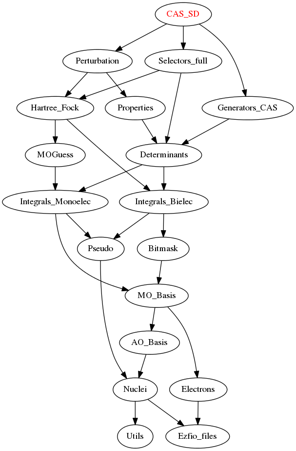

======================
CAS_SD_selected Module
======================

Selected CAS + SD module.

1) Set the different MO classes using the ``qp_set_mo_class`` command
2) Run the selected CAS+SD program

Documentation
=============

.. Do not edit this section. It was auto-generated from the
.. by the `update_README.py` script.

`full_ci <http://github.com/LCPQ/quantum_package/tree/master/src/CAS_SD/cas_sd_selected.irp.f#L1>`_
  Undocumented

`h_apply_cas_sd <http://github.com/LCPQ/quantum_package/tree/master/src/CAS_SD/H_apply.irp.f_shell_22#L414>`_
  Calls H_apply on the HF determinant and selects all connected single and double
  excitations (of the same symmetry). Auto-generated by the ``generate_h_apply`` script.

`h_apply_cas_sd_diexc <http://github.com/LCPQ/quantum_package/tree/master/src/CAS_SD/H_apply.irp.f_shell_22#L1>`_
  Generate all double excitations of key_in using the bit masks of holes and
  particles.
  Assume N_int is already provided.

`h_apply_cas_sd_monoexc <http://github.com/LCPQ/quantum_package/tree/master/src/CAS_SD/H_apply.irp.f_shell_22#L269>`_
  Generate all single excitations of key_in using the bit masks of holes and
  particles.
  Assume N_int is already provided.

`h_apply_cas_sd_pt2 <http://github.com/LCPQ/quantum_package/tree/master/src/CAS_SD/H_apply.irp.f_shell_22#L2610>`_
  Calls H_apply on the HF determinant and selects all connected single and double
  excitations (of the same symmetry). Auto-generated by the ``generate_h_apply`` script.

`h_apply_cas_sd_pt2_diexc <http://github.com/LCPQ/quantum_package/tree/master/src/CAS_SD/H_apply.irp.f_shell_22#L2118>`_
  Generate all double excitations of key_in using the bit masks of holes and
  particles.
  Assume N_int is already provided.

`h_apply_cas_sd_pt2_monoexc <http://github.com/LCPQ/quantum_package/tree/master/src/CAS_SD/H_apply.irp.f_shell_22#L2427>`_
  Generate all single excitations of key_in using the bit masks of holes and
  particles.
  Assume N_int is already provided.

`h_apply_cas_sd_selected <http://github.com/LCPQ/quantum_package/tree/master/src/CAS_SD/H_apply.irp.f_shell_22#L1872>`_
  Calls H_apply on the HF determinant and selects all connected single and double
  excitations (of the same symmetry). Auto-generated by the ``generate_h_apply`` script.

`h_apply_cas_sd_selected_diexc <http://github.com/LCPQ/quantum_package/tree/master/src/CAS_SD/H_apply.irp.f_shell_22#L1346>`_
  Generate all double excitations of key_in using the bit masks of holes and
  particles.
  Assume N_int is already provided.

`h_apply_cas_sd_selected_monoexc <http://github.com/LCPQ/quantum_package/tree/master/src/CAS_SD/H_apply.irp.f_shell_22#L1675>`_
  Generate all single excitations of key_in using the bit masks of holes and
  particles.
  Assume N_int is already provided.

`h_apply_cas_sd_selected_no_skip <http://github.com/LCPQ/quantum_package/tree/master/src/CAS_SD/H_apply.irp.f_shell_22#L1128>`_
  Calls H_apply on the HF determinant and selects all connected single and double
  excitations (of the same symmetry). Auto-generated by the ``generate_h_apply`` script.

`h_apply_cas_sd_selected_no_skip_diexc <http://github.com/LCPQ/quantum_package/tree/master/src/CAS_SD/H_apply.irp.f_shell_22#L602>`_
  Generate all double excitations of key_in using the bit masks of holes and
  particles.
  Assume N_int is already provided.

`h_apply_cas_sd_selected_no_skip_monoexc <http://github.com/LCPQ/quantum_package/tree/master/src/CAS_SD/H_apply.irp.f_shell_22#L931>`_
  Generate all single excitations of key_in using the bit masks of holes and
  particles.
  Assume N_int is already provided.

Needed Modules
==============

.. Do not edit this section. It was auto-generated from the
.. by the `update_README.py` script.

* `Perturbation <http://github.com/LCPQ/quantum_package/tree/master/src/Perturbation>`_
* `Selectors_full <http://github.com/LCPQ/quantum_package/tree/master/src/Selectors_full>`_
* `Generators_CAS <http://github.com/LCPQ/quantum_package/tree/master/src/Generators_CAS>`_

Needed Modules
==============
.. Do not edit this section It was auto-generated
.. by the `update_README.py` script.

* `Perturbation <http://github.com/LCPQ/quantum_package/tree/master/plugins/Perturbation>`_
* `Selectors_full <http://github.com/LCPQ/quantum_package/tree/master/plugins/Selectors_full>`_
* `Generators_CAS <http://github.com/LCPQ/quantum_package/tree/master/plugins/Generators_CAS>`_

Documentation
=============
.. Do not edit this section It was auto-generated
.. by the `update_README.py` script.

`full_ci <http://github.com/LCPQ/quantum_package/tree/master/plugins/CAS_SD/cas_sd_selected.irp.f#L1>`_
  Undocumented

`h_apply_cas_sd <http://github.com/LCPQ/quantum_package/tree/master/plugins/CAS_SD/H_apply.irp.f_shell_22#L537>`_
  Calls H_apply on the HF determinant and selects all connected single and double
  excitations (of the same symmetry). Auto-generated by the ``generate_h_apply`` script.

`h_apply_cas_sd_diexc <http://github.com/LCPQ/quantum_package/tree/master/plugins/CAS_SD/H_apply.irp.f_shell_22#L3>`_
  Undocumented

`h_apply_cas_sd_diexcorg <http://github.com/LCPQ/quantum_package/tree/master/plugins/CAS_SD/H_apply.irp.f_shell_22#L119>`_
  Generate all double excitations of key_in using the bit masks of holes and
  particles.
  Assume N_int is already provided.

`h_apply_cas_sd_diexcp <http://github.com/LCPQ/quantum_package/tree/master/plugins/CAS_SD/H_apply.irp.f_shell_22#L96>`_
  Undocumented

`h_apply_cas_sd_monoexc <http://github.com/LCPQ/quantum_package/tree/master/plugins/CAS_SD/H_apply.irp.f_shell_22#L387>`_
  Generate all single excitations of key_in using the bit masks of holes and
  particles.
  Assume N_int is already provided.

`h_apply_cas_sd_pt2 <http://github.com/LCPQ/quantum_package/tree/master/plugins/CAS_SD/H_apply.irp.f_shell_22#L3175>`_
  Calls H_apply on the HF determinant and selects all connected single and double
  excitations (of the same symmetry). Auto-generated by the ``generate_h_apply`` script.

`h_apply_cas_sd_pt2_diexc <http://github.com/LCPQ/quantum_package/tree/master/plugins/CAS_SD/H_apply.irp.f_shell_22#L2540>`_
  Undocumented

`h_apply_cas_sd_pt2_diexcorg <http://github.com/LCPQ/quantum_package/tree/master/plugins/CAS_SD/H_apply.irp.f_shell_22#L2678>`_
  Generate all double excitations of key_in using the bit masks of holes and
  particles.
  Assume N_int is already provided.

`h_apply_cas_sd_pt2_diexcp <http://github.com/LCPQ/quantum_package/tree/master/plugins/CAS_SD/H_apply.irp.f_shell_22#L2644>`_
  Undocumented

`h_apply_cas_sd_pt2_monoexc <http://github.com/LCPQ/quantum_package/tree/master/plugins/CAS_SD/H_apply.irp.f_shell_22#L2987>`_
  Generate all single excitations of key_in using the bit masks of holes and
  particles.
  Assume N_int is already provided.

`h_apply_cas_sd_selected <http://github.com/LCPQ/quantum_package/tree/master/plugins/CAS_SD/H_apply.irp.f_shell_22#L2291>`_
  Calls H_apply on the HF determinant and selects all connected single and double
  excitations (of the same symmetry). Auto-generated by the ``generate_h_apply`` script.

`h_apply_cas_sd_selected_diexc <http://github.com/LCPQ/quantum_package/tree/master/plugins/CAS_SD/H_apply.irp.f_shell_22#L1620>`_
  Undocumented

`h_apply_cas_sd_selected_diexcorg <http://github.com/LCPQ/quantum_package/tree/master/plugins/CAS_SD/H_apply.irp.f_shell_22#L1760>`_
  Generate all double excitations of key_in using the bit masks of holes and
  particles.
  Assume N_int is already provided.

`h_apply_cas_sd_selected_diexcp <http://github.com/LCPQ/quantum_package/tree/master/plugins/CAS_SD/H_apply.irp.f_shell_22#L1725>`_
  Undocumented

`h_apply_cas_sd_selected_monoexc <http://github.com/LCPQ/quantum_package/tree/master/plugins/CAS_SD/H_apply.irp.f_shell_22#L2089>`_
  Generate all single excitations of key_in using the bit masks of holes and
  particles.
  Assume N_int is already provided.

`h_apply_cas_sd_selected_no_skip <http://github.com/LCPQ/quantum_package/tree/master/plugins/CAS_SD/H_apply.irp.f_shell_22#L1399>`_
  Calls H_apply on the HF determinant and selects all connected single and double
  excitations (of the same symmetry). Auto-generated by the ``generate_h_apply`` script.

`h_apply_cas_sd_selected_no_skip_diexc <http://github.com/LCPQ/quantum_package/tree/master/plugins/CAS_SD/H_apply.irp.f_shell_22#L728>`_
  Undocumented

`h_apply_cas_sd_selected_no_skip_diexcorg <http://github.com/LCPQ/quantum_package/tree/master/plugins/CAS_SD/H_apply.irp.f_shell_22#L868>`_
  Generate all double excitations of key_in using the bit masks of holes and
  particles.
  Assume N_int is already provided.

`h_apply_cas_sd_selected_no_skip_diexcp <http://github.com/LCPQ/quantum_package/tree/master/plugins/CAS_SD/H_apply.irp.f_shell_22#L833>`_
  Undocumented

`h_apply_cas_sd_selected_no_skip_monoexc <http://github.com/LCPQ/quantum_package/tree/master/plugins/CAS_SD/H_apply.irp.f_shell_22#L1197>`_
  Generate all single excitations of key_in using the bit masks of holes and
  particles.
  Assume N_int is already provided.

