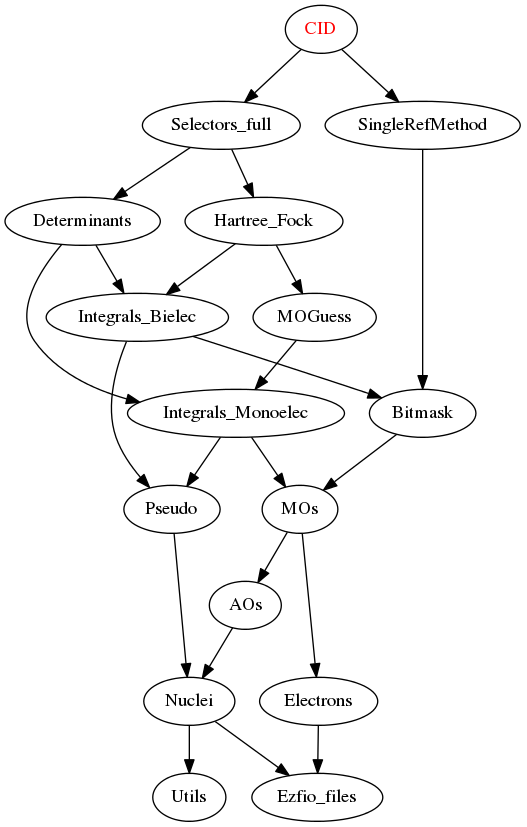

CID
====

This is a test directory which builds a CID by setting the follwoing rules:

* The only generator determinant is the Hartee-Fock (single-reference method)
* All generated determinants are included in the wave function (no perturbative
  selection)

These rules are set in the ``H_apply.irp.f`` file.

Needed Modules
==============

.. Do not edit this section. It was auto-generated from the
.. by the `update_README.py` script.

* `Selectors_full <http://github.com/LCPQ/quantum_package/tree/master/src/Selectors_full>`_
* `SingleRefMethod <http://github.com/LCPQ/quantum_package/tree/master/src/SingleRefMethod>`_

Documentation
=============

.. Do not edit this section. It was auto-generated from the
.. by the `update_README.py` script.

`cid <http://github.com/LCPQ/quantum_package/tree/master/src/CID/cid_lapack.irp.f#L1>`_
  Undocumented

`h_apply_cid <http://github.com/LCPQ/quantum_package/tree/master/src/CID/H_apply.irp.f_shell_8#L408>`_
  Calls H_apply on the HF determinant and selects all connected single and double
  excitations (of the same symmetry). Auto-generated by the ``generate_h_apply`` script.

`h_apply_cid_diexc <http://github.com/LCPQ/quantum_package/tree/master/src/CID/H_apply.irp.f_shell_8#L1>`_
  Generate all double excitations of key_in using the bit masks of holes and
  particles.
  Assume N_int is already provided.

`h_apply_cid_monoexc <http://github.com/LCPQ/quantum_package/tree/master/src/CID/H_apply.irp.f_shell_8#L264>`_
  Generate all single excitations of key_in using the bit masks of holes and
  particles.
  Assume N_int is already provided.

`h_apply_cisd_selection <http://github.com/LCPQ/quantum_package/tree/master/src/CID/H_apply.irp.f#L13>`_
  Undocumented

`h_apply_cisd_selection_delta_rho_one_point <http://github.com/LCPQ/quantum_package/tree/master/src/CID/H_apply.irp.f_shell_10#L1287>`_
  Calls H_apply on the HF determinant and selects all connected single and double
  excitations (of the same symmetry). Auto-generated by the ``generate_h_apply`` script.

`h_apply_cisd_selection_delta_rho_one_point_diexc <http://github.com/LCPQ/quantum_package/tree/master/src/CID/H_apply.irp.f_shell_10#L767>`_
  Generate all double excitations of key_in using the bit masks of holes and
  particles.
  Assume N_int is already provided.

`h_apply_cisd_selection_delta_rho_one_point_monoexc <http://github.com/LCPQ/quantum_package/tree/master/src/CID/H_apply.irp.f_shell_10#L1091>`_
  Generate all single excitations of key_in using the bit masks of holes and
  particles.
  Assume N_int is already provided.

`h_apply_cisd_selection_dipole_moment_z <http://github.com/LCPQ/quantum_package/tree/master/src/CID/H_apply.irp.f_shell_10#L6649>`_
  Calls H_apply on the HF determinant and selects all connected single and double
  excitations (of the same symmetry). Auto-generated by the ``generate_h_apply`` script.

`h_apply_cisd_selection_dipole_moment_z_diexc <http://github.com/LCPQ/quantum_package/tree/master/src/CID/H_apply.irp.f_shell_10#L6129>`_
  Generate all double excitations of key_in using the bit masks of holes and
  particles.
  Assume N_int is already provided.

`h_apply_cisd_selection_dipole_moment_z_monoexc <http://github.com/LCPQ/quantum_package/tree/master/src/CID/H_apply.irp.f_shell_10#L6453>`_
  Generate all single excitations of key_in using the bit masks of holes and
  particles.
  Assume N_int is already provided.

`h_apply_cisd_selection_epstein_nesbet <http://github.com/LCPQ/quantum_package/tree/master/src/CID/H_apply.irp.f_shell_10#L5117>`_
  Calls H_apply on the HF determinant and selects all connected single and double
  excitations (of the same symmetry). Auto-generated by the ``generate_h_apply`` script.

`h_apply_cisd_selection_epstein_nesbet_2x2 <http://github.com/LCPQ/quantum_package/tree/master/src/CID/H_apply.irp.f_shell_10#L5883>`_
  Calls H_apply on the HF determinant and selects all connected single and double
  excitations (of the same symmetry). Auto-generated by the ``generate_h_apply`` script.

`h_apply_cisd_selection_epstein_nesbet_2x2_diexc <http://github.com/LCPQ/quantum_package/tree/master/src/CID/H_apply.irp.f_shell_10#L5363>`_
  Generate all double excitations of key_in using the bit masks of holes and
  particles.
  Assume N_int is already provided.

`h_apply_cisd_selection_epstein_nesbet_2x2_monoexc <http://github.com/LCPQ/quantum_package/tree/master/src/CID/H_apply.irp.f_shell_10#L5687>`_
  Generate all single excitations of key_in using the bit masks of holes and
  particles.
  Assume N_int is already provided.

`h_apply_cisd_selection_epstein_nesbet_diexc <http://github.com/LCPQ/quantum_package/tree/master/src/CID/H_apply.irp.f_shell_10#L4597>`_
  Generate all double excitations of key_in using the bit masks of holes and
  particles.
  Assume N_int is already provided.

`h_apply_cisd_selection_epstein_nesbet_monoexc <http://github.com/LCPQ/quantum_package/tree/master/src/CID/H_apply.irp.f_shell_10#L4921>`_
  Generate all single excitations of key_in using the bit masks of holes and
  particles.
  Assume N_int is already provided.

`h_apply_cisd_selection_epstein_nesbet_sc2 <http://github.com/LCPQ/quantum_package/tree/master/src/CID/H_apply.irp.f_shell_10#L4351>`_
  Calls H_apply on the HF determinant and selects all connected single and double
  excitations (of the same symmetry). Auto-generated by the ``generate_h_apply`` script.

`h_apply_cisd_selection_epstein_nesbet_sc2_diexc <http://github.com/LCPQ/quantum_package/tree/master/src/CID/H_apply.irp.f_shell_10#L3831>`_
  Generate all double excitations of key_in using the bit masks of holes and
  particles.
  Assume N_int is already provided.

`h_apply_cisd_selection_epstein_nesbet_sc2_monoexc <http://github.com/LCPQ/quantum_package/tree/master/src/CID/H_apply.irp.f_shell_10#L4155>`_
  Generate all single excitations of key_in using the bit masks of holes and
  particles.
  Assume N_int is already provided.

`h_apply_cisd_selection_epstein_nesbet_sc2_no_projected <http://github.com/LCPQ/quantum_package/tree/master/src/CID/H_apply.irp.f_shell_10#L3585>`_
  Calls H_apply on the HF determinant and selects all connected single and double
  excitations (of the same symmetry). Auto-generated by the ``generate_h_apply`` script.

`h_apply_cisd_selection_epstein_nesbet_sc2_no_projected_diexc <http://github.com/LCPQ/quantum_package/tree/master/src/CID/H_apply.irp.f_shell_10#L3065>`_
  Generate all double excitations of key_in using the bit masks of holes and
  particles.
  Assume N_int is already provided.

`h_apply_cisd_selection_epstein_nesbet_sc2_no_projected_monoexc <http://github.com/LCPQ/quantum_package/tree/master/src/CID/H_apply.irp.f_shell_10#L3389>`_
  Generate all single excitations of key_in using the bit masks of holes and
  particles.
  Assume N_int is already provided.

`h_apply_cisd_selection_epstein_nesbet_sc2_projected <http://github.com/LCPQ/quantum_package/tree/master/src/CID/H_apply.irp.f_shell_10#L2819>`_
  Calls H_apply on the HF determinant and selects all connected single and double
  excitations (of the same symmetry). Auto-generated by the ``generate_h_apply`` script.

`h_apply_cisd_selection_epstein_nesbet_sc2_projected_diexc <http://github.com/LCPQ/quantum_package/tree/master/src/CID/H_apply.irp.f_shell_10#L2299>`_
  Generate all double excitations of key_in using the bit masks of holes and
  particles.
  Assume N_int is already provided.

`h_apply_cisd_selection_epstein_nesbet_sc2_projected_monoexc <http://github.com/LCPQ/quantum_package/tree/master/src/CID/H_apply.irp.f_shell_10#L2623>`_
  Generate all single excitations of key_in using the bit masks of holes and
  particles.
  Assume N_int is already provided.

`h_apply_cisd_selection_h_core <http://github.com/LCPQ/quantum_package/tree/master/src/CID/H_apply.irp.f_shell_10#L2053>`_
  Calls H_apply on the HF determinant and selects all connected single and double
  excitations (of the same symmetry). Auto-generated by the ``generate_h_apply`` script.

`h_apply_cisd_selection_h_core_diexc <http://github.com/LCPQ/quantum_package/tree/master/src/CID/H_apply.irp.f_shell_10#L1533>`_
  Generate all double excitations of key_in using the bit masks of holes and
  particles.
  Assume N_int is already provided.

`h_apply_cisd_selection_h_core_monoexc <http://github.com/LCPQ/quantum_package/tree/master/src/CID/H_apply.irp.f_shell_10#L1857>`_
  Generate all single excitations of key_in using the bit masks of holes and
  particles.
  Assume N_int is already provided.

`h_apply_cisd_selection_moller_plesset <http://github.com/LCPQ/quantum_package/tree/master/src/CID/H_apply.irp.f_shell_10#L521>`_
  Calls H_apply on the HF determinant and selects all connected single and double
  excitations (of the same symmetry). Auto-generated by the ``generate_h_apply`` script.

`h_apply_cisd_selection_moller_plesset_diexc <http://github.com/LCPQ/quantum_package/tree/master/src/CID/H_apply.irp.f_shell_10#L1>`_
  Generate all double excitations of key_in using the bit masks of holes and
  particles.
  Assume N_int is already provided.

`h_apply_cisd_selection_moller_plesset_monoexc <http://github.com/LCPQ/quantum_package/tree/master/src/CID/H_apply.irp.f_shell_10#L325>`_
  Generate all single excitations of key_in using the bit masks of holes and
  particles.
  Assume N_int is already provided.

Needed Modules
==============
.. Do not edit this section It was auto-generated
.. by the `update_README.py` script.

* `Selectors_full <http://github.com/LCPQ/quantum_package/tree/master/plugins/Selectors_full>`_
* `SingleRefMethod <http://github.com/LCPQ/quantum_package/tree/master/plugins/SingleRefMethod>`_

Documentation
=============
.. Do not edit this section It was auto-generated
.. by the `update_README.py` script.

`cid <http://github.com/LCPQ/quantum_package/tree/master/plugins/CID/cid_lapack.irp.f#L1>`_
  Undocumented

h_apply_cid
  Calls H_apply on the HF determinant and selects all connected single and double
  excitations (of the same symmetry). Auto-generated by the ``generate_h_apply`` script.

h_apply_cid_diexc
  Undocumented

h_apply_cid_diexcorg
  Generate all double excitations of key_in using the bit masks of holes and
  particles.
  Assume N_int is already provided.

h_apply_cid_diexcp
  Undocumented

h_apply_cid_monoexc
  Generate all single excitations of key_in using the bit masks of holes and
  particles.
  Assume N_int is already provided.

