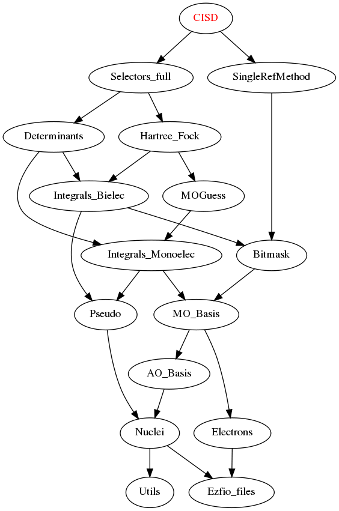

CISD
====

This is a test directory which builds a CISD by setting the follwoing rules:

* The only generator determinant is the Hartee-Fock (single-reference method)
* All generated determinants are included in the wave function (no perturbative
  selection)

These rules are set in the ``H_apply.irp.f`` file.

Needed Modules
==============

.. Do not edit this section. It was auto-generated from the
.. by the `update_README.py` script.

* `Selectors_full <http://github.com/LCPQ/quantum_package/tree/master/src/Selectors_full>`_
* `SingleRefMethod <http://github.com/LCPQ/quantum_package/tree/master/src/SingleRefMethod>`_

Documentation
=============

.. Do not edit this section. It was auto-generated from the
.. by the `update_README.py` script.

`h_apply_cisd <http://github.com/LCPQ/quantum_package/tree/master/src/CISD/H_apply.irp.f_shell_8#L414>`_
  Calls H_apply on the HF determinant and selects all connected single and double
  excitations (of the same symmetry). Auto-generated by the ``generate_h_apply`` script.

`h_apply_cisd_diexc <http://github.com/LCPQ/quantum_package/tree/master/src/CISD/H_apply.irp.f_shell_8#L1>`_
  Generate all double excitations of key_in using the bit masks of holes and
  particles.
  Assume N_int is already provided.

`h_apply_cisd_monoexc <http://github.com/LCPQ/quantum_package/tree/master/src/CISD/H_apply.irp.f_shell_8#L269>`_
  Generate all single excitations of key_in using the bit masks of holes and
  particles.
  Assume N_int is already provided.

Needed Modules
==============
.. Do not edit this section It was auto-generated
.. by the `update_README.py` script.

* `Selectors_full <http://github.com/LCPQ/quantum_package/tree/master/plugins/Selectors_full>`_
* `SingleRefMethod <http://github.com/LCPQ/quantum_package/tree/master/plugins/SingleRefMethod>`_

Documentation
=============
.. Do not edit this section It was auto-generated
.. by the `update_README.py` script.

h_apply_cisd
  Calls H_apply on the HF determinant and selects all connected single and double
  excitations (of the same symmetry). Auto-generated by the ``generate_h_apply`` script.

h_apply_cisd_diexc
  Undocumented

h_apply_cisd_diexcorg
  Generate all double excitations of key_in using the bit masks of holes and
  particles.
  Assume N_int is already provided.

h_apply_cisd_diexcp
  Undocumented

h_apply_cisd_monoexc
  Generate all single excitations of key_in using the bit masks of holes and
  particles.
  Assume N_int is already provided.

