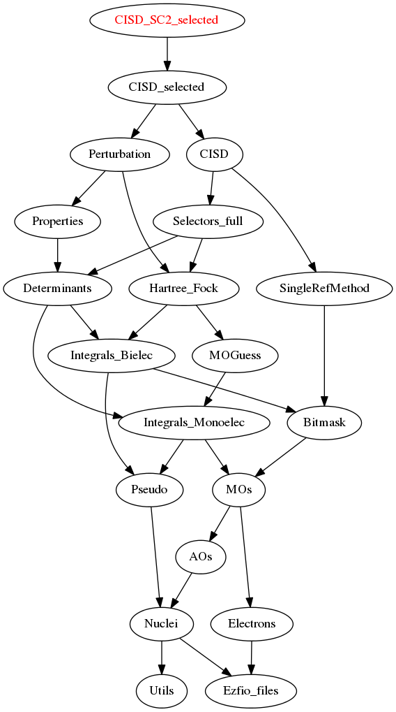

========================
CISD_SC2_selected Module
========================

Documentation
=============

.. Do not edit this section. It was auto-generated from the
.. by the `update_README.py` script.

`cisd_sc2_selected <http://github.com/LCPQ/quantum_package/tree/master/src/CISD_SC2_selected/cisd_sc2_selection.irp.f#L1>`_
  Undocumented

`h_apply_pt2 <http://github.com/LCPQ/quantum_package/tree/master/src/CISD_SC2_selected/H_apply.irp.f_shell_17#L1257>`_
  Calls H_apply on the HF determinant and selects all connected single and double
  excitations (of the same symmetry). Auto-generated by the ``generate_h_apply`` script.

`h_apply_pt2_diexc <http://github.com/LCPQ/quantum_package/tree/master/src/CISD_SC2_selected/H_apply.irp.f_shell_17#L769>`_
  Generate all double excitations of key_in using the bit masks of holes and
  particles.
  Assume N_int is already provided.

`h_apply_pt2_en_sc2 <http://github.com/LCPQ/quantum_package/tree/master/src/CISD_SC2_selected/H_apply.irp.f_shell_17#L1952>`_
  Calls H_apply on the HF determinant and selects all connected single and double
  excitations (of the same symmetry). Auto-generated by the ``generate_h_apply`` script.

`h_apply_pt2_en_sc2_diexc <http://github.com/LCPQ/quantum_package/tree/master/src/CISD_SC2_selected/H_apply.irp.f_shell_17#L1464>`_
  Generate all double excitations of key_in using the bit masks of holes and
  particles.
  Assume N_int is already provided.

`h_apply_pt2_en_sc2_monoexc <http://github.com/LCPQ/quantum_package/tree/master/src/CISD_SC2_selected/H_apply.irp.f_shell_17#L1770>`_
  Generate all single excitations of key_in using the bit masks of holes and
  particles.
  Assume N_int is already provided.

`h_apply_pt2_monoexc <http://github.com/LCPQ/quantum_package/tree/master/src/CISD_SC2_selected/H_apply.irp.f_shell_17#L1075>`_
  Generate all single excitations of key_in using the bit masks of holes and
  particles.
  Assume N_int is already provided.

`h_apply_sc2_selected <http://github.com/LCPQ/quantum_package/tree/master/src/CISD_SC2_selected/H_apply.irp.f_shell_17#L523>`_
  Calls H_apply on the HF determinant and selects all connected single and double
  excitations (of the same symmetry). Auto-generated by the ``generate_h_apply`` script.

`h_apply_sc2_selected_diexc <http://github.com/LCPQ/quantum_package/tree/master/src/CISD_SC2_selected/H_apply.irp.f_shell_17#L1>`_
  Generate all double excitations of key_in using the bit masks of holes and
  particles.
  Assume N_int is already provided.

`h_apply_sc2_selected_monoexc <http://github.com/LCPQ/quantum_package/tree/master/src/CISD_SC2_selected/H_apply.irp.f_shell_17#L327>`_
  Generate all single excitations of key_in using the bit masks of holes and
  particles.
  Assume N_int is already provided.

Needed Modules
==============

.. Do not edit this section. It was auto-generated from the
.. by the `update_README.py` script.

* `CISD_selected <http://github.com/LCPQ/quantum_package/tree/master/src/CISD_selected>`_

Needed Modules
==============
.. Do not edit this section It was auto-generated
.. by the `update_README.py` script.

* `CISD_selected <http://github.com/LCPQ/quantum_package/tree/master/plugins/CISD_selected>`_

Documentation
=============
.. Do not edit this section It was auto-generated
.. by the `update_README.py` script.

`cisd_sc2_selected <http://github.com/LCPQ/quantum_package/tree/master/plugins/CISD_SC2_selected/cisd_sc2_selection.irp.f#L1>`_
  Undocumented

h_apply_cisd
  Calls H_apply on the HF determinant and selects all connected single and double
  excitations (of the same symmetry). Auto-generated by the ``generate_h_apply`` script.

h_apply_cisd_diexc
  Undocumented

h_apply_cisd_diexcorg
  Generate all double excitations of key_in using the bit masks of holes and
  particles.
  Assume N_int is already provided.

h_apply_cisd_diexcp
  Undocumented

h_apply_cisd_monoexc
  Generate all single excitations of key_in using the bit masks of holes and
  particles.
  Assume N_int is already provided.

h_apply_pt2
  Calls H_apply on the HF determinant and selects all connected single and double
  excitations (of the same symmetry). Auto-generated by the ``generate_h_apply`` script.

h_apply_pt2_diexc
  Undocumented

h_apply_pt2_diexcorg
  Generate all double excitations of key_in using the bit masks of holes and
  particles.
  Assume N_int is already provided.

h_apply_pt2_diexcp
  Undocumented

h_apply_pt2_en_sc2
  Calls H_apply on the HF determinant and selects all connected single and double
  excitations (of the same symmetry). Auto-generated by the ``generate_h_apply`` script.

h_apply_pt2_en_sc2_diexc
  Undocumented

h_apply_pt2_en_sc2_diexcorg
  Generate all double excitations of key_in using the bit masks of holes and
  particles.
  Assume N_int is already provided.

h_apply_pt2_en_sc2_diexcp
  Undocumented

h_apply_pt2_en_sc2_monoexc
  Generate all single excitations of key_in using the bit masks of holes and
  particles.
  Assume N_int is already provided.

h_apply_pt2_monoexc
  Generate all single excitations of key_in using the bit masks of holes and
  particles.
  Assume N_int is already provided.

h_apply_sc2_selected
  Calls H_apply on the HF determinant and selects all connected single and double
  excitations (of the same symmetry). Auto-generated by the ``generate_h_apply`` script.

h_apply_sc2_selected_diexc
  Undocumented

h_apply_sc2_selected_diexcorg
  Generate all double excitations of key_in using the bit masks of holes and
  particles.
  Assume N_int is already provided.

h_apply_sc2_selected_diexcp
  Undocumented

h_apply_sc2_selected_monoexc
  Generate all single excitations of key_in using the bit masks of holes and
  particles.
  Assume N_int is already provided.

