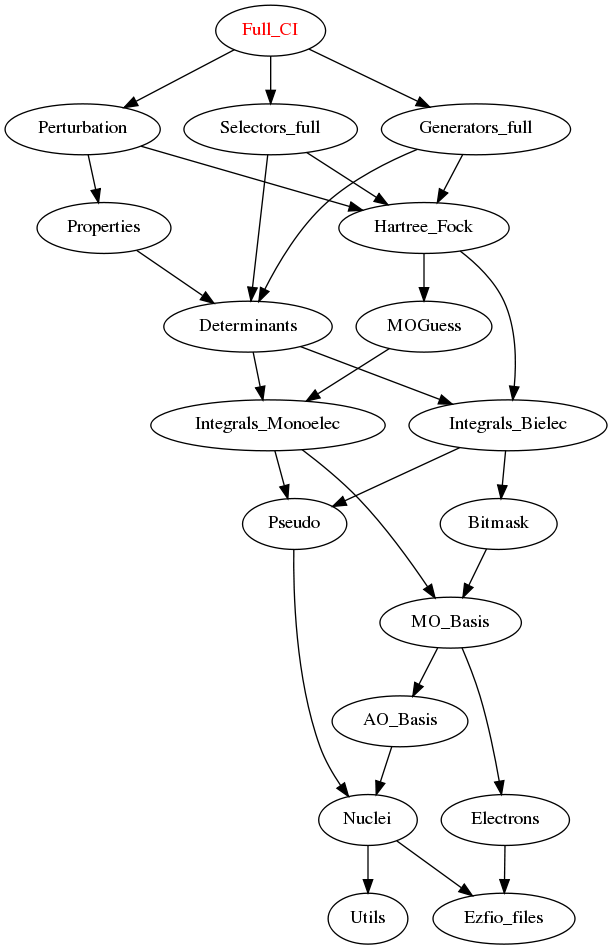

==============
Full_CI Module
==============

Performs a perturbatively selected Full-CI.

Needed Modules
==============
.. Do not edit this section It was auto-generated
.. by the `update_README.py` script.

* `Perturbation <http://github.com/LCPQ/quantum_package/tree/master/plugins/Perturbation>`_
* `Selectors_full <http://github.com/LCPQ/quantum_package/tree/master/plugins/Selectors_full>`_
* `Generators_full <http://github.com/LCPQ/quantum_package/tree/master/plugins/Generators_full>`_

Documentation
=============
.. Do not edit this section It was auto-generated
.. by the `update_README.py` script.

`full_ci <http://github.com/LCPQ/quantum_package/tree/master/plugins/Full_CI/full_ci_no_skip.irp.f#L1>`_
  Undocumented

h_apply_fci
  Calls H_apply on the HF determinant and selects all connected single and double
  excitations (of the same symmetry). Auto-generated by the ``generate_h_apply`` script.

h_apply_fci_diexc
  Undocumented

h_apply_fci_diexcorg
  Generate all double excitations of key_in using the bit masks of holes and
  particles.
  Assume N_int is already provided.

h_apply_fci_diexcp
  Undocumented

h_apply_fci_mono
  Calls H_apply on the HF determinant and selects all connected single and double
  excitations (of the same symmetry). Auto-generated by the ``generate_h_apply`` script.

h_apply_fci_mono_diexc
  Undocumented

h_apply_fci_mono_diexcorg
  Generate all double excitations of key_in using the bit masks of holes and
  particles.
  Assume N_int is already provided.

h_apply_fci_mono_diexcp
  Undocumented

h_apply_fci_mono_monoexc
  Generate all single excitations of key_in using the bit masks of holes and
  particles.
  Assume N_int is already provided.

h_apply_fci_monoexc
  Generate all single excitations of key_in using the bit masks of holes and
  particles.
  Assume N_int is already provided.

h_apply_fci_no_skip
  Calls H_apply on the HF determinant and selects all connected single and double
  excitations (of the same symmetry). Auto-generated by the ``generate_h_apply`` script.

h_apply_fci_no_skip_diexc
  Undocumented

h_apply_fci_no_skip_diexcorg
  Generate all double excitations of key_in using the bit masks of holes and
  particles.
  Assume N_int is already provided.

h_apply_fci_no_skip_diexcp
  Undocumented

h_apply_fci_no_skip_monoexc
  Generate all single excitations of key_in using the bit masks of holes and
  particles.
  Assume N_int is already provided.

h_apply_fci_pt2
  Calls H_apply on the HF determinant and selects all connected single and double
  excitations (of the same symmetry). Auto-generated by the ``generate_h_apply`` script.

h_apply_fci_pt2_diexc
  Undocumented

h_apply_fci_pt2_diexcorg
  Generate all double excitations of key_in using the bit masks of holes and
  particles.
  Assume N_int is already provided.

h_apply_fci_pt2_diexcp
  Undocumented

h_apply_fci_pt2_monoexc
  Generate all single excitations of key_in using the bit masks of holes and
  particles.
  Assume N_int is already provided.

h_apply_pt2_mono_delta_rho
  Calls H_apply on the HF determinant and selects all connected single and double
  excitations (of the same symmetry). Auto-generated by the ``generate_h_apply`` script.

h_apply_pt2_mono_delta_rho_diexc
  Undocumented

h_apply_pt2_mono_delta_rho_diexcorg
  Generate all double excitations of key_in using the bit masks of holes and
  particles.
  Assume N_int is already provided.

h_apply_pt2_mono_delta_rho_diexcp
  Undocumented

h_apply_pt2_mono_delta_rho_monoexc
  Generate all single excitations of key_in using the bit masks of holes and
  particles.
  Assume N_int is already provided.

h_apply_pt2_mono_di_delta_rho
  Calls H_apply on the HF determinant and selects all connected single and double
  excitations (of the same symmetry). Auto-generated by the ``generate_h_apply`` script.

h_apply_pt2_mono_di_delta_rho_diexc
  Undocumented

h_apply_pt2_mono_di_delta_rho_diexcorg
  Generate all double excitations of key_in using the bit masks of holes and
  particles.
  Assume N_int is already provided.

h_apply_pt2_mono_di_delta_rho_diexcp
  Undocumented

h_apply_pt2_mono_di_delta_rho_monoexc
  Generate all single excitations of key_in using the bit masks of holes and
  particles.
  Assume N_int is already provided.

h_apply_select_mono_delta_rho
  Calls H_apply on the HF determinant and selects all connected single and double
  excitations (of the same symmetry). Auto-generated by the ``generate_h_apply`` script.

h_apply_select_mono_delta_rho_diexc
  Undocumented

h_apply_select_mono_delta_rho_diexcorg
  Generate all double excitations of key_in using the bit masks of holes and
  particles.
  Assume N_int is already provided.

h_apply_select_mono_delta_rho_diexcp
  Undocumented

h_apply_select_mono_delta_rho_monoexc
  Generate all single excitations of key_in using the bit masks of holes and
  particles.
  Assume N_int is already provided.

h_apply_select_mono_di_delta_rho
  Calls H_apply on the HF determinant and selects all connected single and double
  excitations (of the same symmetry). Auto-generated by the ``generate_h_apply`` script.

h_apply_select_mono_di_delta_rho_diexc
  Undocumented

h_apply_select_mono_di_delta_rho_diexcorg
  Generate all double excitations of key_in using the bit masks of holes and
  particles.
  Assume N_int is already provided.

h_apply_select_mono_di_delta_rho_diexcp
  Undocumented

h_apply_select_mono_di_delta_rho_monoexc
  Generate all single excitations of key_in using the bit masks of holes and
  particles.
  Assume N_int is already provided.

`var_pt2_ratio_run <http://github.com/LCPQ/quantum_package/tree/master/plugins/Full_CI/var_pt2_ratio.irp.f#L1>`_
  Undocumented

