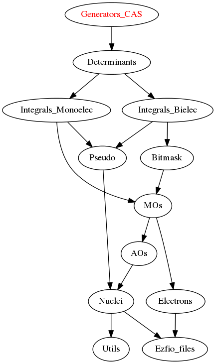

=====================
Generators_CAS Module
=====================

The generator determinants are those filtered by the ``cas_bitmask`` mask.
Assumptions
===========

.. Do not edit this section. It was auto-generated from the
.. NEEDED_MODULES_CHILDREN file by the `update_README.py` script.

The active space is defined by the ``reference_bitmask``.

Documentation
=============

.. Do not edit this section. It was auto-generated from the
.. by the `update_README.py` script.

`n_det_generators <http://github.com/LCPQ/quantum_package/tree/master/src/Generators_CAS/generators.irp.f#L3>`_
  Number of generator detetrminants

`psi_coef_generators <http://github.com/LCPQ/quantum_package/tree/master/src/Generators_CAS/generators.irp.f#L35>`_
  For Single reference wave functions, the generator is the
  Hartree-Fock determinant

`psi_det_generators <http://github.com/LCPQ/quantum_package/tree/master/src/Generators_CAS/generators.irp.f#L34>`_
  For Single reference wave functions, the generator is the
  Hartree-Fock determinant

`select_max <http://github.com/LCPQ/quantum_package/tree/master/src/Generators_CAS/generators.irp.f#L78>`_
  Memo to skip useless selectors

`size_select_max <http://github.com/LCPQ/quantum_package/tree/master/src/Generators_CAS/generators.irp.f#L70>`_
  Size of the select_max array

Needed Modules
==============

.. Do not edit this section. It was auto-generated from the
.. by the `update_README.py` script.

* `Determinants <http://github.com/LCPQ/quantum_package/tree/master/src/Determinants>`_

Needed Modules
==============
.. Do not edit this section It was auto-generated
.. by the `update_README.py` script.

* `Determinants <http://github.com/LCPQ/quantum_package/tree/master/src/Determinants>`_

Documentation
=============
.. Do not edit this section It was auto-generated
.. by the `update_README.py` script.

`n_det_generators <http://github.com/LCPQ/quantum_package/tree/master/plugins/Generators_CAS/generators.irp.f#L3>`_
  Number of generator detetrminants

`psi_coef_generators <http://github.com/LCPQ/quantum_package/tree/master/plugins/Generators_CAS/generators.irp.f#L35>`_
  For Single reference wave functions, the generator is the
  Hartree-Fock determinant

`psi_det_generators <http://github.com/LCPQ/quantum_package/tree/master/plugins/Generators_CAS/generators.irp.f#L34>`_
  For Single reference wave functions, the generator is the
  Hartree-Fock determinant

`select_max <http://github.com/LCPQ/quantum_package/tree/master/plugins/Generators_CAS/generators.irp.f#L78>`_
  Memo to skip useless selectors

`size_select_max <http://github.com/LCPQ/quantum_package/tree/master/plugins/Generators_CAS/generators.irp.f#L70>`_
  Size of the select_max array

