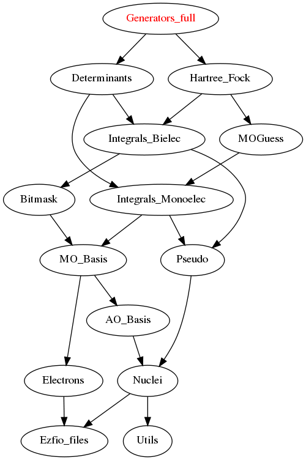

======================
Generators_full Module
======================

All the determinants of the wave function are generators. In this way, the Full CI
space is explored.

Needed Modules
==============

.. Do not edit this section It was auto-generated
.. by the `update_README.py` script.

* `Determinants <http://github.com/LCPQ/quantum_package/tree/master/src/Determinants>`_
* `Hartree_Fock <http://github.com/LCPQ/quantum_package/tree/master/src/Hartree_Fock>`_

Needed Modules
==============
.. Do not edit this section It was auto-generated
.. by the `update_README.py` script.

* `Determinants <http://github.com/LCPQ/quantum_package/tree/master/src/Determinants>`_
* `Hartree_Fock <http://github.com/LCPQ/quantum_package/tree/master/plugins/Hartree_Fock>`_

Documentation
=============
.. Do not edit this section It was auto-generated
.. by the `update_README.py` script.

`degree_max_generators <http://github.com/LCPQ/quantum_package/tree/master/plugins/Generators_full/generators.irp.f#L45>`_
  Max degree of excitation (respect to HF) of the generators

`n_det_generators <http://github.com/LCPQ/quantum_package/tree/master/plugins/Generators_full/generators.irp.f#L3>`_
  For Single reference wave functions, the number of generators is 1 : the
  Hartree-Fock determinant

`psi_coef_generators <http://github.com/LCPQ/quantum_package/tree/master/plugins/Generators_full/generators.irp.f#L26>`_
  For Single reference wave functions, the generator is the
  Hartree-Fock determinant

`psi_det_generators <http://github.com/LCPQ/quantum_package/tree/master/plugins/Generators_full/generators.irp.f#L25>`_
  For Single reference wave functions, the generator is the
  Hartree-Fock determinant

`select_max <http://github.com/LCPQ/quantum_package/tree/master/plugins/Generators_full/generators.irp.f#L68>`_
  Memo to skip useless selectors

`size_select_max <http://github.com/LCPQ/quantum_package/tree/master/plugins/Generators_full/generators.irp.f#L60>`_
  Size of the select_max array

