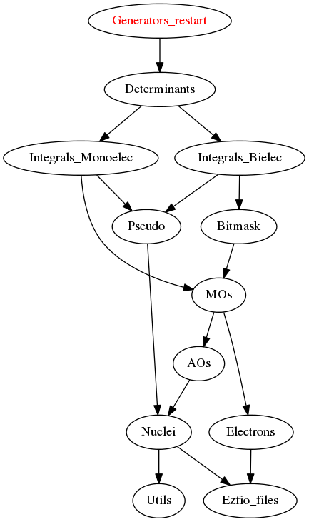

=========================
Generators_restart Module
=========================

Documentation
=============

.. Do not edit this section. It was auto-generated from the
.. by the `update_README.py` script.

`n_det_generators <http://github.com/LCPQ/quantum_package/tree/master/src/Generators_restart/generators.irp.f#L3>`_
  Read the wave function

`psi_coef_generators <http://github.com/LCPQ/quantum_package/tree/master/src/Generators_restart/generators.irp.f#L21>`_
  read wf
  .br

`psi_det_generators <http://github.com/LCPQ/quantum_package/tree/master/src/Generators_restart/generators.irp.f#L20>`_
  read wf
  .br

`select_max <http://github.com/LCPQ/quantum_package/tree/master/src/Generators_restart/generators.irp.f#L52>`_
  Memo to skip useless selectors

`size_select_max <http://github.com/LCPQ/quantum_package/tree/master/src/Generators_restart/generators.irp.f#L44>`_
  Size of the select_max array

Needed Modules
==============

.. Do not edit this section. It was auto-generated from the
.. by the `update_README.py` script.

* `Determinants <http://github.com/LCPQ/quantum_package/tree/master/src/Determinants>`_

