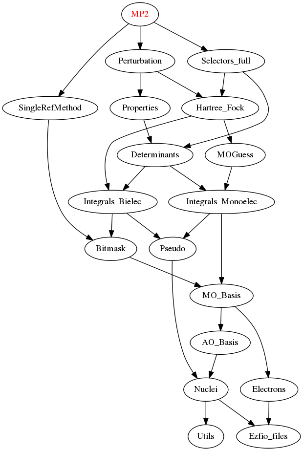

==========
MP2 Module
==========

Documentation
=============

.. Do not edit this section. It was auto-generated from the
.. by the `update_README.py` script.

`h_apply_mp2 <http://github.com/LCPQ/quantum_package/tree/master/src/MP2/H_apply.irp.f_shell_9#L487>`_
  Calls H_apply on the HF determinant and selects all connected single and double
  excitations (of the same symmetry). Auto-generated by the ``generate_h_apply`` script.

`h_apply_mp2_diexc <http://github.com/LCPQ/quantum_package/tree/master/src/MP2/H_apply.irp.f_shell_9#L1>`_
  Generate all double excitations of key_in using the bit masks of holes and
  particles.
  Assume N_int is already provided.

`h_apply_mp2_monoexc <http://github.com/LCPQ/quantum_package/tree/master/src/MP2/H_apply.irp.f_shell_9#L305>`_
  Generate all single excitations of key_in using the bit masks of holes and
  particles.
  Assume N_int is already provided.

`mp2 <http://github.com/LCPQ/quantum_package/tree/master/src/MP2/mp2.irp.f#L1>`_
  Undocumented

Needed Modules
==============

.. Do not edit this section. It was auto-generated from the
.. by the `update_README.py` script.

* `Perturbation <http://github.com/LCPQ/quantum_package/tree/master/src/Perturbation>`_
* `Selectors_full <http://github.com/LCPQ/quantum_package/tree/master/src/Selectors_full>`_
* `SingleRefMethod <http://github.com/LCPQ/quantum_package/tree/master/src/SingleRefMethod>`_

Needed Modules
==============
.. Do not edit this section It was auto-generated
.. by the `update_README.py` script.

* `Perturbation <http://github.com/LCPQ/quantum_package/tree/master/plugins/Perturbation>`_
* `Selectors_full <http://github.com/LCPQ/quantum_package/tree/master/plugins/Selectors_full>`_
* `SingleRefMethod <http://github.com/LCPQ/quantum_package/tree/master/plugins/SingleRefMethod>`_

Documentation
=============
.. Do not edit this section It was auto-generated
.. by the `update_README.py` script.

h_apply_mp2
  Calls H_apply on the HF determinant and selects all connected single and double
  excitations (of the same symmetry). Auto-generated by the ``generate_h_apply`` script.

h_apply_mp2_diexc
  Undocumented

h_apply_mp2_diexcorg
  Generate all double excitations of key_in using the bit masks of holes and
  particles.
  Assume N_int is already provided.

h_apply_mp2_diexcp
  Undocumented

h_apply_mp2_monoexc
  Generate all single excitations of key_in using the bit masks of holes and
  particles.
  Assume N_int is already provided.

h_apply_mp2_selection
  Calls H_apply on the HF determinant and selects all connected single and double
  excitations (of the same symmetry). Auto-generated by the ``generate_h_apply`` script.

h_apply_mp2_selection_diexc
  Undocumented

h_apply_mp2_selection_diexcorg
  Generate all double excitations of key_in using the bit masks of holes and
  particles.
  Assume N_int is already provided.

h_apply_mp2_selection_diexcp
  Undocumented

h_apply_mp2_selection_monoexc
  Generate all single excitations of key_in using the bit masks of holes and
  particles.
  Assume N_int is already provided.

`mp2 <http://github.com/LCPQ/quantum_package/tree/master/plugins/MP2/mp2.irp.f#L1>`_
  Undocumented

`mp2_wf <http://github.com/LCPQ/quantum_package/tree/master/plugins/MP2/mp2_wf.irp.f#L1>`_
  Save the MP2 wave function

