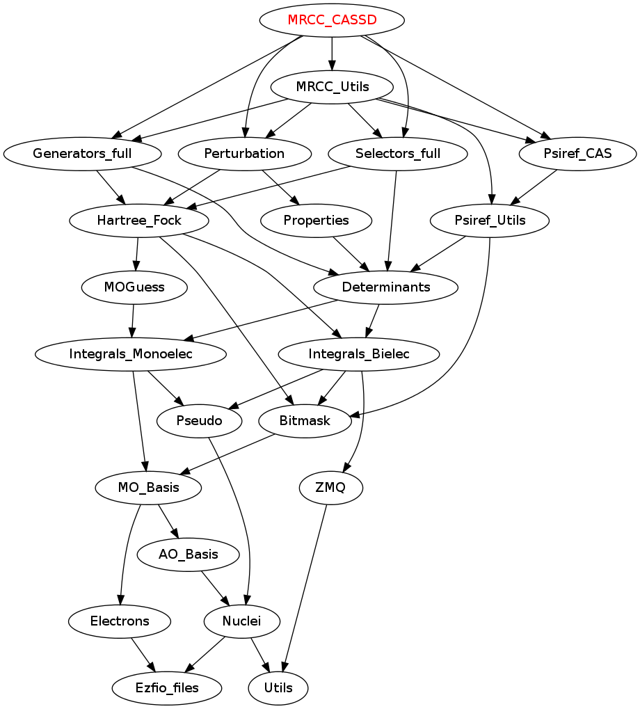

===========
MRCC Module
===========

MRCC as a coupled cluster on a CAS+SD wave function.

Needed Modules
==============

.. Do not edit this section. It was auto-generated from the
.. by the `update_README.py` script.

* `Perturbation <http://github.com/LCPQ/quantum_package/tree/master/src/Perturbation>`_
* `Selectors_full <http://github.com/LCPQ/quantum_package/tree/master/src/Selectors_full>`_
* `Generators_full <http://github.com/LCPQ/quantum_package/tree/master/src/Generators_full>`_
* `Psiref_CAS <http://github.com/LCPQ/quantum_package/tree/master/src/Psiref_CAS>`_
* `MRCC_Utils <http://github.com/LCPQ/quantum_package/tree/master/src/MRCC_Utils>`_

Documentation
=============

.. Do not edit this section. It was auto-generated from the
.. by the `update_README.py` script.

`mrcc <http://github.com/LCPQ/quantum_package/tree/master/src/MRCC_CASSD/mrcc_cassd.irp.f#L1>`_
  Undocumented

`print_cas_coefs <http://github.com/LCPQ/quantum_package/tree/master/src/MRCC_CASSD/mrcc_cassd.irp.f#L11>`_
  Undocumented

Needed Modules
==============
.. Do not edit this section It was auto-generated
.. by the `update_README.py` script.

* `Perturbation <http://github.com/LCPQ/quantum_package/tree/master/plugins/Perturbation>`_
* `Selectors_full <http://github.com/LCPQ/quantum_package/tree/master/plugins/Selectors_full>`_
* `Generators_full <http://github.com/LCPQ/quantum_package/tree/master/plugins/Generators_full>`_
* `Psiref_CAS <http://github.com/LCPQ/quantum_package/tree/master/plugins/Psiref_CAS>`_
* `MRCC_Utils <http://github.com/LCPQ/quantum_package/tree/master/plugins/MRCC_Utils>`_

Documentation
=============
.. Do not edit this section It was auto-generated
.. by the `update_README.py` script.

`mrcc <http://github.com/LCPQ/quantum_package/tree/master/plugins/MRCC_CASSD/mrcc_cassd.irp.f#L1>`_
  Undocumented

`mrcc_noiter <http://github.com/LCPQ/quantum_package/tree/master/plugins/MRCC_CASSD/mrcc_noiter.irp.f#L1>`_
  Undocumented

`n_it_mrcc_max <http://github.com/LCPQ/quantum_package/tree/master/plugins/MRCC_CASSD/ezfio_interface.irp.f#L6>`_
  Maximum number of MRCC iterations

`print_cas_coefs <http://github.com/LCPQ/quantum_package/tree/master/plugins/MRCC_CASSD/mrcc_noiter.irp.f#L78>`_
  Undocumented

`run <http://github.com/LCPQ/quantum_package/tree/master/plugins/MRCC_CASSD/mrcc_noiter.irp.f#L17>`_
  Undocumented

`run_pt2 <http://github.com/LCPQ/quantum_package/tree/master/plugins/MRCC_CASSD/mrcc_noiter.irp.f#L36>`_
  Undocumented

`thresh_mrcc <http://github.com/LCPQ/quantum_package/tree/master/plugins/MRCC_CASSD/ezfio_interface.irp.f#L25>`_
  Threshold on the convergence of the MRCC energy

