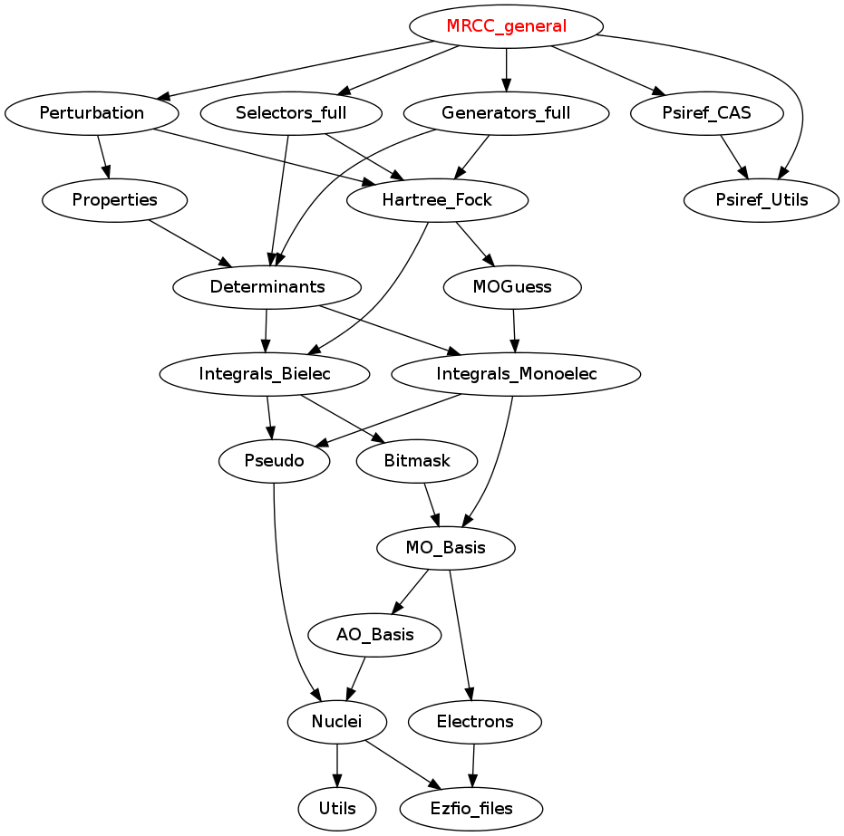

===========
MRCC Module
===========

Needed Modules
==============

.. Do not edit this section. It was auto-generated from the
.. by the `update_README.py` script.

* `Perturbation <http://github.com/LCPQ/quantum_package/tree/master/src/Perturbation>`_
* `Selectors_full <http://github.com/LCPQ/quantum_package/tree/master/src/Selectors_full>`_
* `Generators_full <http://github.com/LCPQ/quantum_package/tree/master/src/Generators_full>`_
* `Psiref_CAS <http://github.com/LCPQ/quantum_package/tree/master/src/Psiref_CAS>`_
* `Psiref_Utils <http://github.com/LCPQ/quantum_package/tree/master/src/Psiref_Utils>`_

Documentation
=============

.. Do not edit this section. It was auto-generated from the
.. by the `update_README.py` script.

`ci_eigenvectors_dressed <http://github.com/LCPQ/quantum_package/tree/master/src/MRCC_general/mrcc_utils.irp.f#L76>`_
  Eigenvectors/values of the CI matrix

`ci_eigenvectors_s2_dressed <http://github.com/LCPQ/quantum_package/tree/master/src/MRCC_general/mrcc_utils.irp.f#L77>`_
  Eigenvectors/values of the CI matrix

`ci_electronic_energy_dressed <http://github.com/LCPQ/quantum_package/tree/master/src/MRCC_general/mrcc_utils.irp.f#L75>`_
  Eigenvectors/values of the CI matrix

`ci_energy_dressed <http://github.com/LCPQ/quantum_package/tree/master/src/MRCC_general/mrcc_utils.irp.f#L142>`_
  N_states lowest eigenvalues of the dressed CI matrix

`davidson_diag_hjj_mrcc <http://github.com/LCPQ/quantum_package/tree/master/src/MRCC_general/davidson.irp.f#L56>`_
  Davidson diagonalization with specific diagonal elements of the H matrix
  .br
  H_jj : specific diagonal H matrix elements to diagonalize de Davidson
  .br
  dets_in : bitmasks corresponding to determinants
  .br
  u_in : guess coefficients on the various states. Overwritten
  on exit
  .br
  dim_in : leftmost dimension of u_in
  .br
  sze : Number of determinants
  .br
  N_st : Number of eigenstates
  .br
  iunit : Unit for the I/O
  .br
  Initial guess vectors are not necessarily orthonormal

`davidson_diag_mrcc <http://github.com/LCPQ/quantum_package/tree/master/src/MRCC_general/davidson.irp.f#L1>`_
  Davidson diagonalization.
  .br
  dets_in : bitmasks corresponding to determinants
  .br
  u_in : guess coefficients on the various states. Overwritten
  on exit
  .br
  dim_in : leftmost dimension of u_in
  .br
  sze : Number of determinants
  .br
  N_st : Number of eigenstates
  .br
  iunit : Unit number for the I/O
  .br
  Initial guess vectors are not necessarily orthonormal

`delta_ii <http://github.com/LCPQ/quantum_package/tree/master/src/MRCC_general/mrcc_utils.irp.f#L39>`_
  Dressing matrix in N_det basis

`delta_ij <http://github.com/LCPQ/quantum_package/tree/master/src/MRCC_general/mrcc_utils.irp.f#L38>`_
  Dressing matrix in N_det basis

`diagonalize_ci_dressed <http://github.com/LCPQ/quantum_package/tree/master/src/MRCC_general/mrcc_utils.irp.f#L157>`_
  Replace the coefficients of the CI states by the coefficients of the
  eigenstates of the CI matrix

`find_triples_and_quadruples <http://github.com/LCPQ/quantum_package/tree/master/src/MRCC_general/mrcc_dress.irp.f#L206>`_
  Undocumented

`h_apply_mrcc <http://github.com/LCPQ/quantum_package/tree/master/src/MRCC_general/H_apply.irp.f_shell_27#L416>`_
  Calls H_apply on the HF determinant and selects all connected single and double
  excitations (of the same symmetry). Auto-generated by the ``generate_h_apply`` script.

`h_apply_mrcc_diexc <http://github.com/LCPQ/quantum_package/tree/master/src/MRCC_general/H_apply.irp.f_shell_27#L1>`_
  Generate all double excitations of key_in using the bit masks of holes and
  particles.
  Assume N_int is already provided.

`h_apply_mrcc_monoexc <http://github.com/LCPQ/quantum_package/tree/master/src/MRCC_general/H_apply.irp.f_shell_27#L268>`_
  Generate all single excitations of key_in using the bit masks of holes and
  particles.
  Assume N_int is already provided.

`h_matrix_dressed <http://github.com/LCPQ/quantum_package/tree/master/src/MRCC_general/mrcc_utils.irp.f#L50>`_
  Dressed H with Delta_ij

`h_u_0_mrcc <http://github.com/LCPQ/quantum_package/tree/master/src/MRCC_general/davidson.irp.f#L360>`_
  Computes v_0 = H|u_0>
  .br
  n : number of determinants
  .br
  H_jj : array of <j|H|j>

`lambda_mrcc <http://github.com/LCPQ/quantum_package/tree/master/src/MRCC_general/mrcc_utils.irp.f#L1>`_
  cm/<Psi_0|H|D_m> or perturbative 1/Delta_E(m)

`lambda_pert <http://github.com/LCPQ/quantum_package/tree/master/src/MRCC_general/mrcc_utils.irp.f#L2>`_
  cm/<Psi_0|H|D_m> or perturbative 1/Delta_E(m)

`mrcc <http://github.com/LCPQ/quantum_package/tree/master/src/MRCC_general/mrcc_general.irp.f#L1>`_
  Undocumented

`mrcc_dress <http://github.com/LCPQ/quantum_package/tree/master/src/MRCC_general/mrcc_dress.irp.f#L15>`_
  Undocumented

`mrcc_dress_simple <http://github.com/LCPQ/quantum_package/tree/master/src/MRCC_general/mrcc_dress.irp.f#L160>`_
  Undocumented

`psi_ref_lock <http://github.com/LCPQ/quantum_package/tree/master/src/MRCC_general/mrcc_dress.irp.f#L3>`_
  Locks on ref determinants to fill delta_ij

`run <http://github.com/LCPQ/quantum_package/tree/master/src/MRCC_general/mrcc_general.irp.f#L10>`_
  Undocumented

`run_mrcc <http://github.com/LCPQ/quantum_package/tree/master/src/MRCC_general/mrcc_general.irp.f#L36>`_
  Undocumented

`run_mrcc_test <http://github.com/LCPQ/quantum_package/tree/master/src/MRCC_general/mrcc_general.irp.f#L23>`_
  Undocumented

