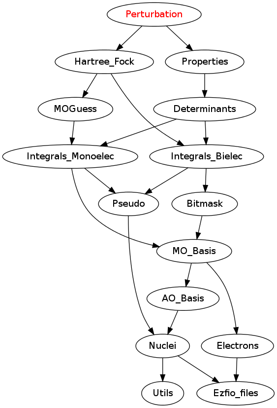

===================
Perturbation Module
===================

All subroutines in `*.irp.f` starting with ``pt2_`` in the current directory are
perturbation computed using the routine ``i_H_psi``. Other cases are not allowed.
The arguments of the ``pt2_`` are always:

  subroutine pt2_...(                                                &
      psi_ref,                                                       &
      psi_ref_coefs,                                                 &
      E_refs,                                                        &
      det_pert,                                                      &
      c_pert,                                                        &
      e_2_pert,                                                      &
      H_pert_diag,                                                   &
      Nint,                                                          &
      ndet,                                                          &
      n_st )

  integer, intent(in) :: Nint,ndet,n_st
  integer(bit_kind), intent(in)  :: psi_ref(Nint,2,ndet)
  double precision , intent(in)  :: psi_ref_coefs(ndet,n_st)
  double precision , intent(in)  :: E_refs(n_st)
  integer(bit_kind), intent(in)  :: det_pert(Nint,2)
  double precision , intent(out) :: c_pert(n_st),e_2_pert(n_st),H_pert_diag

psi_ref
  bitstring of the determinants present in the various n_st states
 
psi_ref_coefs
  coefficients of the determinants on the various n_st states
 
E_refs
  Energy of the various n_st states
 
det_pert
  Perturber determinant

c_pert
  Pertrubative coefficients for the various states
 
e_2_pert
  Perturbative energetic contribution for the various states

H_pert_diag
  Diagonal H matrix element of the perturber

Nint
  Should be equal to N_int

Ndet
  Number of determinants `i` in Psi on which we apply <det_pert|Hi>

N_st
  Number of states

Assumptions
===========

* This is not allowed:

  subroutine &
    pt2_....

Needed Modules
==============

.. Do not edit this section It was auto-generated
.. by the `update_README.py` script.

* `Properties <http://github.com/LCPQ/quantum_package/tree/master/src/Properties>`_
* `Hartree_Fock <http://github.com/LCPQ/quantum_package/tree/master/src/Hartree_Fock>`_

Needed Modules
==============
.. Do not edit this section It was auto-generated
.. by the `update_README.py` script.

* `Properties <http://github.com/LCPQ/quantum_package/tree/master/plugins/Properties>`_
* `Hartree_Fock <http://github.com/LCPQ/quantum_package/tree/master/plugins/Hartree_Fock>`_
* `Davidson <http://github.com/LCPQ/quantum_package/tree/master/src/Davidson>`_

Documentation
=============
.. Do not edit this section It was auto-generated
.. by the `update_README.py` script.

`do_pt2_end <http://github.com/LCPQ/quantum_package/tree/master/plugins/Perturbation/ezfio_interface.irp.f#L6>`_
  If true, compute the PT2 at the end of the selection

`fill_h_apply_buffer_selection <http://github.com/LCPQ/quantum_package/tree/master/plugins/Perturbation/selection.irp.f#L1>`_
  Fill the H_apply buffer with determiants for the selection

`max_exc_pert <http://github.com/LCPQ/quantum_package/tree/master/plugins/Perturbation/exc_max.irp.f#L1>`_
  Undocumented

perturb_buffer_by_mono_dipole_moment_z
  Applly pertubration ``dipole_moment_z`` to the buffer of determinants generated in the H_apply
  routine.

perturb_buffer_by_mono_dummy
  Applly pertubration ``dummy`` to the buffer of determinants generated in the H_apply
  routine.

perturb_buffer_by_mono_epstein_nesbet
  Applly pertubration ``epstein_nesbet`` to the buffer of determinants generated in the H_apply
  routine.

perturb_buffer_by_mono_epstein_nesbet_2x2
  Applly pertubration ``epstein_nesbet_2x2`` to the buffer of determinants generated in the H_apply
  routine.

perturb_buffer_by_mono_epstein_nesbet_sc2
  Applly pertubration ``epstein_nesbet_sc2`` to the buffer of determinants generated in the H_apply
  routine.

perturb_buffer_by_mono_epstein_nesbet_sc2_no_projected
  Applly pertubration ``epstein_nesbet_sc2_no_projected`` to the buffer of determinants generated in the H_apply
  routine.

perturb_buffer_by_mono_epstein_nesbet_sc2_projected
  Applly pertubration ``epstein_nesbet_sc2_projected`` to the buffer of determinants generated in the H_apply
  routine.

perturb_buffer_by_mono_h_core
  Applly pertubration ``h_core`` to the buffer of determinants generated in the H_apply
  routine.

perturb_buffer_by_mono_moller_plesset
  Applly pertubration ``moller_plesset`` to the buffer of determinants generated in the H_apply
  routine.

perturb_buffer_dipole_moment_z
  Applly pertubration ``dipole_moment_z`` to the buffer of determinants generated in the H_apply
  routine.

perturb_buffer_dummy
  Applly pertubration ``dummy`` to the buffer of determinants generated in the H_apply
  routine.

perturb_buffer_epstein_nesbet
  Applly pertubration ``epstein_nesbet`` to the buffer of determinants generated in the H_apply
  routine.

perturb_buffer_epstein_nesbet_2x2
  Applly pertubration ``epstein_nesbet_2x2`` to the buffer of determinants generated in the H_apply
  routine.

perturb_buffer_epstein_nesbet_sc2
  Applly pertubration ``epstein_nesbet_sc2`` to the buffer of determinants generated in the H_apply
  routine.

perturb_buffer_epstein_nesbet_sc2_no_projected
  Applly pertubration ``epstein_nesbet_sc2_no_projected`` to the buffer of determinants generated in the H_apply
  routine.

perturb_buffer_epstein_nesbet_sc2_projected
  Applly pertubration ``epstein_nesbet_sc2_projected`` to the buffer of determinants generated in the H_apply
  routine.

perturb_buffer_h_core
  Applly pertubration ``h_core`` to the buffer of determinants generated in the H_apply
  routine.

perturb_buffer_moller_plesset
  Applly pertubration ``moller_plesset`` to the buffer of determinants generated in the H_apply
  routine.

`pt2_dipole_moment_z <http://github.com/LCPQ/quantum_package/tree/master/plugins/Perturbation/dipole_moment.irp.f#L1>`_
  compute the perturbatibe contribution to the dipole moment of one determinant
  .br
  for the various n_st states, at various level of theory.
  .br
  c_pert(i) = <psi(i)|H|det_pert>/(<psi(i)|H|psi(i)> - <det_pert|H|det_pert>)
  .br
  e_2_pert(i) = c_pert(i) * <det_pert|Z|psi(i)>
  .br
  H_pert_diag(i) = c_pert(i)^2 * <det_pert|Z|det_pert>
  .br
  To get the contribution of the first order :
  .br
  <Z_1> = sum(over i)  e_2_pert(i)
  .br
  To get the contribution of the diagonal elements of the second order :
  .br
  [ <Z_0> + <Z_1> + sum(over i)  H_pert_diag(i) ] / [1. + sum(over i) c_pert(i) **2]
  .br

`pt2_dummy <http://github.com/LCPQ/quantum_package/tree/master/plugins/Perturbation/pt2_equations.irp.f_template_401#L420>`_
  Dummy perturbation to add all connected determinants.

`pt2_epstein_nesbet <http://github.com/LCPQ/quantum_package/tree/master/plugins/Perturbation/pt2_equations.irp.f_template_401#L3>`_
  compute the standard Epstein-Nesbet perturbative first order coefficient and second order energetic contribution
  .br
  for the various N_st states.
  .br
  c_pert(i) = <psi(i)|H|det_pert>/( E(i) - <det_pert|H|det_pert> )
  .br
  e_2_pert(i) = <psi(i)|H|det_pert>^2/( E(i) - <det_pert|H|det_pert> )
  .br

`pt2_epstein_nesbet_2x2 <http://github.com/LCPQ/quantum_package/tree/master/plugins/Perturbation/pt2_equations.irp.f_template_401#L60>`_
  compute the Epstein-Nesbet 2x2 diagonalization coefficient and energetic contribution
  .br
  for the various N_st states.
  .br
  e_2_pert(i) = 0.5 * (( <det_pert|H|det_pert> -  E(i) )  - sqrt( ( <det_pert|H|det_pert> -  E(i)) ^2 + 4 <psi(i)|H|det_pert>^2  )
  .br
  c_pert(i) = e_2_pert(i)/ <psi(i)|H|det_pert>
  .br

`pt2_epstein_nesbet_sc2 <http://github.com/LCPQ/quantum_package/tree/master/plugins/Perturbation/pt2_equations.irp.f_template_401#L364>`_
  compute the standard Epstein-Nesbet perturbative first order coefficient and second order energetic contribution
  .br
  for the various N_st states, but with the CISD_SC2 energies and coefficients
  .br
  c_pert(i) = <psi(i)|H|det_pert>/( E(i) - <det_pert|H|det_pert> )
  .br
  e_2_pert(i) = <psi(i)|H|det_pert>^2/( E(i) - <det_pert|H|det_pert> )
  .br

`pt2_epstein_nesbet_sc2_no_projected <http://github.com/LCPQ/quantum_package/tree/master/plugins/Perturbation/pt2_equations.irp.f_template_401#L285>`_
  compute the Epstein-Nesbet perturbative first order coefficient and second order energetic contribution
  .br
  for the various N_st states,
  .br
  but  with the correction in the denominator
  .br
  comming from the interaction of that determinant with all the others determinants
  .br
  that can be repeated by repeating all the double excitations
  .br
  : you repeat all the correlation energy already taken into account in electronic_energy(1)
  .br
  that could be repeated to this determinant.
  .br
  In addition, for the perturbative energetic contribution you have the standard second order
  .br
  e_2_pert = <psi_i|H|det_pert>^2/(Delta_E)
  .br
  and also the purely projected contribution
  .br
  H_pert_diag = <HF|H|det_pert> c_pert

`pt2_epstein_nesbet_sc2_projected <http://github.com/LCPQ/quantum_package/tree/master/plugins/Perturbation/pt2_equations.irp.f_template_401#L190>`_
  compute the Epstein-Nesbet perturbative first order coefficient and second order energetic contribution
  .br
  for the various N_st states,
  .br
  but  with the correction in the denominator
  .br
  comming from the interaction of that determinant with all the others determinants
  .br
  that can be repeated by repeating all the double excitations
  .br
  : you repeat all the correlation energy already taken into account in electronic_energy(1)
  .br
  that could be repeated to this determinant.
  .br
  In addition, for the perturbative energetic contribution you have the standard second order
  .br
  e_2_pert = <psi_i|H|det_pert>^2/(Delta_E)
  .br
  and also the purely projected contribution
  .br
  H_pert_diag = <HF|H|det_pert> c_pert

`pt2_h_core <http://github.com/LCPQ/quantum_package/tree/master/plugins/Perturbation/pert_single.irp.f#L1>`_
  compute the standard Epstein-Nesbet perturbative first order coefficient and second order energetic contribution
  .br
  for the various N_st states.
  .br
  c_pert(i) = <psi(i)|H|det_pert>/( E(i) - <det_pert|H|det_pert> )
  .br
  e_2_pert(i) = <psi(i)|H|det_pert>^2/( E(i) - <det_pert|H|det_pert> )
  .br

`pt2_max <http://github.com/LCPQ/quantum_package/tree/master/plugins/Perturbation/ezfio_interface.irp.f#L25>`_
  The selection process stops when the largest PT2 (for all the state) is lower
  than pt2_max in absolute value

`pt2_moller_plesset <http://github.com/LCPQ/quantum_package/tree/master/plugins/Perturbation/pt2_equations.irp.f_template_401#L121>`_
  compute the standard Moller-Plesset perturbative first order coefficient and second order energetic contribution
  .br
  for the various n_st states.
  .br
  c_pert(i) = <psi(i)|H|det_pert>/(difference of orbital energies)
  .br
  e_2_pert(i) = <psi(i)|H|det_pert>^2/(difference of orbital energies)
  .br

`remove_small_contributions <http://github.com/LCPQ/quantum_package/tree/master/plugins/Perturbation/selection.irp.f#L77>`_
  Remove determinants with small contributions. N_states is assumed to be
  provided.

`repeat_all_e_corr <http://github.com/LCPQ/quantum_package/tree/master/plugins/Perturbation/pert_sc2.irp.f#L1>`_
  Undocumented

`selection_criterion <http://github.com/LCPQ/quantum_package/tree/master/plugins/Perturbation/selection.irp.f#L64>`_
  Threshold to select determinants. Set by selection routines.

`selection_criterion_factor <http://github.com/LCPQ/quantum_package/tree/master/plugins/Perturbation/selection.irp.f#L66>`_
  Threshold to select determinants. Set by selection routines.

`selection_criterion_min <http://github.com/LCPQ/quantum_package/tree/master/plugins/Perturbation/selection.irp.f#L65>`_
  Threshold to select determinants. Set by selection routines.

`var_pt2_ratio <http://github.com/LCPQ/quantum_package/tree/master/plugins/Perturbation/ezfio_interface.irp.f#L45>`_
  The selection process stops when the energy ratio variational/(variational+PT2)
  is equal to var_pt2_ratio

