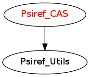

=======================
Psiref_threshold Module
=======================

Reference wave function is defined as all determinants with coefficients
such that | c_i/c_max | > threshold.

Documentation
=============

.. Do not edit this section. It was auto-generated from the
.. by the `update_README.py` script.

`idx_ref <http://github.com/LCPQ/quantum_package/tree/master/src/Psiref_CAS/psi_ref.irp.f#L5>`_
  CAS wave function, defined from the application of the CAS bitmask on the
  determinants. idx_cas gives the indice of the CAS determinant in psi_det.

`n_det_ref <http://github.com/LCPQ/quantum_package/tree/master/src/Psiref_CAS/psi_ref.irp.f#L6>`_
  CAS wave function, defined from the application of the CAS bitmask on the
  determinants. idx_cas gives the indice of the CAS determinant in psi_det.

`psi_ref <http://github.com/LCPQ/quantum_package/tree/master/src/Psiref_CAS/psi_ref.irp.f#L3>`_
  CAS wave function, defined from the application of the CAS bitmask on the
  determinants. idx_cas gives the indice of the CAS determinant in psi_det.

`psi_ref_coef <http://github.com/LCPQ/quantum_package/tree/master/src/Psiref_CAS/psi_ref.irp.f#L4>`_
  CAS wave function, defined from the application of the CAS bitmask on the
  determinants. idx_cas gives the indice of the CAS determinant in psi_det.

`psi_ref_coef_restart <http://github.com/LCPQ/quantum_package/tree/master/src/Psiref_CAS/psi_ref.irp.f#L30>`_
  Projection of the CAS wave function on the restart wave function.

`psi_ref_restart <http://github.com/LCPQ/quantum_package/tree/master/src/Psiref_CAS/psi_ref.irp.f#L29>`_
  Projection of the CAS wave function on the restart wave function.

Needed Modules
==============

.. Do not edit this section. It was auto-generated from the
.. by the `update_README.py` script.

* `Psiref_Utils <http://github.com/LCPQ/quantum_package/tree/master/src/Psiref_Utils>`_

Needed Modules
==============
.. Do not edit this section It was auto-generated
.. by the `update_README.py` script.

* `Psiref_Utils <http://github.com/LCPQ/quantum_package/tree/master/plugins/Psiref_Utils>`_
* `Davidson <http://github.com/LCPQ/quantum_package/tree/master/src/Davidson>`_

Documentation
=============
.. Do not edit this section It was auto-generated
.. by the `update_README.py` script.

`idx_ref <http://github.com/LCPQ/quantum_package/tree/master/plugins/Psiref_CAS/psi_ref.irp.f#L5>`_
  CAS wave function, defined from the application of the CAS bitmask on the
  determinants. idx_cas gives the indice of the CAS determinant in psi_det.

`n_det_ref <http://github.com/LCPQ/quantum_package/tree/master/plugins/Psiref_CAS/psi_ref.irp.f#L6>`_
  CAS wave function, defined from the application of the CAS bitmask on the
  determinants. idx_cas gives the indice of the CAS determinant in psi_det.

`overwrite_w_cas <http://github.com/LCPQ/quantum_package/tree/master/plugins/Psiref_CAS/overwrite_with_cas.irp.f#L1>`_
  Undocumented

`psi_ref <http://github.com/LCPQ/quantum_package/tree/master/plugins/Psiref_CAS/psi_ref.irp.f#L3>`_
  CAS wave function, defined from the application of the CAS bitmask on the
  determinants. idx_cas gives the indice of the CAS determinant in psi_det.

`psi_ref_coef <http://github.com/LCPQ/quantum_package/tree/master/plugins/Psiref_CAS/psi_ref.irp.f#L4>`_
  CAS wave function, defined from the application of the CAS bitmask on the
  determinants. idx_cas gives the indice of the CAS determinant in psi_det.

`psi_ref_coef_inv <http://github.com/LCPQ/quantum_package/tree/master/plugins/Psiref_CAS/psi_ref.irp.f#L29>`_
  1/psi_ref_coef

`psi_ref_coef_restart <http://github.com/LCPQ/quantum_package/tree/master/plugins/Psiref_CAS/psi_ref.irp.f#L45>`_
  Projection of the CAS wave function on the restart wave function.

`psi_ref_restart <http://github.com/LCPQ/quantum_package/tree/master/plugins/Psiref_CAS/psi_ref.irp.f#L44>`_
  Projection of the CAS wave function on the restart wave function.

