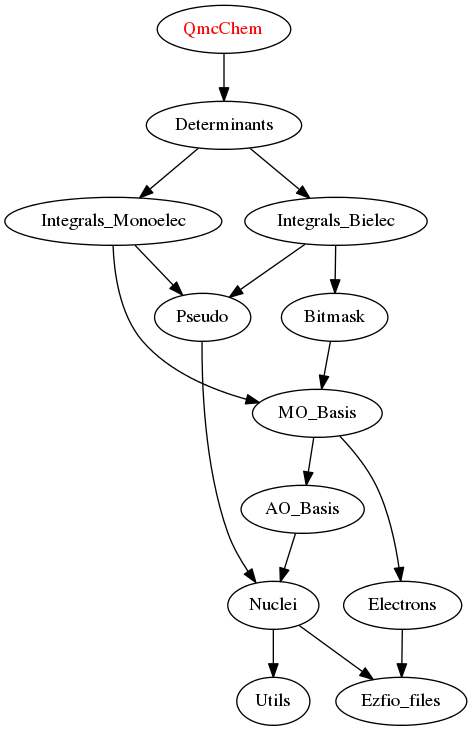

==============
QmcChem Module
==============

Documentation
=============

.. Do not edit this section. It was auto-generated from the
.. by the `update_README.py` script.

`ao_pseudo_grid <http://github.com/LCPQ/quantum_package/tree/master/src/QmcChem/pot_ao_pseudo_ints.irp.f#L2>`_
  Grid points for f(|r-r_A|) = \int Y_{lm}^{C} (|r-r_C|, \Omega_C) \chi_i^{A} (r-r_A) d\Omega_C
  .br
  

`mo_pseudo_grid <http://github.com/LCPQ/quantum_package/tree/master/src/QmcChem/pot_ao_pseudo_ints.irp.f#L56>`_
  Grid points for f(|r-r_A|) = \int Y_{lm}^{C} (|r-r_C|, \Omega_C) \phi_i^{A} (r-r_A) d\Omega_C
  .br
  

`save_for_qmc <http://github.com/LCPQ/quantum_package/tree/master/src/QmcChem/save_for_qmcchem.irp.f#L1>`_
  Undocumented

`test_pseudo_grid_ao <http://github.com/LCPQ/quantum_package/tree/master/src/QmcChem/pot_ao_pseudo_ints.irp.f#L105>`_
  Undocumented

`write_pseudopotential <http://github.com/LCPQ/quantum_package/tree/master/src/QmcChem/pseudo.irp.f#L1>`_
  Write the pseudo_potential into the EZFIO file

Needed Modules
==============

.. Do not edit this section. It was auto-generated from the
.. by the `update_README.py` script.

* `Determinants <http://github.com/LCPQ/quantum_package/tree/master/src/Determinants>`_

