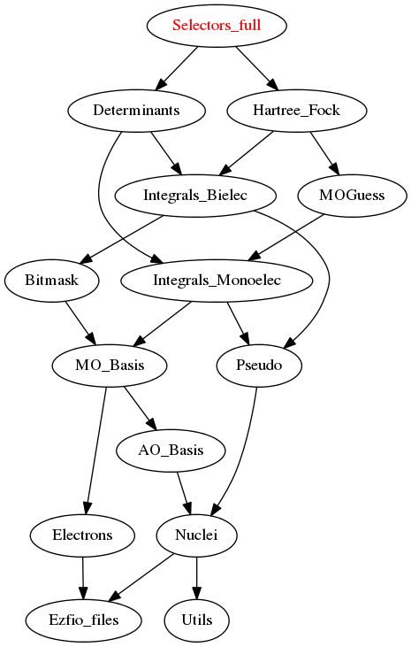

=====================
Selectors_full Module
=====================

Needed Modules
==============

.. Do not edit this section It was auto-generated
.. by the `update_README.py` script.

* `Determinants <http://github.com/LCPQ/quantum_package/tree/master/src/Determinants>`_
* `Hartree_Fock <http://github.com/LCPQ/quantum_package/tree/master/src/Hartree_Fock>`_

Needed Modules
==============
.. Do not edit this section It was auto-generated
.. by the `update_README.py` script.

* `Determinants <http://github.com/LCPQ/quantum_package/tree/master/src/Determinants>`_
* `Hartree_Fock <http://github.com/LCPQ/quantum_package/tree/master/plugins/Hartree_Fock>`_

Documentation
=============
.. Do not edit this section It was auto-generated
.. by the `update_README.py` script.

`coef_hf_selector <http://github.com/LCPQ/quantum_package/tree/master/plugins/Selectors_full/e_corr_selectors.irp.f#L28>`_
  energy of correlation per determinant respect to the Hartree Fock determinant
  .br
  for the all the double excitations in the selectors determinants
  .br
  E_corr_per_selectors(i) = <D_i|H|HF> * c(D_i)/c(HF) if |D_i> is a double excitation
  .br
  E_corr_per_selectors(i) = -1000.d0 if it is not a double excitation
  .br
  coef_hf_selector = coefficient of the Hartree Fock determinant in the selectors determinants

`delta_e_per_selector <http://github.com/LCPQ/quantum_package/tree/master/plugins/Selectors_full/e_corr_selectors.irp.f#L33>`_
  energy of correlation per determinant respect to the Hartree Fock determinant
  .br
  for the all the double excitations in the selectors determinants
  .br
  E_corr_per_selectors(i) = <D_i|H|HF> * c(D_i)/c(HF) if |D_i> is a double excitation
  .br
  E_corr_per_selectors(i) = -1000.d0 if it is not a double excitation
  .br
  coef_hf_selector = coefficient of the Hartree Fock determinant in the selectors determinants

`double_index_selectors <http://github.com/LCPQ/quantum_package/tree/master/plugins/Selectors_full/e_corr_selectors.irp.f#L4>`_
  degree of excitation respect to Hartree Fock for the wave function
  .br
  for the all the selectors determinants
  .br
  double_index_selectors = list of the index of the double excitations
  .br
  n_double_selectors = number of double excitations in the selectors determinants

`e_corr_double_only <http://github.com/LCPQ/quantum_package/tree/master/plugins/Selectors_full/e_corr_selectors.irp.f#L34>`_
  energy of correlation per determinant respect to the Hartree Fock determinant
  .br
  for the all the double excitations in the selectors determinants
  .br
  E_corr_per_selectors(i) = <D_i|H|HF> * c(D_i)/c(HF) if |D_i> is a double excitation
  .br
  E_corr_per_selectors(i) = -1000.d0 if it is not a double excitation
  .br
  coef_hf_selector = coefficient of the Hartree Fock determinant in the selectors determinants

`e_corr_per_selectors <http://github.com/LCPQ/quantum_package/tree/master/plugins/Selectors_full/e_corr_selectors.irp.f#L31>`_
  energy of correlation per determinant respect to the Hartree Fock determinant
  .br
  for the all the double excitations in the selectors determinants
  .br
  E_corr_per_selectors(i) = <D_i|H|HF> * c(D_i)/c(HF) if |D_i> is a double excitation
  .br
  E_corr_per_selectors(i) = -1000.d0 if it is not a double excitation
  .br
  coef_hf_selector = coefficient of the Hartree Fock determinant in the selectors determinants

`e_corr_second_order <http://github.com/LCPQ/quantum_package/tree/master/plugins/Selectors_full/e_corr_selectors.irp.f#L35>`_
  energy of correlation per determinant respect to the Hartree Fock determinant
  .br
  for the all the double excitations in the selectors determinants
  .br
  E_corr_per_selectors(i) = <D_i|H|HF> * c(D_i)/c(HF) if |D_i> is a double excitation
  .br
  E_corr_per_selectors(i) = -1000.d0 if it is not a double excitation
  .br
  coef_hf_selector = coefficient of the Hartree Fock determinant in the selectors determinants

`exc_degree_per_selectors <http://github.com/LCPQ/quantum_package/tree/master/plugins/Selectors_full/e_corr_selectors.irp.f#L3>`_
  degree of excitation respect to Hartree Fock for the wave function
  .br
  for the all the selectors determinants
  .br
  double_index_selectors = list of the index of the double excitations
  .br
  n_double_selectors = number of double excitations in the selectors determinants

`i_h_hf_per_selectors <http://github.com/LCPQ/quantum_package/tree/master/plugins/Selectors_full/e_corr_selectors.irp.f#L32>`_
  energy of correlation per determinant respect to the Hartree Fock determinant
  .br
  for the all the double excitations in the selectors determinants
  .br
  E_corr_per_selectors(i) = <D_i|H|HF> * c(D_i)/c(HF) if |D_i> is a double excitation
  .br
  E_corr_per_selectors(i) = -1000.d0 if it is not a double excitation
  .br
  coef_hf_selector = coefficient of the Hartree Fock determinant in the selectors determinants

`inv_selectors_coef_hf <http://github.com/LCPQ/quantum_package/tree/master/plugins/Selectors_full/e_corr_selectors.irp.f#L29>`_
  energy of correlation per determinant respect to the Hartree Fock determinant
  .br
  for the all the double excitations in the selectors determinants
  .br
  E_corr_per_selectors(i) = <D_i|H|HF> * c(D_i)/c(HF) if |D_i> is a double excitation
  .br
  E_corr_per_selectors(i) = -1000.d0 if it is not a double excitation
  .br
  coef_hf_selector = coefficient of the Hartree Fock determinant in the selectors determinants

`inv_selectors_coef_hf_squared <http://github.com/LCPQ/quantum_package/tree/master/plugins/Selectors_full/e_corr_selectors.irp.f#L30>`_
  energy of correlation per determinant respect to the Hartree Fock determinant
  .br
  for the all the double excitations in the selectors determinants
  .br
  E_corr_per_selectors(i) = <D_i|H|HF> * c(D_i)/c(HF) if |D_i> is a double excitation
  .br
  E_corr_per_selectors(i) = -1000.d0 if it is not a double excitation
  .br
  coef_hf_selector = coefficient of the Hartree Fock determinant in the selectors determinants

`n_det_selectors <http://github.com/LCPQ/quantum_package/tree/master/plugins/Selectors_full/selectors.irp.f#L8>`_
  For Single reference wave functions, the number of selectors is 1 : the
  Hartree-Fock determinant

`n_double_selectors <http://github.com/LCPQ/quantum_package/tree/master/plugins/Selectors_full/e_corr_selectors.irp.f#L5>`_
  degree of excitation respect to Hartree Fock for the wave function
  .br
  for the all the selectors determinants
  .br
  double_index_selectors = list of the index of the double excitations
  .br
  n_double_selectors = number of double excitations in the selectors determinants

`psi_selectors <http://github.com/LCPQ/quantum_package/tree/master/plugins/Selectors_full/selectors.irp.f#L32>`_
  Determinants on which we apply <i|H|psi> for perturbation.

`psi_selectors_coef <http://github.com/LCPQ/quantum_package/tree/master/plugins/Selectors_full/selectors.irp.f#L33>`_
  Determinants on which we apply <i|H|psi> for perturbation.

`psi_selectors_coef_transp <http://github.com/LCPQ/quantum_package/tree/master/plugins/Selectors_full/selectors.irp.f#L53>`_
  Transposed psi_selectors

`psi_selectors_diag_h_mat <http://github.com/LCPQ/quantum_package/tree/master/plugins/Selectors_full/selectors.irp.f#L67>`_
  Diagonal elements of the H matrix for each selectors

`psi_selectors_size <http://github.com/LCPQ/quantum_package/tree/master/plugins/Selectors_full/selectors.irp.f#L3>`_
  Undocumented

`zmq_get_psi <http://github.com/LCPQ/quantum_package/tree/master/plugins/Selectors_full/zmq.irp.f#L51>`_
  Get the wave function from the qp_run scheduler

`zmq_put_psi <http://github.com/LCPQ/quantum_package/tree/master/plugins/Selectors_full/zmq.irp.f#L1>`_
  Put the wave function on the qp_run scheduler

