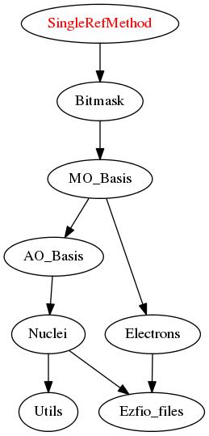

======================
SingleDetMethod Module
======================

Include this module for single reference methods.
Using this module, the only generator determinant is the Hartree-Fock determinant.

Documentation
=============

.. Do not edit this section. It was auto-generated from the
.. by the `update_README.py` script.

`n_det_generators <http://github.com/LCPQ/quantum_package/tree/master/src/SingleRefMethod/generators.irp.f#L3>`_
  For Single reference wave functions, the number of generators is 1 : the
  Hartree-Fock determinant

`psi_coef_generators <http://github.com/LCPQ/quantum_package/tree/master/src/SingleRefMethod/generators.irp.f#L13>`_
  For Single reference wave functions, the generator is the
  Hartree-Fock determinant

`psi_det_generators <http://github.com/LCPQ/quantum_package/tree/master/src/SingleRefMethod/generators.irp.f#L12>`_
  For Single reference wave functions, the generator is the
  Hartree-Fock determinant

`select_max <http://github.com/LCPQ/quantum_package/tree/master/src/SingleRefMethod/generators.irp.f#L41>`_
  Memo to skip useless selectors

`size_select_max <http://github.com/LCPQ/quantum_package/tree/master/src/SingleRefMethod/generators.irp.f#L49>`_
  Size of select_max

Needed Modules
==============

.. Do not edit this section. It was auto-generated from the
.. by the `update_README.py` script.

* `Bitmask <http://github.com/LCPQ/quantum_package/tree/master/src/Bitmask>`_

Needed Modules
==============
.. Do not edit this section It was auto-generated
.. by the `update_README.py` script.

* `Bitmask <http://github.com/LCPQ/quantum_package/tree/master/src/Bitmask>`_

Documentation
=============
.. Do not edit this section It was auto-generated
.. by the `update_README.py` script.

`n_det_generators <http://github.com/LCPQ/quantum_package/tree/master/plugins/SingleRefMethod/generators.irp.f#L3>`_
  For Single reference wave functions, the number of generators is 1 : the
  Hartree-Fock determinant

`psi_coef_generators <http://github.com/LCPQ/quantum_package/tree/master/plugins/SingleRefMethod/generators.irp.f#L13>`_
  For Single reference wave functions, the generator is the
  Hartree-Fock determinant

`psi_det_generators <http://github.com/LCPQ/quantum_package/tree/master/plugins/SingleRefMethod/generators.irp.f#L12>`_
  For Single reference wave functions, the generator is the
  Hartree-Fock determinant

`select_max <http://github.com/LCPQ/quantum_package/tree/master/plugins/SingleRefMethod/generators.irp.f#L41>`_
  Memo to skip useless selectors

`size_select_max <http://github.com/LCPQ/quantum_package/tree/master/plugins/SingleRefMethod/generators.irp.f#L49>`_
  Size of select_max

