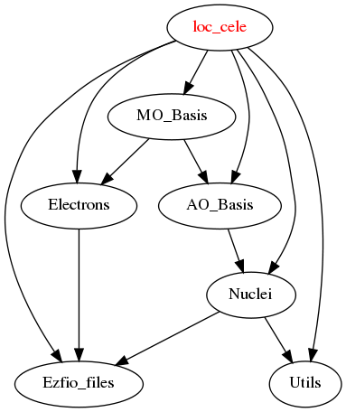

Documentation
=============

.. Do not edit this section. It was auto-generated from the
.. by the `update_README.py` script.

`loc_rasorb <http://github.com/LCPQ/quantum_package/tree/master/src/loc_cele/loc_cele.irp.f#L1>`_
  This program performs a localization of the active orbitals
  of a CASSCF wavefunction, reading the orbitals from a RASORB
  file of molcas.
  id1=max is the number of MO in a given symmetry.

Needed Modules
==============

.. Do not edit this section. It was auto-generated from the
.. by the `update_README.py` script.

* `MO_Basis <http://github.com/LCPQ/quantum_package/tree/master/src/MO_Basis>`_

Needed Modules
==============
.. Do not edit this section It was auto-generated
.. by the `update_README.py` script.

* `MO_Basis <http://github.com/LCPQ/quantum_package/tree/master/src/MO_Basis>`_

Documentation
=============
.. Do not edit this section It was auto-generated
.. by the `update_README.py` script.

`loc_rasorb <http://github.com/LCPQ/quantum_package/tree/master/plugins/loc_cele/loc_cele.irp.f#L1>`_
  This program performs a localization of the active orbitals
  of a CASSCF wavefunction, reading the orbitals from a RASORB
  file of molcas.
  id1=max is the number of MO in a given symmetry.

