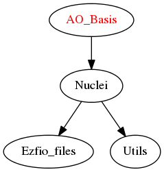

==========
AOs Module
==========

This module describes the atomic orbitals basis set.

An atomic orbital :math:`\chi` centered on nucleus A is represented as:

.. math::

   \chi_i({\bf r}) = (x-X_A)^a (y-Y_A)^b (z-Z_A)^c \sum_k c_{ki} e^{-\gamma_{ki} |{\bf r} - {\bf R}_A|^2}

The AO coefficients are normalized as:

.. math::

  {\tilde c}_{ki} = \frac{c_{ki}}{ \int \left( (x-X_A)^a (y-Y_A)^b (z-Z_A)^c  e^{-\gamma_{ki} |{\bf r} - {\bf R}_A|^2} \right)^2} dr

Warning: ``ao_coef`` contains the AO coefficients given in input. These do not
include the normalization constant of the AO. The ``ao_coef_normalized`` includes
this normalization factor.

The AOs are also sorted by increasing exponent to accelerate the calculation of
the two electron integrals.

Assumptions
===========

* The AO coefficients in the EZFIO files are not necessarily normalized and are normalized after reading

Needed Modules
==============

.. Do not edit this section It was auto-generated
.. by the `update_README.py` script.

* `Nuclei <http://github.com/LCPQ/quantum_package/tree/master/src/Nuclei>`_

Needed Modules
==============
.. Do not edit this section It was auto-generated
.. by the `update_README.py` script.

* `Nuclei <http://github.com/LCPQ/quantum_package/tree/master/src/Nuclei>`_

Documentation
=============
.. Do not edit this section It was auto-generated
.. by the `update_README.py` script.

`ao_cartesian <http://github.com/LCPQ/quantum_package/tree/master/src/AO_Basis/ezfio_interface.irp.f#L65>`_
  If true, use AOs in Cartesian coordinates (6d,10f,...)

`ao_coef <http://github.com/LCPQ/quantum_package/tree/master/src/AO_Basis/ezfio_interface.irp.f#L25>`_
  Primitive coefficients, read from input. Those should not be used directly, as the MOs are expressed on the basis of **normalized** AOs.

`ao_coef_normalization_factor <http://github.com/LCPQ/quantum_package/tree/master/src/AO_Basis/aos.irp.f#L23>`_
  Coefficients including the AO normalization

`ao_coef_normalization_libint_factor <http://github.com/LCPQ/quantum_package/tree/master/src/AO_Basis/aos.irp.f#L59>`_
  Coefficients including the AO normalization

`ao_coef_normalized <http://github.com/LCPQ/quantum_package/tree/master/src/AO_Basis/aos.irp.f#L22>`_
  Coefficients including the AO normalization

`ao_coef_normalized_ordered <http://github.com/LCPQ/quantum_package/tree/master/src/AO_Basis/aos.irp.f#L92>`_
  Sorted primitives to accelerate 4 index MO transformation

`ao_coef_normalized_ordered_transp <http://github.com/LCPQ/quantum_package/tree/master/src/AO_Basis/aos.irp.f#L118>`_
  Transposed ao_coef_normalized_ordered

`ao_expo <http://github.com/LCPQ/quantum_package/tree/master/src/AO_Basis/ezfio_interface.irp.f#L143>`_
  Exponents for each primitive of each AO

`ao_expo_ordered <http://github.com/LCPQ/quantum_package/tree/master/src/AO_Basis/aos.irp.f#L93>`_
  Sorted primitives to accelerate 4 index MO transformation

`ao_expo_ordered_transp <http://github.com/LCPQ/quantum_package/tree/master/src/AO_Basis/aos.irp.f#L132>`_
  Transposed ao_expo_ordered

`ao_l <http://github.com/LCPQ/quantum_package/tree/master/src/AO_Basis/aos.irp.f#L146>`_
  ao_l = l value of the AO: a+b+c in x^a y^b z^c

`ao_l_char <http://github.com/LCPQ/quantum_package/tree/master/src/AO_Basis/aos.irp.f#L148>`_
  ao_l = l value of the AO: a+b+c in x^a y^b z^c

`ao_l_char_space <http://github.com/LCPQ/quantum_package/tree/master/src/AO_Basis/aos.irp.f#L282>`_
  Undocumented

`ao_l_max <http://github.com/LCPQ/quantum_package/tree/master/src/AO_Basis/aos.irp.f#L147>`_
  ao_l = l value of the AO: a+b+c in x^a y^b z^c

`ao_md5 <http://github.com/LCPQ/quantum_package/tree/master/src/AO_Basis/ezfio_interface.irp.f#L6>`_
  MD5 key, specific of the AO basis

`ao_nucl <http://github.com/LCPQ/quantum_package/tree/master/src/AO_Basis/ezfio_interface.irp.f#L123>`_
  Index of the nucleus on which the AO is centered

`ao_num <http://github.com/LCPQ/quantum_package/tree/master/src/AO_Basis/ezfio_interface.irp.f#L84>`_
  number of AOs

`ao_num_align <http://github.com/LCPQ/quantum_package/tree/master/src/AO_Basis/aos.irp.f#L1>`_
  Number of atomic orbitals align

`ao_overlap <http://github.com/LCPQ/quantum_package/tree/master/src/AO_Basis/ao_overlap.irp.f#L1>`_
  Overlap between atomic basis functions:
  :math:`\int \chi_i(r) \chi_j(r) dr)`

`ao_overlap_abs <http://github.com/LCPQ/quantum_package/tree/master/src/AO_Basis/ao_overlap.irp.f#L75>`_
  Overlap between absolute value of atomic basis functions:
  :math:`\int |\chi_i(r)| |\chi_j(r)| dr)`

`ao_overlap_x <http://github.com/LCPQ/quantum_package/tree/master/src/AO_Basis/ao_overlap.irp.f#L2>`_
  Overlap between atomic basis functions:
  :math:`\int \chi_i(r) \chi_j(r) dr)`

`ao_overlap_y <http://github.com/LCPQ/quantum_package/tree/master/src/AO_Basis/ao_overlap.irp.f#L3>`_
  Overlap between atomic basis functions:
  :math:`\int \chi_i(r) \chi_j(r) dr)`

`ao_overlap_z <http://github.com/LCPQ/quantum_package/tree/master/src/AO_Basis/ao_overlap.irp.f#L4>`_
  Overlap between atomic basis functions:
  :math:`\int \chi_i(r) \chi_j(r) dr)`

`ao_power <http://github.com/LCPQ/quantum_package/tree/master/src/AO_Basis/ezfio_interface.irp.f#L45>`_
  Powers of x, y and z for each AO

`ao_power_index <http://github.com/LCPQ/quantum_package/tree/master/src/AO_Basis/aos.irp.f#L171>`_
  Unique index given to a triplet of powers:
  .br
  1/2 (l-n_x)*(l-n_x+1) + n_z + 1

`ao_prim_num <http://github.com/LCPQ/quantum_package/tree/master/src/AO_Basis/ezfio_interface.irp.f#L103>`_
  Number of primitives per atomic orbital

`ao_prim_num_max <http://github.com/LCPQ/quantum_package/tree/master/src/AO_Basis/aos.irp.f#L12>`_
  Undocumented

`ao_prim_num_max_align <http://github.com/LCPQ/quantum_package/tree/master/src/AO_Basis/aos.irp.f#L161>`_
  Number of primitives per atomic orbital aligned

`ao_value <http://github.com/LCPQ/quantum_package/tree/master/src/AO_Basis/aos_value.irp.f#L1>`_
  return the value of the ith ao at point r

`cart_to_sphe_0 <http://github.com/LCPQ/quantum_package/tree/master/src/AO_Basis/spherical_to_cartesian.irp.f#L7>`_
  Spherical -> Cartesian Transformation matrix for l=0

`cart_to_sphe_1 <http://github.com/LCPQ/quantum_package/tree/master/src/AO_Basis/spherical_to_cartesian.irp.f#L18>`_
  Spherical -> Cartesian Transformation matrix for l=1

`cart_to_sphe_2 <http://github.com/LCPQ/quantum_package/tree/master/src/AO_Basis/spherical_to_cartesian.irp.f#L31>`_
  Spherical -> Cartesian Transformation matrix for l=2

`cart_to_sphe_3 <http://github.com/LCPQ/quantum_package/tree/master/src/AO_Basis/spherical_to_cartesian.irp.f#L49>`_
  Spherical -> Cartesian Transformation matrix for l=3

`cart_to_sphe_4 <http://github.com/LCPQ/quantum_package/tree/master/src/AO_Basis/spherical_to_cartesian.irp.f#L75>`_
  Spherical -> Cartesian Transformation matrix for l=4

`cart_to_sphe_5 <http://github.com/LCPQ/quantum_package/tree/master/src/AO_Basis/spherical_to_cartesian.irp.f#L113>`_
  Spherical -> Cartesian Transformation matrix for l=5

`cart_to_sphe_6 <http://github.com/LCPQ/quantum_package/tree/master/src/AO_Basis/spherical_to_cartesian.irp.f#L169>`_
  Spherical -> Cartesian Transformation matrix for l=6

`cart_to_sphe_7 <http://github.com/LCPQ/quantum_package/tree/master/src/AO_Basis/spherical_to_cartesian.irp.f#L249>`_
  Spherical -> Cartesian Transformation matrix for l=7

`cart_to_sphe_8 <http://github.com/LCPQ/quantum_package/tree/master/src/AO_Basis/spherical_to_cartesian.irp.f#L361>`_
  Spherical -> Cartesian Transformation matrix for l=8

`cart_to_sphe_9 <http://github.com/LCPQ/quantum_package/tree/master/src/AO_Basis/spherical_to_cartesian.irp.f#L512>`_
  Spherical -> Cartesian Transformation matrix for l=9

`give_all_aos_at_r <http://github.com/LCPQ/quantum_package/tree/master/src/AO_Basis/aos_value.irp.f#L34>`_
  gives the values of aos at a given point r

`l_to_charater <http://github.com/LCPQ/quantum_package/tree/master/src/AO_Basis/aos.irp.f#L185>`_
  character corresponding to the "L" value of an AO orbital

`n_aos_max <http://github.com/LCPQ/quantum_package/tree/master/src/AO_Basis/aos.irp.f#L202>`_
  Number of AOs per atom

`n_pt_max_i_x <http://github.com/LCPQ/quantum_package/tree/master/src/AO_Basis/dimensions_integrals.irp.f#L2>`_
  Undocumented

`n_pt_max_integrals <http://github.com/LCPQ/quantum_package/tree/master/src/AO_Basis/dimensions_integrals.irp.f#L1>`_
  Undocumented

`nucl_aos <http://github.com/LCPQ/quantum_package/tree/master/src/AO_Basis/aos.irp.f#L215>`_
  List of AOs attached on each atom

`nucl_list_shell_aos <http://github.com/LCPQ/quantum_package/tree/master/src/AO_Basis/aos.irp.f#L233>`_
  Index of the shell type Aos and of the corresponding Aos
  Per convention, for P,D,F and G AOs, we take the index
  of the AO with the the corresponding power in the "X" axis

`nucl_n_aos <http://github.com/LCPQ/quantum_package/tree/master/src/AO_Basis/aos.irp.f#L201>`_
  Number of AOs per atom

`nucl_num_shell_aos <http://github.com/LCPQ/quantum_package/tree/master/src/AO_Basis/aos.irp.f#L234>`_
  Index of the shell type Aos and of the corresponding Aos
  Per convention, for P,D,F and G AOs, we take the index
  of the AO with the the corresponding power in the "X" axis

