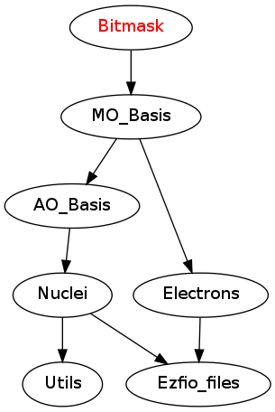

==============
Bitmask Module
==============

The central part of this module is the ``bitmasks_module.f90`` file. It contains
the constants that will be used to define on which kind of integer the bitmasks
will be defined.

In the program, when an integer ``X`` is used to represent a bit string (like a determinant
for example), it should be defined as, for example:

.. code-block:: fortran

  use bitmasks
  integer(bit_kind)  :: X

The ``bitmasks_routines.irp.f`` contains helper routines to manipulate bitmassk, like
transforming a bit string to a list of integers for example.

Assumptions
===========

.. Do not edit this section. It was auto-generated from the
.. NEEDED_MODULES_CHILDREN file by the `update_README.py` script.

``bit_kind_shift``, ``bit_kind_size`` and ``bit_kind`` are coherent:

.. code_block:: fortran

  2**bit_kind_shift = bit_kind_size
  bit_kind = bit_kind_size / 8

Needed Modules
==============

.. Do not edit this section It was auto-generated
.. by the `update_README.py` script.

* `MO_Basis <http://github.com/LCPQ/quantum_package/tree/master/src/MO_Basis>`_

Needed Modules
==============
.. Do not edit this section It was auto-generated
.. by the `update_README.py` script.

* `MO_Basis <http://github.com/LCPQ/quantum_package/tree/master/src/MO_Basis>`_

Documentation
=============
.. Do not edit this section It was auto-generated
.. by the `update_README.py` script.

`bitstring_to_hexa <http://github.com/LCPQ/quantum_package/tree/master/src/Bitmask/bitmasks_routines.irp.f#L98>`_
  Transform a bit string to a string in hexadecimal format for printing

`bitstring_to_list <http://github.com/LCPQ/quantum_package/tree/master/src/Bitmask/bitmasks_routines.irp.f#L1>`_
  Gives the inidices(+1) of the bits set to 1 in the bit string

`bitstring_to_str <http://github.com/LCPQ/quantum_package/tree/master/src/Bitmask/bitmasks_routines.irp.f#L65>`_
  Transform a bit string to a string for printing

`cas_bitmask <http://github.com/LCPQ/quantum_package/tree/master/src/Bitmask/bitmasks.irp.f#L307>`_
  Bitmasks for CAS reference determinants. (N_int, alpha/beta, CAS reference)

`closed_shell_ref_bitmask <http://github.com/LCPQ/quantum_package/tree/master/src/Bitmask/bitmasks.irp.f#L631>`_
  Undocumented

`core_bitmask <http://github.com/LCPQ/quantum_package/tree/master/src/Bitmask/bitmasks.irp.f#L558>`_
  Core + deleted orbitals bitmask

`core_inact_act_bitmask_4 <http://github.com/LCPQ/quantum_package/tree/master/src/Bitmask/bitmasks.irp.f#L46>`_
  Undocumented

`core_inact_virt_bitmask <http://github.com/LCPQ/quantum_package/tree/master/src/Bitmask/bitmasks.irp.f#L526>`_
  Reunion of the inactive and virtual bitmasks

`debug_det <http://github.com/LCPQ/quantum_package/tree/master/src/Bitmask/bitmasks_routines.irp.f#L120>`_
  Subroutine to print the content of a determinant in '+-' notation and
  hexadecimal representation.

`debug_spindet <http://github.com/LCPQ/quantum_package/tree/master/src/Bitmask/bitmasks_routines.irp.f#L155>`_
  Subroutine to print the content of a determinant in '+-' notation and
  hexadecimal representation.

`full_ijkl_bitmask <http://github.com/LCPQ/quantum_package/tree/master/src/Bitmask/bitmasks.irp.f#L18>`_
  Bitmask to include all possible MOs

`full_ijkl_bitmask_4 <http://github.com/LCPQ/quantum_package/tree/master/src/Bitmask/bitmasks.irp.f#L35>`_
  Undocumented

`generators_bitmask <http://github.com/LCPQ/quantum_package/tree/master/src/Bitmask/bitmasks.irp.f#L220>`_
  Bitmasks for generator determinants.
  (N_int, alpha/beta, hole/particle, generator).
  .br
  3rd index is :
  .br
  * 1 : hole     for single exc
  .br
  * 2 : particle for single exc
  .br
  * 3 : hole     for 1st exc of double
  .br
  * 4 : particle for 1st exc of double
  .br
  * 5 : hole     for 2nd exc of double
  .br
  * 6 : particle for 2nd exc of double
  .br

`generators_bitmask_restart <http://github.com/LCPQ/quantum_package/tree/master/src/Bitmask/bitmasks.irp.f#L161>`_
  Bitmasks for generator determinants.
  (N_int, alpha/beta, hole/particle, generator).
  .br
  3rd index is :
  .br
  * 1 : hole     for single exc
  .br
  * 2 : particle for single exc
  .br
  * 3 : hole     for 1st exc of double
  .br
  * 4 : particle for 1st exc of double
  .br
  * 5 : hole     for 2nd exc of double
  .br
  * 6 : particle for 2nd exc of double
  .br

`hf_bitmask <http://github.com/LCPQ/quantum_package/tree/master/src/Bitmask/bitmasks.irp.f#L71>`_
  Hartree Fock bit mask

`i_bitmask_gen <http://github.com/LCPQ/quantum_package/tree/master/src/Bitmask/bitmasks.irp.f#L575>`_
  Current bitmask for the generators

`inact_bitmask <http://github.com/LCPQ/quantum_package/tree/master/src/Bitmask/bitmasks.irp.f#L348>`_
  inact_bitmask : Bitmask of the inactive orbitals which are supposed to be doubly excited
  in post CAS methods
  n_inact_orb   : Number of inactive orbitals
  virt_bitmask  : Bitmaks of vritual orbitals which are supposed to be recieve electrons
  in post CAS methods
  n_virt_orb    : Number of virtual orbitals

`inact_virt_bitmask <http://github.com/LCPQ/quantum_package/tree/master/src/Bitmask/bitmasks.irp.f#L525>`_
  Reunion of the inactive and virtual bitmasks

`index_holes_bitmask <http://github.com/LCPQ/quantum_package/tree/master/src/Bitmask/modify_bitmasks.irp.f#L260>`_
  Index of the holes in the generators_bitmasks

`index_particl_bitmask <http://github.com/LCPQ/quantum_package/tree/master/src/Bitmask/modify_bitmasks.irp.f#L271>`_
  Index of the holes in the generators_bitmasks

`initialize_bitmask_to_restart_ones <http://github.com/LCPQ/quantum_package/tree/master/src/Bitmask/modify_bitmasks.irp.f#L3>`_
  Initialization of the generators_bitmask to the restart bitmask

`is_a_1h <http://github.com/LCPQ/quantum_package/tree/master/src/Bitmask/bitmask_cas_routines.irp.f#L499>`_
  Undocumented

`is_a_1h1p <http://github.com/LCPQ/quantum_package/tree/master/src/Bitmask/bitmask_cas_routines.irp.f#L466>`_
  Undocumented

`is_a_1h2p <http://github.com/LCPQ/quantum_package/tree/master/src/Bitmask/bitmask_cas_routines.irp.f#L477>`_
  Undocumented

`is_a_1p <http://github.com/LCPQ/quantum_package/tree/master/src/Bitmask/bitmask_cas_routines.irp.f#L510>`_
  Undocumented

`is_a_2h <http://github.com/LCPQ/quantum_package/tree/master/src/Bitmask/bitmask_cas_routines.irp.f#L532>`_
  Undocumented

`is_a_2h1p <http://github.com/LCPQ/quantum_package/tree/master/src/Bitmask/bitmask_cas_routines.irp.f#L488>`_
  Undocumented

`is_a_2p <http://github.com/LCPQ/quantum_package/tree/master/src/Bitmask/bitmask_cas_routines.irp.f#L521>`_
  Undocumented

`is_a_two_holes_two_particles <http://github.com/LCPQ/quantum_package/tree/master/src/Bitmask/bitmask_cas_routines.irp.f#L212>`_
  logical function that returns True if the determinant 'key_in'
  belongs to the 2h-2p excitation class of the DDCI space
  this is calculated using the CAS_bitmask that defines the active
  orbital space, the inact_bitmasl that defines the inactive oribital space
  and the virt_bitmask that defines the virtual orbital space

`is_i_in_virtual <http://github.com/LCPQ/quantum_package/tree/master/src/Bitmask/bitmask_cas_routines.irp.f#L543>`_
  Undocumented

`is_the_hole_in_det <http://github.com/LCPQ/quantum_package/tree/master/src/Bitmask/find_hole.irp.f#L1>`_
  Undocumented

`is_the_particl_in_det <http://github.com/LCPQ/quantum_package/tree/master/src/Bitmask/find_hole.irp.f#L29>`_
  Undocumented

`list_act <http://github.com/LCPQ/quantum_package/tree/master/src/Bitmask/bitmasks.irp.f#L609>`_
  list_act(i) = index of the ith active orbital
  .br
  list_act_reverse : reverse list of active orbitals
  list_act_reverse(i) = 0 ::> not an active
  list_act_reverse(i) = k ::> IS the kth active orbital

`list_act_reverse <http://github.com/LCPQ/quantum_package/tree/master/src/Bitmask/bitmasks.irp.f#L610>`_
  list_act(i) = index of the ith active orbital
  .br
  list_act_reverse : reverse list of active orbitals
  list_act_reverse(i) = 0 ::> not an active
  list_act_reverse(i) = k ::> IS the kth active orbital

`list_core <http://github.com/LCPQ/quantum_package/tree/master/src/Bitmask/bitmasks.irp.f#L540>`_
  List of the core orbitals that are never excited in post CAS method

`list_core_inact <http://github.com/LCPQ/quantum_package/tree/master/src/Bitmask/bitmasks.irp.f#L440>`_
  Undocumented

`list_core_inact_act <http://github.com/LCPQ/quantum_package/tree/master/src/Bitmask/bitmasks.irp.f#L495>`_
  Undocumented

`list_core_inact_act_reverse <http://github.com/LCPQ/quantum_package/tree/master/src/Bitmask/bitmasks.irp.f#L496>`_
  Undocumented

`list_core_inact_reverse <http://github.com/LCPQ/quantum_package/tree/master/src/Bitmask/bitmasks.irp.f#L441>`_
  Undocumented

`list_core_reverse <http://github.com/LCPQ/quantum_package/tree/master/src/Bitmask/bitmasks.irp.f#L541>`_
  List of the core orbitals that are never excited in post CAS method

`list_inact <http://github.com/LCPQ/quantum_package/tree/master/src/Bitmask/bitmasks.irp.f#L399>`_
  list_inact : List of the inactive orbitals which are supposed to be doubly excited
  in post CAS methods
  list_virt  : List of vritual orbitals which are supposed to be recieve electrons
  in post CAS methods
  list_inact_reverse : reverse list of inactive orbitals
  list_inact_reverse(i) = 0 ::> not an inactive
  list_inact_reverse(i) = k ::> IS the kth inactive
  list_virt_reverse : reverse list of virtual orbitals
  list_virt_reverse(i) = 0 ::> not an virtual
  list_virt_reverse(i) = k ::> IS the kth virtual

`list_inact_reverse <http://github.com/LCPQ/quantum_package/tree/master/src/Bitmask/bitmasks.irp.f#L401>`_
  list_inact : List of the inactive orbitals which are supposed to be doubly excited
  in post CAS methods
  list_virt  : List of vritual orbitals which are supposed to be recieve electrons
  in post CAS methods
  list_inact_reverse : reverse list of inactive orbitals
  list_inact_reverse(i) = 0 ::> not an inactive
  list_inact_reverse(i) = k ::> IS the kth inactive
  list_virt_reverse : reverse list of virtual orbitals
  list_virt_reverse(i) = 0 ::> not an virtual
  list_virt_reverse(i) = k ::> IS the kth virtual

`list_to_bitstring <http://github.com/LCPQ/quantum_package/tree/master/src/Bitmask/bitmasks_routines.irp.f#L29>`_
  Returns the physical string "string(N_int,2)" from the array of
  occupations "list(N_int*bit_kind_size,2)

`list_virt <http://github.com/LCPQ/quantum_package/tree/master/src/Bitmask/bitmasks.irp.f#L400>`_
  list_inact : List of the inactive orbitals which are supposed to be doubly excited
  in post CAS methods
  list_virt  : List of vritual orbitals which are supposed to be recieve electrons
  in post CAS methods
  list_inact_reverse : reverse list of inactive orbitals
  list_inact_reverse(i) = 0 ::> not an inactive
  list_inact_reverse(i) = k ::> IS the kth inactive
  list_virt_reverse : reverse list of virtual orbitals
  list_virt_reverse(i) = 0 ::> not an virtual
  list_virt_reverse(i) = k ::> IS the kth virtual

`list_virt_reverse <http://github.com/LCPQ/quantum_package/tree/master/src/Bitmask/bitmasks.irp.f#L402>`_
  list_inact : List of the inactive orbitals which are supposed to be doubly excited
  in post CAS methods
  list_virt  : List of vritual orbitals which are supposed to be recieve electrons
  in post CAS methods
  list_inact_reverse : reverse list of inactive orbitals
  list_inact_reverse(i) = 0 ::> not an inactive
  list_inact_reverse(i) = k ::> IS the kth inactive
  list_virt_reverse : reverse list of virtual orbitals
  list_virt_reverse(i) = 0 ::> not an virtual
  list_virt_reverse(i) = k ::> IS the kth virtual

`modify_bitmasks_for_hole <http://github.com/LCPQ/quantum_package/tree/master/src/Bitmask/modify_bitmasks.irp.f#L25>`_
  modify the generators_bitmask in order that one can only excite
  the electrons occupying i_hole

`modify_bitmasks_for_hole_in_out <http://github.com/LCPQ/quantum_package/tree/master/src/Bitmask/modify_bitmasks.irp.f#L60>`_
  modify the generators_bitmask in order that one can only excite
  the electrons occupying i_hole

`modify_bitmasks_for_particl <http://github.com/LCPQ/quantum_package/tree/master/src/Bitmask/modify_bitmasks.irp.f#L83>`_
  modify the generators_bitmask in order that one can only excite
  the electrons to the orbital i_part

`n_act_orb <http://github.com/LCPQ/quantum_package/tree/master/src/Bitmask/bitmasks.irp.f#L596>`_
  number of active orbitals

`n_cas_bitmask <http://github.com/LCPQ/quantum_package/tree/master/src/Bitmask/bitmasks.irp.f#L277>`_
  Number of bitmasks for CAS

`n_core_inact_act_orb <http://github.com/LCPQ/quantum_package/tree/master/src/Bitmask/bitmasks.irp.f#L481>`_
  Reunion of the core, inactive and active bitmasks

`n_core_inact_orb <http://github.com/LCPQ/quantum_package/tree/master/src/Bitmask/bitmasks.irp.f#L458>`_
  Undocumented

`n_core_orb <http://github.com/LCPQ/quantum_package/tree/master/src/Bitmask/bitmasks.irp.f#L559>`_
  Core + deleted orbitals bitmask

`n_core_orb_allocate <http://github.com/LCPQ/quantum_package/tree/master/src/Bitmask/bitmasks.irp.f#L654>`_
  Undocumented

`n_generators_bitmask <http://github.com/LCPQ/quantum_package/tree/master/src/Bitmask/bitmasks.irp.f#L97>`_
  Number of bitmasks for generators

`n_generators_bitmask_restart <http://github.com/LCPQ/quantum_package/tree/master/src/Bitmask/bitmasks.irp.f#L128>`_
  Number of bitmasks for generators

`n_inact_orb <http://github.com/LCPQ/quantum_package/tree/master/src/Bitmask/bitmasks.irp.f#L350>`_
  inact_bitmask : Bitmask of the inactive orbitals which are supposed to be doubly excited
  in post CAS methods
  n_inact_orb   : Number of inactive orbitals
  virt_bitmask  : Bitmaks of vritual orbitals which are supposed to be recieve electrons
  in post CAS methods
  n_virt_orb    : Number of virtual orbitals

`n_inact_orb_allocate <http://github.com/LCPQ/quantum_package/tree/master/src/Bitmask/bitmasks.irp.f#L659>`_
  Undocumented

`n_int <http://github.com/LCPQ/quantum_package/tree/master/src/Bitmask/bitmasks.irp.f#L3>`_
  Number of 64-bit integers needed to represent determinants as binary strings

`n_virt_orb <http://github.com/LCPQ/quantum_package/tree/master/src/Bitmask/bitmasks.irp.f#L351>`_
  inact_bitmask : Bitmask of the inactive orbitals which are supposed to be doubly excited
  in post CAS methods
  n_inact_orb   : Number of inactive orbitals
  virt_bitmask  : Bitmaks of vritual orbitals which are supposed to be recieve electrons
  in post CAS methods
  n_virt_orb    : Number of virtual orbitals

`n_virt_orb_allocate <http://github.com/LCPQ/quantum_package/tree/master/src/Bitmask/bitmasks.irp.f#L664>`_
  Undocumented

`number_of_holes <http://github.com/LCPQ/quantum_package/tree/master/src/Bitmask/bitmask_cas_routines.irp.f#L2>`_
  Function that returns the number of holes in the inact space

`number_of_holes_verbose <http://github.com/LCPQ/quantum_package/tree/master/src/Bitmask/bitmask_cas_routines.irp.f#L408>`_
  function that returns the number of holes in the inact space

`number_of_particles <http://github.com/LCPQ/quantum_package/tree/master/src/Bitmask/bitmask_cas_routines.irp.f#L107>`_
  function that returns the number of particles in the virtual space

`number_of_particles_verbose <http://github.com/LCPQ/quantum_package/tree/master/src/Bitmask/bitmask_cas_routines.irp.f#L438>`_
  function that returns the number of particles in the inact space

`print_det <http://github.com/LCPQ/quantum_package/tree/master/src/Bitmask/bitmasks_routines.irp.f#L138>`_
  Subroutine to print the content of a determinant using the '+-' notation

`print_generators_bitmasks_holes <http://github.com/LCPQ/quantum_package/tree/master/src/Bitmask/modify_bitmasks.irp.f#L169>`_
  Undocumented

`print_generators_bitmasks_holes_for_one_generator <http://github.com/LCPQ/quantum_package/tree/master/src/Bitmask/modify_bitmasks.irp.f#L213>`_
  Undocumented

`print_generators_bitmasks_particles <http://github.com/LCPQ/quantum_package/tree/master/src/Bitmask/modify_bitmasks.irp.f#L191>`_
  Undocumented

`print_generators_bitmasks_particles_for_one_generator <http://github.com/LCPQ/quantum_package/tree/master/src/Bitmask/modify_bitmasks.irp.f#L236>`_
  Undocumented

`print_spindet <http://github.com/LCPQ/quantum_package/tree/master/src/Bitmask/bitmasks_routines.irp.f#L171>`_
  Subroutine to print the content of a determinant using the '+-' notation

`ref_bitmask <http://github.com/LCPQ/quantum_package/tree/master/src/Bitmask/bitmasks.irp.f#L89>`_
  Reference bit mask, used in Slater rules, chosen as Hartree-Fock bitmask

`reunion_of_bitmask <http://github.com/LCPQ/quantum_package/tree/master/src/Bitmask/bitmasks.irp.f#L512>`_
  Reunion of the inactive, active and virtual bitmasks

`reunion_of_cas_inact_bitmask <http://github.com/LCPQ/quantum_package/tree/master/src/Bitmask/bitmasks.irp.f#L641>`_
  Reunion of the inactive, active and virtual bitmasks

`reunion_of_core_inact_act_bitmask <http://github.com/LCPQ/quantum_package/tree/master/src/Bitmask/bitmasks.irp.f#L480>`_
  Reunion of the core, inactive and active bitmasks

`reunion_of_core_inact_bitmask <http://github.com/LCPQ/quantum_package/tree/master/src/Bitmask/bitmasks.irp.f#L467>`_
  Reunion of the core and inactive and virtual bitmasks

`set_bitmask_hole_as_input <http://github.com/LCPQ/quantum_package/tree/master/src/Bitmask/modify_bitmasks.irp.f#L144>`_
  set the generators_bitmask for the holes
  as the input_bimask

`set_bitmask_particl_as_input <http://github.com/LCPQ/quantum_package/tree/master/src/Bitmask/modify_bitmasks.irp.f#L119>`_
  set the generators_bitmask for the particles
  as the input_bimask

`unpaired_alpha_electrons <http://github.com/LCPQ/quantum_package/tree/master/src/Bitmask/bitmasks.irp.f#L584>`_
  Bitmask reprenting the unpaired alpha electrons in the HF_bitmask

`virt_bitmask <http://github.com/LCPQ/quantum_package/tree/master/src/Bitmask/bitmasks.irp.f#L349>`_
  inact_bitmask : Bitmask of the inactive orbitals which are supposed to be doubly excited
  in post CAS methods
  n_inact_orb   : Number of inactive orbitals
  virt_bitmask  : Bitmaks of vritual orbitals which are supposed to be recieve electrons
  in post CAS methods
  n_virt_orb    : Number of virtual orbitals

`virt_bitmask_4 <http://github.com/LCPQ/quantum_package/tree/master/src/Bitmask/bitmasks.irp.f#L57>`_
  Undocumented

