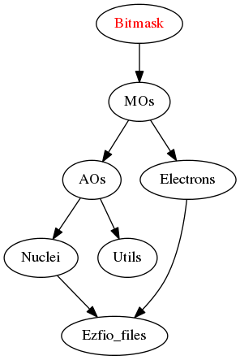

==============
Bitmask Module
==============

The central part of this module is the ``bitmasks_module.f90`` file. It contains
the constants that will be used to define on which kind of integer the bitmasks
will be defined.

In the program, when an integer ``X`` is used to represent a bit string (like a determinant
for example), it should be defined as, for example:

.. code-block:: fortran

  use bitmasks
  integer(bit_kind)  :: X

The ``bitmasks_routines.irp.f`` contains helper routines to manipulate bitmassk, like
transforming a bit string to a list of integers for example.

Assumptions
===========

.. Do not edit this section. It was auto-generated from the
.. NEEDED_MODULES file.

``bit_kind_shift``, ``bit_kind_size`` and ``bit_kind`` are coherent:

.. code_block:: fortran

  2**bit_kind_shift = bit_kind_size
  bit_kind = bit_kind_size / 8

Needed Modules
==============

.. Do not edit this section. It was auto-generated from the
.. NEEDED_MODULES file.

* `MOs <http://github.com/LCPQ/quantum_package/tree/master/src/MOs>`_

Documentation
=============

.. Do not edit this section. It was auto-generated from the
.. NEEDED_MODULES file.

`is_a_two_holes_two_particles <http://github.com/LCPQ/quantum_package/tree/master/src/Bitmask/bitmask_cas_routines.irp.f#L206>`_
  Undocumented

`number_of_holes <http://github.com/LCPQ/quantum_package/tree/master/src/Bitmask/bitmask_cas_routines.irp.f#L1>`_
  Undocumented

`number_of_holes_verbose <http://github.com/LCPQ/quantum_package/tree/master/src/Bitmask/bitmask_cas_routines.irp.f#L394>`_
  Undocumented

`number_of_particles <http://github.com/LCPQ/quantum_package/tree/master/src/Bitmask/bitmask_cas_routines.irp.f#L103>`_
  Undocumented

`number_of_particles_verbose <http://github.com/LCPQ/quantum_package/tree/master/src/Bitmask/bitmask_cas_routines.irp.f#L422>`_
  Undocumented

`cas_bitmask <http://github.com/LCPQ/quantum_package/tree/master/src/Bitmask/bitmasks.irp.f#L173>`_
  Bitmasks for CAS reference determinants. (N_int, alpha/beta, CAS reference)

`cis_ijkl_bitmask <http://github.com/LCPQ/quantum_package/tree/master/src/Bitmask/bitmasks.irp.f#L32>`_
  Bitmask to include all possible single excitations from Hartree-Fock

`full_ijkl_bitmask <http://github.com/LCPQ/quantum_package/tree/master/src/Bitmask/bitmasks.irp.f#L12>`_
  Bitmask to include all possible MOs

`generators_bitmask <http://github.com/LCPQ/quantum_package/tree/master/src/Bitmask/bitmasks.irp.f#L100>`_
  Bitmasks for generator determinants.
  (N_int, alpha/beta, hole/particle, generator).
  .br
  3rd index is :
  .br
  * 1 : hole     for single exc
  .br
  * 2 : particle for single exc
  .br
  * 3 : hole     for 1st exc of double
  .br
  * 4 : particle for 1st exc of double
  .br
  * 5 : hole     for 2nd exc of double
  .br
  * 6 : particle for 2nd exc of double
  .br

`hf_bitmask <http://github.com/LCPQ/quantum_package/tree/master/src/Bitmask/bitmasks.irp.f#L44>`_
  Hartree Fock bit mask

`i_bitmask_gen <http://github.com/LCPQ/quantum_package/tree/master/src/Bitmask/bitmasks.irp.f#L211>`_
  Current bitmask for the generators

`inact_bitmask <http://github.com/LCPQ/quantum_package/tree/master/src/Bitmask/bitmasks.irp.f#L193>`_
  Bitmasks for the inactive orbitals that are excited in post CAS method

`n_cas_bitmask <http://github.com/LCPQ/quantum_package/tree/master/src/Bitmask/bitmasks.irp.f#L143>`_
  Number of bitmasks for CAS

`n_generators_bitmask <http://github.com/LCPQ/quantum_package/tree/master/src/Bitmask/bitmasks.irp.f#L70>`_
  Number of bitmasks for generators

`n_int <http://github.com/LCPQ/quantum_package/tree/master/src/Bitmask/bitmasks.irp.f#L3>`_
  Number of 64-bit integers needed to represent determinants as binary strings

`ref_bitmask <http://github.com/LCPQ/quantum_package/tree/master/src/Bitmask/bitmasks.irp.f#L62>`_
  Reference bit mask, used in Slater rules, chosen as Hartree-Fock bitmask

`virt_bitmask <http://github.com/LCPQ/quantum_package/tree/master/src/Bitmask/bitmasks.irp.f#L194>`_
  Bitmasks for the inactive orbitals that are excited in post CAS method

`bitstring_to_hexa <http://github.com/LCPQ/quantum_package/tree/master/src/Bitmask/bitmasks_routines.irp.f#L98>`_
  Transform a bit string to a string in hexadecimal format for printing

`bitstring_to_list <http://github.com/LCPQ/quantum_package/tree/master/src/Bitmask/bitmasks_routines.irp.f#L1>`_
  Gives the inidices(+1) of the bits set to 1 in the bit string

`bitstring_to_str <http://github.com/LCPQ/quantum_package/tree/master/src/Bitmask/bitmasks_routines.irp.f#L65>`_
  Transform a bit string to a string for printing

`debug_det <http://github.com/LCPQ/quantum_package/tree/master/src/Bitmask/bitmasks_routines.irp.f#L120>`_
  Subroutine to print the content of a determinant in '+-' notation and
  hexadecimal representation.

`debug_spindet <http://github.com/LCPQ/quantum_package/tree/master/src/Bitmask/bitmasks_routines.irp.f#L155>`_
  Subroutine to print the content of a determinant in '+-' notation and
  hexadecimal representation.

`list_to_bitstring <http://github.com/LCPQ/quantum_package/tree/master/src/Bitmask/bitmasks_routines.irp.f#L29>`_
  Returns the physical string "string(N_int,2)" from the array of
  occupations "list(N_int*bit_kind_size,2)

`print_det <http://github.com/LCPQ/quantum_package/tree/master/src/Bitmask/bitmasks_routines.irp.f#L138>`_
  Subroutine to print the content of a determinant using the '+-' notation

`print_spindet <http://github.com/LCPQ/quantum_package/tree/master/src/Bitmask/bitmasks_routines.irp.f#L171>`_
  Subroutine to print the content of a determinant using the '+-' notation

