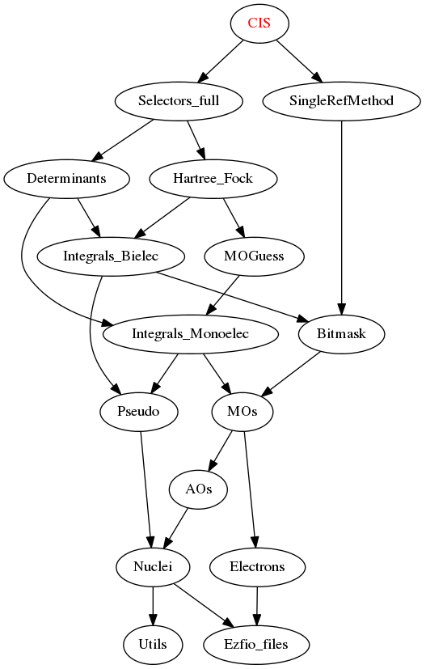

==========
CIS Module
==========

Assumptions
===========

.. Do not edit this section. It was auto-generated from the
.. NEEDED_MODULES_CHILDREN file by the `update_README.py` script.

* The molecular orbitals are assumed orthonormal

Documentation
=============

.. Do not edit this section. It was auto-generated from the
.. NEEDED_MODULES_CHILDREN file by the `update_README.py` script.

`cis <http://github.com/LCPQ/quantum_package/tree/master/src/CIS/super_ci.irp.f#L1>`_
  Undocumented

`super_ci <http://github.com/LCPQ/quantum_package/tree/master/src/CIS/super_ci.irp.f#L9>`_
  Undocumented

Needed Modules
==============

.. Do not edit this section. It was auto-generated from the
.. NEEDED_MODULES_CHILDREN file by the `update_README.py` script.

* `Selectors_full <http://github.com/LCPQ/quantum_package/tree/master/src/Selectors_full>`_
* `SingleRefMethod <http://github.com/LCPQ/quantum_package/tree/master/src/SingleRefMethod>`_

