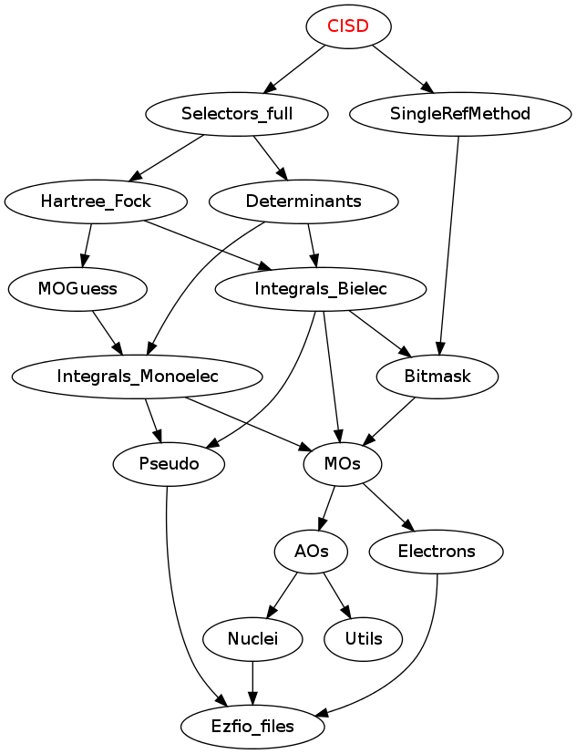

CISD
====

This is a test directory which builds a CISD by setting the follwoing rules:

* The only generator determinant is the Hartee-Fock (single-reference method)
* All generated determinants are included in the wave function (no perturbative
  selection)

These rules are set in the ``H_apply.irp.f`` file.

Needed Modules
==============

.. Do not edit this section. It was auto-generated from the
.. NEEDED_MODULES_CHILDREN file by the `update_README.py` script.

* `Selectors_full <http://github.com/LCPQ/quantum_package/tree/master/src/Selectors_full>`_
* `SingleRefMethod <http://github.com/LCPQ/quantum_package/tree/master/src/SingleRefMethod>`_

Documentation
=============

.. Do not edit this section. It was auto-generated from the
.. NEEDED_MODULES_CHILDREN file by the `update_README.py` script.

`cisd <http://github.com/LCPQ/quantum_package/tree/master/src/CISD/cisd_lapack.irp.f#L1>`_
  Undocumented

