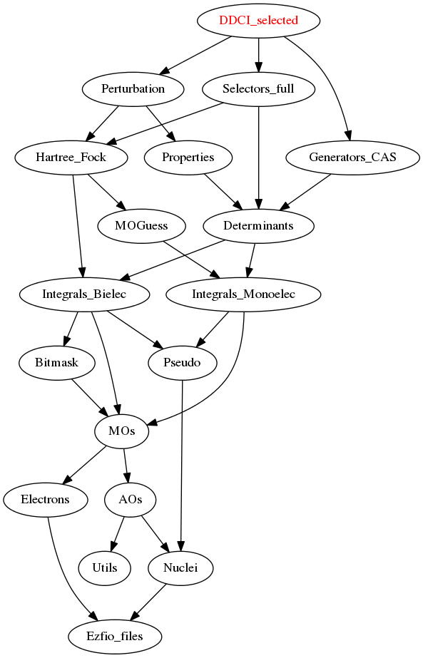

====================
DDCI_selected Module
====================

Documentation
=============

.. Do not edit this section. It was auto-generated from the
.. NEEDED_MODULES_CHILDREN file by the `update_README.py` script.

`full_ci <http://github.com/LCPQ/quantum_package/tree/master/src/DDCI_selected/ddci.irp.f#L1>`_
  Undocumented

Needed Modules
==============

.. Do not edit this section. It was auto-generated from the
.. NEEDED_MODULES_CHILDREN file by the `update_README.py` script.

* `Perturbation <http://github.com/LCPQ/quantum_package/tree/master/src/Perturbation>`_
* `Selectors_full <http://github.com/LCPQ/quantum_package/tree/master/src/Selectors_full>`_
* `Generators_CAS <http://github.com/LCPQ/quantum_package/tree/master/src/Generators_CAS>`_

