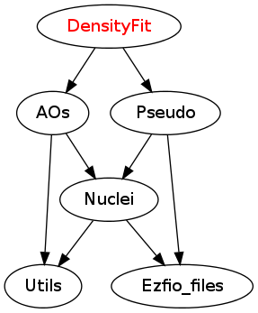

=================
DensityFit Module
=================

In this module, the basis of all the products of atomic orbitals is built.

Documentation
=============

.. Do not edit this section. It was auto-generated from the
.. NEEDED_MODULES file.

Needed Modules
==============

.. Do not edit this section. It was auto-generated from the
.. NEEDED_MODULES file.

* `AOs <http://github.com/LCPQ/quantum_package/tree/master/src/AOs>`_

