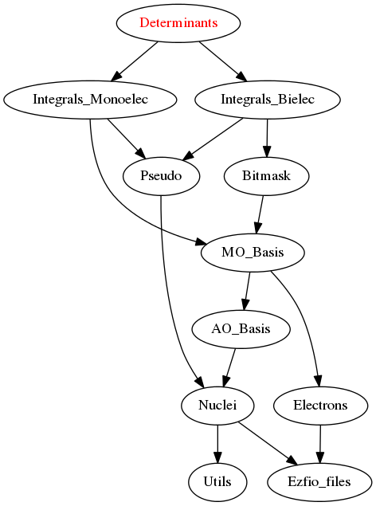

Needed Modules
==============
.. Do not edit this section It was auto-generated
.. by the `update_README.py` script.

* `Integrals_Monoelec <http://github.com/LCPQ/quantum_package/tree/master/src/Integrals_Monoelec>`_
* `Integrals_Bielec <http://github.com/LCPQ/quantum_package/tree/master/src/Integrals_Bielec>`_

Documentation
=============
.. Do not edit this section It was auto-generated
.. by the `update_README.py` script.

`a_operator <http://github.com/LCPQ/quantum_package/tree/master/src/Determinants/slater_rules.irp.f#L1923>`_
  Needed for diag_H_mat_elem

`abs_psi_coef_max <http://github.com/LCPQ/quantum_package/tree/master/src/Determinants/determinants.irp.f#L438>`_
  Max and min values of the coefficients

`abs_psi_coef_min <http://github.com/LCPQ/quantum_package/tree/master/src/Determinants/determinants.irp.f#L439>`_
  Max and min values of the coefficients

`ac_operator <http://github.com/LCPQ/quantum_package/tree/master/src/Determinants/slater_rules.irp.f#L1969>`_
  Needed for diag_H_mat_elem

`add_values_to_two_body_dm_map <http://github.com/LCPQ/quantum_package/tree/master/src/Determinants/two_body_dm_map.irp.f#L96>`_
  Adds values to the map of two_body_dm according to some bitmask

`apply_excitation <http://github.com/LCPQ/quantum_package/tree/master/src/Determinants/determinants.irp.f#L758>`_
  Undocumented

`apply_hole <http://github.com/LCPQ/quantum_package/tree/master/src/Determinants/determinants.irp.f#L936>`_
  Undocumented

`apply_holes <http://github.com/LCPQ/quantum_package/tree/master/src/Determinants/determinants.irp.f#L886>`_
  Undocumented

`apply_mono <http://github.com/LCPQ/quantum_package/tree/master/src/Determinants/excitations_utils.irp.f#L1>`_
  Undocumented

`apply_particle <http://github.com/LCPQ/quantum_package/tree/master/src/Determinants/determinants.irp.f#L914>`_
  Undocumented

`apply_particles <http://github.com/LCPQ/quantum_package/tree/master/src/Determinants/determinants.irp.f#L857>`_
  Undocumented

`au0_h_au0 <http://github.com/LCPQ/quantum_package/tree/master/src/Determinants/mo_energy_expval.irp.f#L78>`_
  Undocumented

`bi_elec_ref_bitmask_energy <http://github.com/LCPQ/quantum_package/tree/master/src/Determinants/ref_bitmask.irp.f#L5>`_
  Energy of the reference bitmask used in Slater rules

`bitstring_to_list_ab <http://github.com/LCPQ/quantum_package/tree/master/src/Determinants/slater_rules.irp.f#L394>`_
  Gives the inidices(+1) of the bits set to 1 in the bit string
  For alpha/beta determinants

`bitstring_to_list_ab_old <http://github.com/LCPQ/quantum_package/tree/master/src/Determinants/slater_rules.irp.f#L432>`_
  Gives the inidices(+1) of the bits set to 1 in the bit string
  For alpha/beta determinants

`build_fock_tmp <http://github.com/LCPQ/quantum_package/tree/master/src/Determinants/Fock_diag.irp.f#L1>`_
  Build the diagonal of the Fock matrix corresponding to a generator
  determinant. F_00 is <i|H|i> = E0.

`clear_bit_to_integer <http://github.com/LCPQ/quantum_package/tree/master/src/Determinants/create_excitations.irp.f#L118>`_
  Undocumented

`compute_diag_two_body_dm_ab <http://github.com/LCPQ/quantum_package/tree/master/src/Determinants/two_body_dm_map.irp.f#L612>`_
  Undocumented

`compute_diag_two_body_dm_ab_act <http://github.com/LCPQ/quantum_package/tree/master/src/Determinants/two_body_dm_map.irp.f#L564>`_
  Undocumented

`compute_diag_two_body_dm_ab_core <http://github.com/LCPQ/quantum_package/tree/master/src/Determinants/two_body_dm_map.irp.f#L542>`_
  Undocumented

`compute_diag_two_body_dm_ab_core_act <http://github.com/LCPQ/quantum_package/tree/master/src/Determinants/two_body_dm_map.irp.f#L584>`_
  Undocumented

`compute_extra_diag_two_body_dm_ab <http://github.com/LCPQ/quantum_package/tree/master/src/Determinants/two_body_dm_map.irp.f#L468>`_
  compute the extra diagonal contribution to the alpha/bet two body density at r1, r2

`compute_extra_diag_two_body_dm_ab_act <http://github.com/LCPQ/quantum_package/tree/master/src/Determinants/two_body_dm_map.irp.f#L478>`_
  compute the extra diagonal contribution to the two body density at r1, r2
  involving ONLY THE ACTIVE PART, which means that the four index of the excitations
  involved in the two body density matrix are ACTIVE

`compute_extra_diag_two_body_dm_ab_core_act <http://github.com/LCPQ/quantum_package/tree/master/src/Determinants/two_body_dm_map.irp.f#L508>`_
  compute the extra diagonal contribution to the two body density at r1, r2
  involving ONLY THE ACTIVE PART, which means that the four index of the excitations
  involved in the two body density matrix are ACTIVE

`connected_to_ref <http://github.com/LCPQ/quantum_package/tree/master/src/Determinants/connected_to_ref.irp.f#L245>`_
  Undocumented

`connected_to_ref_by_mono <http://github.com/LCPQ/quantum_package/tree/master/src/Determinants/connected_to_ref.irp.f#L345>`_
  Undocumented

`copy_h_apply_buffer_to_wf <http://github.com/LCPQ/quantum_package/tree/master/src/Determinants/H_apply.irp.f#L113>`_
  Copies the H_apply buffer to psi_coef.
  After calling this subroutine, N_det, psi_det and psi_coef need to be touched

`copy_psi_bilinear_to_psi <http://github.com/LCPQ/quantum_package/tree/master/src/Determinants/spindeterminants.irp.f#L826>`_
  Overwrites psi_det and psi_coef with the wf in bilinear order

`create_microlist <http://github.com/LCPQ/quantum_package/tree/master/src/Determinants/filter_connected.irp.f#L229>`_
  Undocumented

`create_minilist <http://github.com/LCPQ/quantum_package/tree/master/src/Determinants/slater_rules.irp.f#L864>`_
  Undocumented

`create_minilist_find_previous <http://github.com/LCPQ/quantum_package/tree/master/src/Determinants/slater_rules.irp.f#L926>`_
  Undocumented

`create_wf_of_psi_bilinear_matrix <http://github.com/LCPQ/quantum_package/tree/master/src/Determinants/spindeterminants.irp.f#L615>`_
  Generate a wave function containing all possible products
  of alpha and beta determinants

`decode_exc <http://github.com/LCPQ/quantum_package/tree/master/src/Determinants/slater_rules.irp.f#L106>`_
  Decodes the exc arrays returned by get_excitation.
  h1,h2 : Holes
  p1,p2 : Particles
  s1,s2 : Spins (1:alpha, 2:beta)
  degree : Degree of excitation

`decode_exc_spin <http://github.com/LCPQ/quantum_package/tree/master/src/Determinants/slater_rules.irp.f#L2288>`_
  Decodes the exc arrays returned by get_excitation.
  h1,h2 : Holes
  p1,p2 : Particles

`det_alpha_norm <http://github.com/LCPQ/quantum_package/tree/master/src/Determinants/spindeterminants.irp.f#L351>`_
  Norm of the alpha and beta spin determinants in the wave function:
  .br
  ||Da||_i \sum_j C_{ij}**2

`det_beta_norm <http://github.com/LCPQ/quantum_package/tree/master/src/Determinants/spindeterminants.irp.f#L352>`_
  Norm of the alpha and beta spin determinants in the wave function:
  .br
  ||Da||_i \sum_j C_{ij}**2

`det_coef <http://github.com/LCPQ/quantum_package/tree/master/src/Determinants/ezfio_interface.irp.f#L139>`_
  det_coef

`det_occ <http://github.com/LCPQ/quantum_package/tree/master/src/Determinants/ezfio_interface.irp.f#L216>`_
  det_occ

`det_search_key <http://github.com/LCPQ/quantum_package/tree/master/src/Determinants/connected_to_ref.irp.f#L1>`_
  Return an integer*8 corresponding to a determinant index for searching

`det_to_occ_pattern <http://github.com/LCPQ/quantum_package/tree/master/src/Determinants/occ_pattern.irp.f#L2>`_
  Transform a determinant to an occupation pattern

`detcmp <http://github.com/LCPQ/quantum_package/tree/master/src/Determinants/determinants.irp.f#L734>`_
  Undocumented

`deteq <http://github.com/LCPQ/quantum_package/tree/master/src/Determinants/determinants.irp.f#L717>`_
  Undocumented

`diag_algorithm <http://github.com/LCPQ/quantum_package/tree/master/src/Determinants/determinants.irp.f#L3>`_
  Diagonalization algorithm (Davidson or Lapack)

`diag_h_mat_elem <http://github.com/LCPQ/quantum_package/tree/master/src/Determinants/slater_rules.irp.f#L1861>`_
  Computes <i|H|i>

`diag_h_mat_elem_au0_h_au0 <http://github.com/LCPQ/quantum_package/tree/master/src/Determinants/mo_energy_expval.irp.f#L112>`_
  Computes <i|H|i> for any determinant i. Used for wave functions with an additional electron.

`diag_h_mat_elem_fock <http://github.com/LCPQ/quantum_package/tree/master/src/Determinants/slater_rules.irp.f#L1792>`_
  Computes <i|H|i> when i is at most a double excitation from
  a reference.

`diag_s_mat_elem <http://github.com/LCPQ/quantum_package/tree/master/src/Determinants/s2.irp.f#L1>`_
  Returns <i|S^2|i>

`diagonalize_s2_betweenstates <http://github.com/LCPQ/quantum_package/tree/master/src/Determinants/s2.irp.f#L331>`_
  You enter with nstates vectors in u_0 that may be coupled by S^2
  The subroutine diagonalize the S^2 operator in the basis of these states.
  The vectors that you obtain in output are no more coupled by S^2,
  which does not necessary mean that they are eigenfunction of S^2.
  n,nmax,nstates = number of determinants, physical dimension of the arrays and number of states
  keys_tmp = array of integer(bit_kind) that represents the determinants
  psi_coefs(i,j) = coeff of the ith determinant in the jth state
  VECTORS ARE SUPPOSED TO BE ORTHONORMAL IN INPUT

`do_mono_excitation <http://github.com/LCPQ/quantum_package/tree/master/src/Determinants/create_excitations.irp.f#L1>`_
  Apply the mono excitation operator : a^{dager}_(i_particle) a_(i_hole) of spin = ispin
  on key_in
  ispin = 1  == alpha
  ispin = 2  == beta
  i_ok = 1  == the excitation is possible
  i_ok = -1 == the excitation is not possible

`do_spin_flip <http://github.com/LCPQ/quantum_package/tree/master/src/Determinants/create_excitations.irp.f#L40>`_
  flip the spin ispin in the orbital i_flip
  on key_in
  ispin = 1  == alpha
  ispin = 2  == beta
  i_ok = 1  == the flip is possible
  i_ok = -1 == the flip is not possible

`double_exc_bitmask <http://github.com/LCPQ/quantum_package/tree/master/src/Determinants/determinants_bitmasks.irp.f#L40>`_
  double_exc_bitmask(:,1,i) is the bitmask for holes of excitation 1
  double_exc_bitmask(:,2,i) is the bitmask for particles of excitation 1
  double_exc_bitmask(:,3,i) is the bitmask for holes of excitation 2
  double_exc_bitmask(:,4,i) is the bitmask for particles of excitation 2
  for a given couple of hole/particle excitations i.

`doubly_occ_empty_in_couple <http://github.com/LCPQ/quantum_package/tree/master/src/Determinants/useful_for_ovb.irp.f#L44>`_
  n_couples is the number of couples of orbitals to be checked
  couples(i,1) = first orbital of the ith couple
  couples(i,2) = second orbital of the ith couple
  returns the array couples_out
  couples_out(i) = .True. if det_in contains
  an orbital empty in the ith couple  AND
  an orbital doubly occupied in the ith couple

`doubly_occ_empty_in_couple_and_no_hund_elsewhere <http://github.com/LCPQ/quantum_package/tree/master/src/Determinants/useful_for_ovb.irp.f#L138>`_
  n_couples is the number of couples of orbitals to be checked
  couples(i,1) = first orbital of the ith couple
  couples(i,2) = second orbital of the ith couple
  returns the array couples_out
  couples_out(i) = .True. if det_in contains
  an orbital empty in the ith couple  AND
  an orbital doubly occupied in the ith couple

`expected_s2 <http://github.com/LCPQ/quantum_package/tree/master/src/Determinants/s2.irp.f#L78>`_
  Expected value of S2 : S*(S+1)

`fill_h_apply_buffer_no_selection <http://github.com/LCPQ/quantum_package/tree/master/src/Determinants/H_apply.irp.f#L275>`_
  Fill the H_apply buffer with determiants for CISD

`filter_connected <http://github.com/LCPQ/quantum_package/tree/master/src/Determinants/filter_connected.irp.f#L100>`_
  Filters out the determinants that are not connected by H
  .br
  returns the array idx which contains the index of the
  .br
  determinants in the array key1 that interact
  .br
  via the H operator with key2.
  .br
  idx(0) is the number of determinants that interact with key1

`filter_connected_i_h_psi0 <http://github.com/LCPQ/quantum_package/tree/master/src/Determinants/filter_connected.irp.f#L333>`_
  returns the array idx which contains the index of the
  .br
  determinants in the array key1 that interact
  .br
  via the H operator with key2.
  .br
  idx(0) is the number of determinants that interact with key1

`filter_connected_i_h_psi0_sc2 <http://github.com/LCPQ/quantum_package/tree/master/src/Determinants/filter_connected.irp.f#L427>`_
  standard filter_connected_i_H_psi but returns in addition
  .br
  the array of the index of the non connected determinants to key1
  .br
  in order to know what double excitation can be repeated on key1
  .br
  idx_repeat(0) is the number of determinants that can be used
  .br
  to repeat the excitations

`filter_not_connected <http://github.com/LCPQ/quantum_package/tree/master/src/Determinants/filter_connected.irp.f#L2>`_
  Returns the array idx which contains the index of the
  .br
  determinants in the array key1 that DO NOT interact
  .br
  via the H operator with key2.
  .br
  idx(0) is the number of determinants that DO NOT interact with key1

`flip_generators <http://github.com/LCPQ/quantum_package/tree/master/src/Determinants/determinants.irp.f#L361>`_
  Undocumented

`fock_operator_closed_shell_ref_bitmask <http://github.com/LCPQ/quantum_package/tree/master/src/Determinants/mono_excitations.irp.f#L22>`_
  Undocumented

`generate_all_alpha_beta_det_products <http://github.com/LCPQ/quantum_package/tree/master/src/Determinants/spindeterminants.irp.f#L683>`_
  Create a wave function from all possible alpha x beta determinants

`get_all_spin_doubles <http://github.com/LCPQ/quantum_package/tree/master/src/Determinants/spindeterminants.irp.f#L792>`_
  .br
  Returns the indices of all the double excitations in the list of
  unique alpha determinants.
  .br

`get_all_spin_doubles_1 <http://github.com/LCPQ/quantum_package/tree/master/src/Determinants/spindeterminants.irp.f#L994>`_
  .br
  Returns the indices of all the double excitations in the list of
  unique alpha determinants.
  .br

`get_all_spin_doubles_2 <http://github.com/LCPQ/quantum_package/tree/master/src/Determinants/spindeterminants.irp.f_template_1204#L121>`_
  .br
  Returns the indices of all the double excitations in the list of
  unique alpha determinants.
  .br

`get_all_spin_doubles_3 <http://github.com/LCPQ/quantum_package/tree/master/src/Determinants/spindeterminants.irp.f_template_1204#L293>`_
  .br
  Returns the indices of all the double excitations in the list of
  unique alpha determinants.
  .br

`get_all_spin_doubles_4 <http://github.com/LCPQ/quantum_package/tree/master/src/Determinants/spindeterminants.irp.f_template_1204#L465>`_
  .br
  Returns the indices of all the double excitations in the list of
  unique alpha determinants.
  .br

`get_all_spin_doubles_n_int <http://github.com/LCPQ/quantum_package/tree/master/src/Determinants/spindeterminants.irp.f_template_1204#L637>`_
  .br
  Returns the indices of all the double excitations in the list of
  unique alpha determinants.
  .br

`get_all_spin_singles <http://github.com/LCPQ/quantum_package/tree/master/src/Determinants/spindeterminants.irp.f#L760>`_
  .br
  Returns the indices of all the single excitations in the list of
  unique alpha determinants.
  .br

`get_all_spin_singles_1 <http://github.com/LCPQ/quantum_package/tree/master/src/Determinants/spindeterminants.irp.f#L963>`_
  .br
  Returns the indices of all the single excitations in the list of
  unique alpha determinants.
  .br

`get_all_spin_singles_2 <http://github.com/LCPQ/quantum_package/tree/master/src/Determinants/spindeterminants.irp.f_template_1204#L66>`_
  .br
  Returns the indices of all the single excitations in the list of
  unique alpha determinants.
  .br

`get_all_spin_singles_3 <http://github.com/LCPQ/quantum_package/tree/master/src/Determinants/spindeterminants.irp.f_template_1204#L238>`_
  .br
  Returns the indices of all the single excitations in the list of
  unique alpha determinants.
  .br

`get_all_spin_singles_4 <http://github.com/LCPQ/quantum_package/tree/master/src/Determinants/spindeterminants.irp.f_template_1204#L410>`_
  .br
  Returns the indices of all the single excitations in the list of
  unique alpha determinants.
  .br

`get_all_spin_singles_and_doubles <http://github.com/LCPQ/quantum_package/tree/master/src/Determinants/spindeterminants.irp.f#L725>`_
  .br
  Returns the indices of all the single and double excitations in the list of
  unique alpha determinants.
  .br
  /!\ : The buffer is transposed !
  .br

`get_all_spin_singles_and_doubles_1 <http://github.com/LCPQ/quantum_package/tree/master/src/Determinants/spindeterminants.irp.f#L919>`_
  .br
  Returns the indices of all the single and double excitations in the list of
  unique alpha determinants.
  .br
  /!\ : The buffer is transposed !
  .br

`get_all_spin_singles_and_doubles_2 <http://github.com/LCPQ/quantum_package/tree/master/src/Determinants/spindeterminants.irp.f_template_1204#L3>`_
  .br
  Returns the indices of all the single and double excitations in the list of
  unique alpha determinants.
  .br
  /!\ : The buffer is transposed !
  .br

`get_all_spin_singles_and_doubles_3 <http://github.com/LCPQ/quantum_package/tree/master/src/Determinants/spindeterminants.irp.f_template_1204#L175>`_
  .br
  Returns the indices of all the single and double excitations in the list of
  unique alpha determinants.
  .br
  /!\ : The buffer is transposed !
  .br

`get_all_spin_singles_and_doubles_4 <http://github.com/LCPQ/quantum_package/tree/master/src/Determinants/spindeterminants.irp.f_template_1204#L347>`_
  .br
  Returns the indices of all the single and double excitations in the list of
  unique alpha determinants.
  .br
  /!\ : The buffer is transposed !
  .br

`get_all_spin_singles_and_doubles_n_int <http://github.com/LCPQ/quantum_package/tree/master/src/Determinants/spindeterminants.irp.f_template_1204#L519>`_
  .br
  Returns the indices of all the single and double excitations in the list of
  unique alpha determinants.
  .br
  /!\ : The buffer is transposed !
  .br

`get_all_spin_singles_n_int <http://github.com/LCPQ/quantum_package/tree/master/src/Determinants/spindeterminants.irp.f_template_1204#L582>`_
  .br
  Returns the indices of all the single excitations in the list of
  unique alpha determinants.
  .br

`get_double_excitation <http://github.com/LCPQ/quantum_package/tree/master/src/Determinants/slater_rules.irp.f#L172>`_
  Returns the two excitation operators between two doubly excited determinants and the phase

`get_double_excitation_phase <http://github.com/LCPQ/quantum_package/tree/master/src/Determinants/slater_rules.irp.f#L2033>`_
  Undocumented

`get_double_excitation_spin <http://github.com/LCPQ/quantum_package/tree/master/src/Determinants/slater_rules.irp.f#L2319>`_
  Returns the two excitation operators between two doubly excited spin-determinants
  and the phase

`get_excitation <http://github.com/LCPQ/quantum_package/tree/master/src/Determinants/slater_rules.irp.f#L60>`_
  Returns the excitation operators between two determinants and the phase

`get_excitation_degree <http://github.com/LCPQ/quantum_package/tree/master/src/Determinants/slater_rules.irp.f#L1>`_
  Returns the excitation degree between two determinants

`get_excitation_degree_spin <http://github.com/LCPQ/quantum_package/tree/master/src/Determinants/slater_rules.irp.f#L2191>`_
  Returns the excitation degree between two determinants

`get_excitation_degree_vector <http://github.com/LCPQ/quantum_package/tree/master/src/Determinants/slater_rules.irp.f#L1702>`_
  Applies get_excitation_degree to an array of determinants

`get_excitation_degree_vector_double_alpha_beta <http://github.com/LCPQ/quantum_package/tree/master/src/Determinants/slater_rules.irp.f#L1420>`_
  Applies get_excitation_degree to an array of determinants and return only the mono excitations
  and the connections through exchange integrals

`get_excitation_degree_vector_mono <http://github.com/LCPQ/quantum_package/tree/master/src/Determinants/slater_rules.irp.f#L1270>`_
  Applies get_excitation_degree to an array of determinants and return only the mono excitations

`get_excitation_degree_vector_mono_or_exchange <http://github.com/LCPQ/quantum_package/tree/master/src/Determinants/slater_rules.irp.f#L1362>`_
  Applies get_excitation_degree to an array of determinants and return only the mono excitations
  and the connections through exchange integrals

`get_excitation_degree_vector_mono_or_exchange_verbose <http://github.com/LCPQ/quantum_package/tree/master/src/Determinants/slater_rules.irp.f#L1530>`_
  Applies get_excitation_degree to an array of determinants and return only the mono excitations
  and the connections through exchange integrals

`get_excitation_spin <http://github.com/LCPQ/quantum_package/tree/master/src/Determinants/slater_rules.irp.f#L2245>`_
  Returns the excitation operators between two determinants and the phase

`get_get_two_body_dm_ab_map_elements <http://github.com/LCPQ/quantum_package/tree/master/src/Determinants/two_body_dm_map.irp.f#L54>`_
  Returns multiple elements of the \rho_{ijkl}^{\alpha \beta }, all
  i for j,k,l fixed.

`get_index_in_psi_det_alpha_unique <http://github.com/LCPQ/quantum_package/tree/master/src/Determinants/spindeterminants.irp.f#L141>`_
  Returns the index of the determinant in the ``psi_det_alpha_unique`` array

`get_index_in_psi_det_beta_unique <http://github.com/LCPQ/quantum_package/tree/master/src/Determinants/spindeterminants.irp.f#L222>`_
  Returns the index of the determinant in the ``psi_det_beta_unique`` array

`get_index_in_psi_det_sorted_bit <http://github.com/LCPQ/quantum_package/tree/master/src/Determinants/connected_to_ref.irp.f#L50>`_
  Returns the index of the determinant in the ``psi_det_sorted_bit`` array

`get_mono_excitation <http://github.com/LCPQ/quantum_package/tree/master/src/Determinants/slater_rules.irp.f#L311>`_
  Returns the excitation operator between two singly excited determinants and the phase

`get_mono_excitation_from_fock <http://github.com/LCPQ/quantum_package/tree/master/src/Determinants/mono_excitations.irp.f#L97>`_
  Undocumented

`get_mono_excitation_spin <http://github.com/LCPQ/quantum_package/tree/master/src/Determinants/slater_rules.irp.f#L2449>`_
  Returns the excitation operator between two singly excited determinants and the phase

`get_occ_from_key <http://github.com/LCPQ/quantum_package/tree/master/src/Determinants/slater_rules.irp.f#L2016>`_
  Returns a list of occupation numbers from a bitstring

`get_phase <http://github.com/LCPQ/quantum_package/tree/master/src/Determinants/slater_rules.irp.f#L2130>`_
  Returns the phase between key1 and key2

`get_s2 <http://github.com/LCPQ/quantum_package/tree/master/src/Determinants/s2.irp.f#L33>`_
  Returns <S^2>

`get_two_body_dm_ab_map_element <http://github.com/LCPQ/quantum_package/tree/master/src/Determinants/two_body_dm_map.irp.f#L33>`_
  Returns one value of the wo body density matrix \rho_{ijkl}^{\alpha \beta} defined as :
  \rho_{ijkl}^{\alpha \beta  } = <\Psi|a^{\dagger}_{i\alpha} a^{\dagger}_{j\beta} a_{k\beta} a_{l\alpha}|\Psi>

`get_uj_s2_ui <http://github.com/LCPQ/quantum_package/tree/master/src/Determinants/s2.irp.f#L282>`_
  returns the matrix elements of S^2 "s2(i,j)" between the "nstates" states
  psi_coefs_tmp(:,i) and psi_coefs_tmp(:,j)

`getmobiles <http://github.com/LCPQ/quantum_package/tree/master/src/Determinants/filter_connected.irp.f#L199>`_
  Undocumented

`give_index_of_doubly_occ_in_active_space <http://github.com/LCPQ/quantum_package/tree/master/src/Determinants/useful_for_ovb.irp.f#L100>`_
  Undocumented

`h_apply_buffer_allocated <http://github.com/LCPQ/quantum_package/tree/master/src/Determinants/H_apply.irp.f#L15>`_
  Buffer of determinants/coefficients/perturbative energy for H_apply.
  Uninitialized. Filled by H_apply subroutines.

`h_apply_buffer_lock <http://github.com/LCPQ/quantum_package/tree/master/src/Determinants/H_apply.irp.f#L16>`_
  Buffer of determinants/coefficients/perturbative energy for H_apply.
  Uninitialized. Filled by H_apply subroutines.

`h_matrix_all_dets <http://github.com/LCPQ/quantum_package/tree/master/src/Determinants/utils.irp.f#L1>`_
  H matrix on the basis of the slater determinants defined by psi_det

`h_matrix_cas <http://github.com/LCPQ/quantum_package/tree/master/src/Determinants/psi_cas.irp.f#L115>`_
  Undocumented

`h_u_0_stored <http://github.com/LCPQ/quantum_package/tree/master/src/Determinants/slater_rules.irp.f#L2145>`_
  Computes v_0 = H|u_0>
  .br
  n : number of determinants
  .br
  uses the big_matrix_stored array

`i_h_j <http://github.com/LCPQ/quantum_package/tree/master/src/Determinants/slater_rules.irp.f#L470>`_
  Returns <i|H|j> where i and j are determinants

`i_h_j_double_alpha_beta <http://github.com/LCPQ/quantum_package/tree/master/src/Determinants/slater_rules.irp.f#L2573>`_
  Returns <i|H|j> where i and j are determinants differing by an opposite-spin double excitation

`i_h_j_double_spin <http://github.com/LCPQ/quantum_package/tree/master/src/Determinants/slater_rules.irp.f#L2544>`_
  Returns <i|H|j> where i and j are determinants differing by a same-spin double excitation

`i_h_j_mono_spin <http://github.com/LCPQ/quantum_package/tree/master/src/Determinants/slater_rules.irp.f#L2525>`_
  Returns <i|H|j> where i and j are determinants differing by a single excitation

`i_h_j_phase_out <http://github.com/LCPQ/quantum_package/tree/master/src/Determinants/slater_rules.irp.f#L566>`_
  Returns <i|H|j> where i and j are determinants

`i_h_j_verbose <http://github.com/LCPQ/quantum_package/tree/master/src/Determinants/slater_rules.irp.f#L702>`_
  Returns <i|H|j> where i and j are determinants

`i_h_psi <http://github.com/LCPQ/quantum_package/tree/master/src/Determinants/slater_rules.irp.f#L1002>`_
  Computes <i|H|Psi> = \sum_J c_J <i|H|J>.
  .br
  Uses filter_connected_i_H_psi0 to get all the |J> to which |i>
  is connected.
  The i_H_psi_minilist is much faster but requires to build the
  minilists

`i_h_psi_minilist <http://github.com/LCPQ/quantum_package/tree/master/src/Determinants/slater_rules.irp.f#L1060>`_
  Computes <i|H|Psi> = \sum_J c_J <i|H|J>.
  .br
  Uses filter_connected_i_H_psi0 to get all the |J> to which |i>
  is connected. The |J> are searched in short pre-computed lists.

`i_h_psi_sc2 <http://github.com/LCPQ/quantum_package/tree/master/src/Determinants/slater_rules.irp.f#L1167>`_
  <key|H|psi> for the various Nstate
  .br
  returns in addition
  .br
  the array of the index of the non connected determinants to key1
  .br
  in order to know what double excitation can be repeated on key1
  .br
  idx_repeat(0) is the number of determinants that can be used
  .br
  to repeat the excitations

`i_h_psi_sc2_verbose <http://github.com/LCPQ/quantum_package/tree/master/src/Determinants/slater_rules.irp.f#L1215>`_
  <key|H|psi> for the various Nstate
  .br
  returns in addition
  .br
  the array of the index of the non connected determinants to key1
  .br
  in order to know what double excitation can be repeated on key1
  .br
  idx_repeat(0) is the number of determinants that can be used
  .br
  to repeat the excitations

`i_h_psi_sec_ord <http://github.com/LCPQ/quantum_package/tree/master/src/Determinants/slater_rules.irp.f#L1118>`_
  <key|H|psi> for the various Nstates

`i_s2_psi_minilist <http://github.com/LCPQ/quantum_package/tree/master/src/Determinants/s2.irp.f#L450>`_
  Computes <i|S2|Psi> = \sum_J c_J <i|S2|J>.
  .br
  Uses filter_connected_i_H_psi0 to get all the |J> to which |i>
  is connected. The |J> are searched in short pre-computed lists.

`idx_cas <http://github.com/LCPQ/quantum_package/tree/master/src/Determinants/psi_cas.irp.f#L5>`_
  CAS wave function, defined from the application of the CAS bitmask on the
  determinants. idx_cas gives the indice of the CAS determinant in psi_det.

`idx_non_cas <http://github.com/LCPQ/quantum_package/tree/master/src/Determinants/psi_cas.irp.f#L65>`_
  Set of determinants which are not part of the CAS, defined from the application
  of the CAS bitmask on the determinants.
  idx_non_cas gives the indice of the determinant in psi_det.

`insert_into_two_body_dm_ab_map <http://github.com/LCPQ/quantum_package/tree/master/src/Determinants/two_body_dm_map.irp.f#L18>`_
  Create new entry into two_body_dm_ab_map, or accumulate in an existing entry

`insert_into_two_body_dm_big_array <http://github.com/LCPQ/quantum_package/tree/master/src/Determinants/two_body_dm_map.irp.f#L452>`_
  Undocumented

`is_connected_to <http://github.com/LCPQ/quantum_package/tree/master/src/Determinants/connected_to_ref.irp.f#L157>`_
  Undocumented

`is_connected_to_by_mono <http://github.com/LCPQ/quantum_package/tree/master/src/Determinants/connected_to_ref.irp.f#L212>`_
  Undocumented

`is_generable_cassd <http://github.com/LCPQ/quantum_package/tree/master/src/Determinants/connected_to_ref.irp.f#L191>`_
  Undocumented

`is_in_wavefunction <http://github.com/LCPQ/quantum_package/tree/master/src/Determinants/connected_to_ref.irp.f#L36>`_
  True if the determinant ``det`` is in the wave function

`is_spin_flip_possible <http://github.com/LCPQ/quantum_package/tree/master/src/Determinants/create_excitations.irp.f#L76>`_
  returns .True. if the spin-flip of spin ispin in the orbital i_flip is possible
  on key_in

`kinetic_ref_bitmask_energy <http://github.com/LCPQ/quantum_package/tree/master/src/Determinants/ref_bitmask.irp.f#L3>`_
  Energy of the reference bitmask used in Slater rules

`make_s2_eigenfunction <http://github.com/LCPQ/quantum_package/tree/master/src/Determinants/occ_pattern.irp.f#L246>`_
  Undocumented

`max_degree_exc <http://github.com/LCPQ/quantum_package/tree/master/src/Determinants/determinants.irp.f#L50>`_
  Maximum degree of excitation in the wf

`mo_energy_expval <http://github.com/LCPQ/quantum_package/tree/master/src/Determinants/mo_energy_expval.irp.f#L1>`_
  Third index is spin.
  Fourth index is 1:creation, 2:annihilation

`mono_elec_ref_bitmask_energy <http://github.com/LCPQ/quantum_package/tree/master/src/Determinants/ref_bitmask.irp.f#L2>`_
  Energy of the reference bitmask used in Slater rules

`n_closed_shell <http://github.com/LCPQ/quantum_package/tree/master/src/Determinants/useful_for_ovb.irp.f#L14>`_
  Undocumented

`n_closed_shell_cas <http://github.com/LCPQ/quantum_package/tree/master/src/Determinants/useful_for_ovb.irp.f#L26>`_
  Undocumented

`n_det <http://github.com/LCPQ/quantum_package/tree/master/src/Determinants/determinants.irp.f#L20>`_
  Number of determinants in the wave function

`n_det_alpha_unique <http://github.com/LCPQ/quantum_package/tree/master/src/Determinants/spindeterminants.irp.f_template_136#L4>`_
  Unique alpha determinants

`n_det_beta_unique <http://github.com/LCPQ/quantum_package/tree/master/src/Determinants/spindeterminants.irp.f_template_136#L80>`_
  Unique beta determinants

`n_det_cas <http://github.com/LCPQ/quantum_package/tree/master/src/Determinants/psi_cas.irp.f#L6>`_
  CAS wave function, defined from the application of the CAS bitmask on the
  determinants. idx_cas gives the indice of the CAS determinant in psi_det.

`n_det_max <http://github.com/LCPQ/quantum_package/tree/master/src/Determinants/ezfio_interface.irp.f#L63>`_
  Max number of determinants in the wave function

`n_det_max_jacobi <http://github.com/LCPQ/quantum_package/tree/master/src/Determinants/ezfio_interface.irp.f#L101>`_
  Maximum number of determinants diagonalized by Jacobi

`n_det_max_property <http://github.com/LCPQ/quantum_package/tree/master/src/Determinants/ezfio_interface.irp.f#L274>`_
  Max number of determinants in the wave function when you select for a given property

`n_det_max_stored <http://github.com/LCPQ/quantum_package/tree/master/src/Determinants/ezfio_interface.irp.f#L44>`_
  Maximum number of determinants for which the full H matrix is stored. Be careful, the memory requested scales as 10*n_det_max_stored**2. For instance, 90000 determinants represent a matrix of size 60 Gb.

`n_det_non_cas <http://github.com/LCPQ/quantum_package/tree/master/src/Determinants/psi_cas.irp.f#L66>`_
  Set of determinants which are not part of the CAS, defined from the application
  of the CAS bitmask on the determinants.
  idx_non_cas gives the indice of the determinant in psi_det.

`n_double_exc_bitmasks <http://github.com/LCPQ/quantum_package/tree/master/src/Determinants/determinants_bitmasks.irp.f#L31>`_
  Number of double excitation bitmasks

`n_occ_pattern <http://github.com/LCPQ/quantum_package/tree/master/src/Determinants/occ_pattern.irp.f#L136>`_
  array of the occ_pattern present in the wf
  psi_occ_pattern(:,1,j) = jth occ_pattern of the wave function : represent all the single occupations
  psi_occ_pattern(:,2,j) = jth occ_pattern of the wave function : represent all the double occupations

`n_open_shell <http://github.com/LCPQ/quantum_package/tree/master/src/Determinants/useful_for_ovb.irp.f#L2>`_
  Undocumented

`n_single_exc_bitmasks <http://github.com/LCPQ/quantum_package/tree/master/src/Determinants/determinants_bitmasks.irp.f#L8>`_
  Number of single excitation bitmasks

`n_states <http://github.com/LCPQ/quantum_package/tree/master/src/Determinants/ezfio_interface.irp.f#L82>`_
  Number of states to consider

`neutral_no_hund_in_couple <http://github.com/LCPQ/quantum_package/tree/master/src/Determinants/useful_for_ovb.irp.f#L223>`_
  n_couples is the number of couples of orbitals to be checked
  couples(i,1) = first orbital of the ith couple
  couples(i,2) = second orbital of the ith couple
  returns the array couples_out
  couples_out(i) = .True. if det_in contains
  an orbital empty in the ith couple  AND
  an orbital doubly occupied in the ith couple

`nucl_elec_ref_bitmask_energy <http://github.com/LCPQ/quantum_package/tree/master/src/Determinants/ref_bitmask.irp.f#L4>`_
  Energy of the reference bitmask used in Slater rules

`occ_pattern_search_key <http://github.com/LCPQ/quantum_package/tree/master/src/Determinants/connected_to_ref.irp.f#L18>`_
  Return an integer*8 corresponding to a determinant index for searching

`occ_pattern_to_dets <http://github.com/LCPQ/quantum_package/tree/master/src/Determinants/occ_pattern.irp.f#L43>`_
  Generate all possible determinants for a give occ_pattern

`occ_pattern_to_dets_size <http://github.com/LCPQ/quantum_package/tree/master/src/Determinants/occ_pattern.irp.f#L20>`_
  Number of possible determinants for a given occ_pattern

`one_body_dm_ao_alpha <http://github.com/LCPQ/quantum_package/tree/master/src/Determinants/density_matrix.irp.f#L337>`_
  one body density matrix on the AO basis : rho_AO(alpha) , rho_AO(beta)

`one_body_dm_ao_alpha_no_align <http://github.com/LCPQ/quantum_package/tree/master/src/Determinants/density_matrix.irp.f#L339>`_
  one body density matrix on the AO basis : rho_AO(alpha) , rho_AO(beta)

`one_body_dm_ao_beta <http://github.com/LCPQ/quantum_package/tree/master/src/Determinants/density_matrix.irp.f#L338>`_
  one body density matrix on the AO basis : rho_AO(alpha) , rho_AO(beta)

`one_body_dm_ao_beta_no_align <http://github.com/LCPQ/quantum_package/tree/master/src/Determinants/density_matrix.irp.f#L340>`_
  one body density matrix on the AO basis : rho_AO(alpha) , rho_AO(beta)

`one_body_dm_dagger_mo_spin_index <http://github.com/LCPQ/quantum_package/tree/master/src/Determinants/density_matrix.irp.f#L42>`_
  Undocumented

`one_body_dm_mo <http://github.com/LCPQ/quantum_package/tree/master/src/Determinants/density_matrix.irp.f#L265>`_
  One-body density matrix

`one_body_dm_mo_alpha <http://github.com/LCPQ/quantum_package/tree/master/src/Determinants/density_matrix.irp.f#L69>`_
  Alpha and beta one-body density matrix for each state

`one_body_dm_mo_alpha_average <http://github.com/LCPQ/quantum_package/tree/master/src/Determinants/density_matrix.irp.f#L1>`_
  Alpha and beta one-body density matrix for each state

`one_body_dm_mo_alpha_old <http://github.com/LCPQ/quantum_package/tree/master/src/Determinants/density_matrix.irp.f#L373>`_
  Alpha and beta one-body density matrix for each state

`one_body_dm_mo_beta <http://github.com/LCPQ/quantum_package/tree/master/src/Determinants/density_matrix.irp.f#L70>`_
  Alpha and beta one-body density matrix for each state

`one_body_dm_mo_beta_average <http://github.com/LCPQ/quantum_package/tree/master/src/Determinants/density_matrix.irp.f#L2>`_
  Alpha and beta one-body density matrix for each state

`one_body_dm_mo_beta_old <http://github.com/LCPQ/quantum_package/tree/master/src/Determinants/density_matrix.irp.f#L374>`_
  Alpha and beta one-body density matrix for each state

`one_body_dm_mo_spin_index <http://github.com/LCPQ/quantum_package/tree/master/src/Determinants/density_matrix.irp.f#L18>`_
  Undocumented

`one_body_single_double_dm_mo_alpha <http://github.com/LCPQ/quantum_package/tree/master/src/Determinants/density_matrix.irp.f#L182>`_
  Alpha and beta one-body density matrix for each state

`one_body_single_double_dm_mo_beta <http://github.com/LCPQ/quantum_package/tree/master/src/Determinants/density_matrix.irp.f#L183>`_
  Alpha and beta one-body density matrix for each state

`one_body_spin_density_ao <http://github.com/LCPQ/quantum_package/tree/master/src/Determinants/density_matrix.irp.f#L313>`_
  one body spin density matrix on the AO basis : rho_AO(alpha) - rho_AO(beta)

`one_body_spin_density_mo <http://github.com/LCPQ/quantum_package/tree/master/src/Determinants/density_matrix.irp.f#L273>`_
  rho(alpha) - rho(beta)

`only_single_double_dm <http://github.com/LCPQ/quantum_package/tree/master/src/Determinants/ezfio_interface.irp.f#L178>`_
  If true, The One body DM is calculated with ignoring the Double<->Doubles extra diag elements

`print_bitmask <http://github.com/LCPQ/quantum_package/tree/master/src/Determinants/print_bitmask.irp.f#L1>`_
  Undocumented

`printwf <http://github.com/LCPQ/quantum_package/tree/master/src/Determinants/print_wf.irp.f#L1>`_
  Undocumented

`psi_average_norm_contrib <http://github.com/LCPQ/quantum_package/tree/master/src/Determinants/determinants.irp.f#L292>`_
  Contribution of determinants to the state-averaged density

`psi_average_norm_contrib_sorted <http://github.com/LCPQ/quantum_package/tree/master/src/Determinants/determinants.irp.f#L326>`_
  Wave function sorted by determinants contribution to the norm (state-averaged)
  .br
  psi_det_sorted_order(i) -> k : index in psi_det

`psi_bilinear_matrix <http://github.com/LCPQ/quantum_package/tree/master/src/Determinants/spindeterminants.irp.f#L598>`_
  Coefficient matrix if the wave function is expressed in a bilinear form :
  D_a^t C D_b

`psi_bilinear_matrix_columns <http://github.com/LCPQ/quantum_package/tree/master/src/Determinants/spindeterminants.irp.f#L388>`_
  Sparse coefficient matrix if the wave function is expressed in a bilinear form :
  D_a^t C D_b
  .br
  Rows are alpha determinants and columns are beta.
  .br
  Order refers to psi_det

`psi_bilinear_matrix_columns_loc <http://github.com/LCPQ/quantum_package/tree/master/src/Determinants/spindeterminants.irp.f#L464>`_
  Sparse coefficient matrix if the wave function is expressed in a bilinear form :
  D_a^t C D_b
  .br
  Rows are alpha determinants and columns are beta.
  .br
  Order refers to psi_det

`psi_bilinear_matrix_order <http://github.com/LCPQ/quantum_package/tree/master/src/Determinants/spindeterminants.irp.f#L389>`_
  Sparse coefficient matrix if the wave function is expressed in a bilinear form :
  D_a^t C D_b
  .br
  Rows are alpha determinants and columns are beta.
  .br
  Order refers to psi_det

`psi_bilinear_matrix_order_reverse <http://github.com/LCPQ/quantum_package/tree/master/src/Determinants/spindeterminants.irp.f#L447>`_
  Order which allows to go from psi_bilinear_matrix to psi_det

`psi_bilinear_matrix_order_transp_reverse <http://github.com/LCPQ/quantum_package/tree/master/src/Determinants/spindeterminants.irp.f#L579>`_
  Order which allows to go from psi_bilinear_matrix_order_transp to psi_bilinear_matrix

`psi_bilinear_matrix_rows <http://github.com/LCPQ/quantum_package/tree/master/src/Determinants/spindeterminants.irp.f#L387>`_
  Sparse coefficient matrix if the wave function is expressed in a bilinear form :
  D_a^t C D_b
  .br
  Rows are alpha determinants and columns are beta.
  .br
  Order refers to psi_det

`psi_bilinear_matrix_transp_columns <http://github.com/LCPQ/quantum_package/tree/master/src/Determinants/spindeterminants.irp.f#L497>`_
  Transpose of psi_bilinear_matrix
  D_b^t C^t D_a
  .br
  Rows are Alpha determinants and columns are beta, but the matrix is stored in row major
  format

`psi_bilinear_matrix_transp_order <http://github.com/LCPQ/quantum_package/tree/master/src/Determinants/spindeterminants.irp.f#L498>`_
  Transpose of psi_bilinear_matrix
  D_b^t C^t D_a
  .br
  Rows are Alpha determinants and columns are beta, but the matrix is stored in row major
  format

`psi_bilinear_matrix_transp_rows <http://github.com/LCPQ/quantum_package/tree/master/src/Determinants/spindeterminants.irp.f#L496>`_
  Transpose of psi_bilinear_matrix
  D_b^t C^t D_a
  .br
  Rows are Alpha determinants and columns are beta, but the matrix is stored in row major
  format

`psi_bilinear_matrix_transp_rows_loc <http://github.com/LCPQ/quantum_package/tree/master/src/Determinants/spindeterminants.irp.f#L556>`_
  Location of the columns in the psi_bilinear_matrix

`psi_bilinear_matrix_transp_values <http://github.com/LCPQ/quantum_package/tree/master/src/Determinants/spindeterminants.irp.f#L495>`_
  Transpose of psi_bilinear_matrix
  D_b^t C^t D_a
  .br
  Rows are Alpha determinants and columns are beta, but the matrix is stored in row major
  format

`psi_bilinear_matrix_values <http://github.com/LCPQ/quantum_package/tree/master/src/Determinants/spindeterminants.irp.f#L386>`_
  Sparse coefficient matrix if the wave function is expressed in a bilinear form :
  D_a^t C D_b
  .br
  Rows are alpha determinants and columns are beta.
  .br
  Order refers to psi_det

`psi_cas <http://github.com/LCPQ/quantum_package/tree/master/src/Determinants/psi_cas.irp.f#L3>`_
  CAS wave function, defined from the application of the CAS bitmask on the
  determinants. idx_cas gives the indice of the CAS determinant in psi_det.

`psi_cas_coef <http://github.com/LCPQ/quantum_package/tree/master/src/Determinants/psi_cas.irp.f#L4>`_
  CAS wave function, defined from the application of the CAS bitmask on the
  determinants. idx_cas gives the indice of the CAS determinant in psi_det.

`psi_cas_coef_sorted_bit <http://github.com/LCPQ/quantum_package/tree/master/src/Determinants/psi_cas.irp.f#L50>`_
  CAS determinants sorted to accelerate the search of a random determinant in the wave
  function.

`psi_cas_energy <http://github.com/LCPQ/quantum_package/tree/master/src/Determinants/psi_cas.irp.f#L146>`_
  Undocumented

`psi_cas_energy_diagonalized <http://github.com/LCPQ/quantum_package/tree/master/src/Determinants/psi_cas.irp.f#L128>`_
  Undocumented

`psi_cas_sorted_bit <http://github.com/LCPQ/quantum_package/tree/master/src/Determinants/psi_cas.irp.f#L49>`_
  CAS determinants sorted to accelerate the search of a random determinant in the wave
  function.

`psi_coef <http://github.com/LCPQ/quantum_package/tree/master/src/Determinants/determinants.irp.f#L246>`_
  The wave function coefficients. Initialized with Hartree-Fock if the EZFIO file
  is empty

`psi_coef_cas_diagonalized <http://github.com/LCPQ/quantum_package/tree/master/src/Determinants/psi_cas.irp.f#L127>`_
  Undocumented

`psi_coef_max <http://github.com/LCPQ/quantum_package/tree/master/src/Determinants/determinants.irp.f#L436>`_
  Max and min values of the coefficients

`psi_coef_min <http://github.com/LCPQ/quantum_package/tree/master/src/Determinants/determinants.irp.f#L437>`_
  Max and min values of the coefficients

`psi_coef_sorted <http://github.com/LCPQ/quantum_package/tree/master/src/Determinants/determinants.irp.f#L325>`_
  Wave function sorted by determinants contribution to the norm (state-averaged)
  .br
  psi_det_sorted_order(i) -> k : index in psi_det

`psi_coef_sorted_bit <http://github.com/LCPQ/quantum_package/tree/master/src/Determinants/determinants.irp.f#L380>`_
  Determinants on which we apply <i|H|psi> for perturbation.
  They are sorted by determinants interpreted as integers. Useful
  to accelerate the search of a random determinant in the wave
  function.

`psi_det <http://github.com/LCPQ/quantum_package/tree/master/src/Determinants/determinants.irp.f#L83>`_
  The wave function determinants. Initialized with Hartree-Fock if the EZFIO file
  is empty

`psi_det_alpha <http://github.com/LCPQ/quantum_package/tree/master/src/Determinants/spindeterminants.irp.f#L27>`_
  List of alpha determinants of psi_det

`psi_det_alpha_unique <http://github.com/LCPQ/quantum_package/tree/master/src/Determinants/spindeterminants.irp.f_template_136#L3>`_
  Unique alpha determinants

`psi_det_beta <http://github.com/LCPQ/quantum_package/tree/master/src/Determinants/spindeterminants.irp.f#L41>`_
  List of beta determinants of psi_det

`psi_det_beta_unique <http://github.com/LCPQ/quantum_package/tree/master/src/Determinants/spindeterminants.irp.f_template_136#L79>`_
  Unique beta determinants

`psi_det_size <http://github.com/LCPQ/quantum_package/tree/master/src/Determinants/determinants.irp.f#L65>`_
  Size of the psi_det/psi_coef arrays

`psi_det_sorted <http://github.com/LCPQ/quantum_package/tree/master/src/Determinants/determinants.irp.f#L324>`_
  Wave function sorted by determinants contribution to the norm (state-averaged)
  .br
  psi_det_sorted_order(i) -> k : index in psi_det

`psi_det_sorted_bit <http://github.com/LCPQ/quantum_package/tree/master/src/Determinants/determinants.irp.f#L379>`_
  Determinants on which we apply <i|H|psi> for perturbation.
  They are sorted by determinants interpreted as integers. Useful
  to accelerate the search of a random determinant in the wave
  function.

`psi_det_sorted_order <http://github.com/LCPQ/quantum_package/tree/master/src/Determinants/determinants.irp.f#L327>`_
  Wave function sorted by determinants contribution to the norm (state-averaged)
  .br
  psi_det_sorted_order(i) -> k : index in psi_det

`psi_non_cas <http://github.com/LCPQ/quantum_package/tree/master/src/Determinants/psi_cas.irp.f#L63>`_
  Set of determinants which are not part of the CAS, defined from the application
  of the CAS bitmask on the determinants.
  idx_non_cas gives the indice of the determinant in psi_det.

`psi_non_cas_coef <http://github.com/LCPQ/quantum_package/tree/master/src/Determinants/psi_cas.irp.f#L64>`_
  Set of determinants which are not part of the CAS, defined from the application
  of the CAS bitmask on the determinants.
  idx_non_cas gives the indice of the determinant in psi_det.

`psi_non_cas_coef_sorted_bit <http://github.com/LCPQ/quantum_package/tree/master/src/Determinants/psi_cas.irp.f#L103>`_
  CAS determinants sorted to accelerate the search of a random determinant in the wave
  function.

`psi_non_cas_sorted_bit <http://github.com/LCPQ/quantum_package/tree/master/src/Determinants/psi_cas.irp.f#L102>`_
  CAS determinants sorted to accelerate the search of a random determinant in the wave
  function.

`psi_occ_pattern <http://github.com/LCPQ/quantum_package/tree/master/src/Determinants/occ_pattern.irp.f#L135>`_
  array of the occ_pattern present in the wf
  psi_occ_pattern(:,1,j) = jth occ_pattern of the wave function : represent all the single occupations
  psi_occ_pattern(:,2,j) = jth occ_pattern of the wave function : represent all the double occupations

`pull_pt2 <http://github.com/LCPQ/quantum_package/tree/master/src/Determinants/H_apply.irp.f#L378>`_
  Pull PT2 calculation in the collector

`push_pt2 <http://github.com/LCPQ/quantum_package/tree/master/src/Determinants/H_apply.irp.f#L317>`_
  Push PT2 calculation to the collector

`put_gess <http://github.com/LCPQ/quantum_package/tree/master/src/Determinants/guess_triplet.irp.f#L1>`_
  Undocumented

`read_dets <http://github.com/LCPQ/quantum_package/tree/master/src/Determinants/determinants.irp.f#L465>`_
  Reads the determinants from the EZFIO file

`read_wf <http://github.com/LCPQ/quantum_package/tree/master/src/Determinants/ezfio_interface.irp.f#L120>`_
  If true, read the wave function from the EZFIO file

`rec_occ_pattern_to_dets <http://github.com/LCPQ/quantum_package/tree/master/src/Determinants/occ_pattern.irp.f#L93>`_
  Undocumented

`ref_bitmask_energy <http://github.com/LCPQ/quantum_package/tree/master/src/Determinants/ref_bitmask.irp.f#L1>`_
  Energy of the reference bitmask used in Slater rules

`ref_closed_shell_bitmask <http://github.com/LCPQ/quantum_package/tree/master/src/Determinants/mono_excitations.irp.f#L2>`_
  Undocumented

`remove_duplicates_in_psi_det <http://github.com/LCPQ/quantum_package/tree/master/src/Determinants/H_apply.irp.f#L199>`_
  Removes duplicate determinants in the wave function.

`resize_h_apply_buffer <http://github.com/LCPQ/quantum_package/tree/master/src/Determinants/H_apply.irp.f#L57>`_
  Resizes the H_apply buffer of proc iproc. The buffer lock should
  be set before calling this function.

`s2_eig <http://github.com/LCPQ/quantum_package/tree/master/src/Determinants/ezfio_interface.irp.f#L236>`_
  Force the wave function to be an eigenfunction of S^2

`s2_eig_restart <http://github.com/LCPQ/quantum_package/tree/master/src/Determinants/truncate_wf.irp.f#L1>`_
  Undocumented

`s2_u_0 <http://github.com/LCPQ/quantum_package/tree/master/src/Determinants/s2.irp.f#L135>`_
  Computes v_0 = S^2|u_0>
  .br
  n : number of determinants
  .br

`s2_u_0_nstates <http://github.com/LCPQ/quantum_package/tree/master/src/Determinants/s2.irp.f#L151>`_
  Computes v_0  = S^2|u_0>
  .br
  n : number of determinants
  .br

`s2_values <http://github.com/LCPQ/quantum_package/tree/master/src/Determinants/s2.irp.f#L96>`_
  array of the averaged values of the S^2 operator on the various states

`s_z <http://github.com/LCPQ/quantum_package/tree/master/src/Determinants/s2.irp.f#L66>`_
  z component of the Spin

`s_z2_sz <http://github.com/LCPQ/quantum_package/tree/master/src/Determinants/s2.irp.f#L67>`_
  z component of the Spin

`save_hf <http://github.com/LCPQ/quantum_package/tree/master/src/Determinants/save_HF_determinant.irp.f#L1>`_
  Undocumented

`save_natorb <http://github.com/LCPQ/quantum_package/tree/master/src/Determinants/save_natorb.irp.f#L1>`_
  Undocumented

`save_natural_mos <http://github.com/LCPQ/quantum_package/tree/master/src/Determinants/density_matrix.irp.f#L293>`_
  Save natural orbitals, obtained by diagonalization of the one-body density matrix in the MO basis

`save_only_singles <http://github.com/LCPQ/quantum_package/tree/master/src/Determinants/save_only_singles.irp.f#L1>`_
  Undocumented

`save_ref_determinant <http://github.com/LCPQ/quantum_package/tree/master/src/Determinants/determinants.irp.f#L511>`_
  Undocumented

`save_wavefunction <http://github.com/LCPQ/quantum_package/tree/master/src/Determinants/determinants.irp.f#L522>`_
  Save the wave function into the EZFIO file

`save_wavefunction_general <http://github.com/LCPQ/quantum_package/tree/master/src/Determinants/determinants.irp.f#L541>`_
  Save the wave function into the EZFIO file

`save_wavefunction_specified <http://github.com/LCPQ/quantum_package/tree/master/src/Determinants/determinants.irp.f#L629>`_
  Save the wave function into the EZFIO file

`save_wavefunction_unsorted <http://github.com/LCPQ/quantum_package/tree/master/src/Determinants/determinants.irp.f#L532>`_
  Save the wave function into the EZFIO file

`set_bit_to_integer <http://github.com/LCPQ/quantum_package/tree/master/src/Determinants/create_excitations.irp.f#L106>`_
  Undocumented

`set_natural_mos <http://github.com/LCPQ/quantum_package/tree/master/src/Determinants/density_matrix.irp.f#L281>`_
  Set natural orbitals, obtained by diagonalization of the one-body density matrix in the MO basis

`single_exc_bitmask <http://github.com/LCPQ/quantum_package/tree/master/src/Determinants/determinants_bitmasks.irp.f#L17>`_
  single_exc_bitmask(:,1,i) is the bitmask for holes
  single_exc_bitmask(:,2,i) is the bitmask for particles
  for a given couple of hole/particle excitations i.

`singles_alpha_csc <http://github.com/LCPQ/quantum_package/tree/master/src/Determinants/spindeterminants.irp.f#L889>`_
  Dimension of the singles_alpha array

`singles_alpha_csc_idx <http://github.com/LCPQ/quantum_package/tree/master/src/Determinants/spindeterminants.irp.f#L850>`_
  Dimension of the singles_alpha array

`singles_alpha_csc_size <http://github.com/LCPQ/quantum_package/tree/master/src/Determinants/spindeterminants.irp.f#L851>`_
  Dimension of the singles_alpha array

`singles_alpha_size <http://github.com/LCPQ/quantum_package/tree/master/src/Determinants/spindeterminants.irp.f#L842>`_
  Dimension of the singles_alpha array

`sort_dets_by_det_search_key <http://github.com/LCPQ/quantum_package/tree/master/src/Determinants/determinants.irp.f#L393>`_
  Determinants are sorted are sorted according to their det_search_key.
  Useful to accelerate the search of a random determinant in the wave
  function.

`spin_det_search_key <http://github.com/LCPQ/quantum_package/tree/master/src/Determinants/spindeterminants.irp.f#L9>`_
  Return an integer(8) corresponding to a determinant index for searching

`state_average_weight <http://github.com/LCPQ/quantum_package/tree/master/src/Determinants/density_matrix.irp.f#L304>`_
  Weights in the state-average calculation of the density matrix

`store_full_h_mat <http://github.com/LCPQ/quantum_package/tree/master/src/Determinants/ezfio_interface.irp.f#L197>`_
  If True, the Davidson diagonalization is performed by storing the full H matrix up to n_det_max_stored. Be careful, it can cost a lot of memory but can also save a lot of CPU time

`target_energy <http://github.com/LCPQ/quantum_package/tree/master/src/Determinants/ezfio_interface.irp.f#L159>`_
  Energy that should be obtained when truncating the wave function (optional)

`threshold_generators <http://github.com/LCPQ/quantum_package/tree/master/src/Determinants/ezfio_interface.irp.f#L255>`_
  Thresholds on generators (fraction of the norm)

`threshold_selectors <http://github.com/LCPQ/quantum_package/tree/master/src/Determinants/ezfio_interface.irp.f#L6>`_
  Thresholds on selectors (fraction of the norm)

`two_body_dm_ab_big_array_act <http://github.com/LCPQ/quantum_package/tree/master/src/Determinants/two_body_dm_map.irp.f#L327>`_
  two_body_dm_ab_big_array_act = Purely active part of the two body density matrix
  two_body_dm_ab_big_array_act_core takes only into account the single excitation
  within the active space that adds terms in the act <-> core two body dm
  two_body_dm_ab_big_array_act_core(i,j,k)  = < a^\dagger_i n_k a_j >
  with i,j in the ACTIVE SPACE
  with k in the CORE SPACE
  .br
  The alpha-beta extra diagonal energy FOR WF DEFINED AS AN APPROXIMATION OF A CAS can be computed thanks to
  sum_{h1,p1,h2,p2} two_body_dm_ab_big_array_act(h1,p1,h2,p2) * (h1p1|h2p2)
  +  sum_{h1,p1,h2,p2} two_body_dm_ab_big_array_core_act(h1,p1,h2,p2) * (h1p1|h2p2)

`two_body_dm_ab_big_array_core_act <http://github.com/LCPQ/quantum_package/tree/master/src/Determinants/two_body_dm_map.irp.f#L328>`_
  two_body_dm_ab_big_array_act = Purely active part of the two body density matrix
  two_body_dm_ab_big_array_act_core takes only into account the single excitation
  within the active space that adds terms in the act <-> core two body dm
  two_body_dm_ab_big_array_act_core(i,j,k)  = < a^\dagger_i n_k a_j >
  with i,j in the ACTIVE SPACE
  with k in the CORE SPACE
  .br
  The alpha-beta extra diagonal energy FOR WF DEFINED AS AN APPROXIMATION OF A CAS can be computed thanks to
  sum_{h1,p1,h2,p2} two_body_dm_ab_big_array_act(h1,p1,h2,p2) * (h1p1|h2p2)
  +  sum_{h1,p1,h2,p2} two_body_dm_ab_big_array_core_act(h1,p1,h2,p2) * (h1p1|h2p2)

`two_body_dm_ab_diag_act <http://github.com/LCPQ/quantum_package/tree/master/src/Determinants/two_body_dm_map.irp.f#L196>`_
  two_body_dm_ab_diag_all(k,m) = <\Psi | n_(k\alpha) n_(m\beta) | \Psi>
  two_body_dm_ab_diag_act(k,m) is restricted to the active orbitals :
  orbital k = list_act(k)
  two_body_dm_ab_diag_inact(k,m) is restricted to the inactive orbitals :
  orbital k = list_inact(k)
  two_body_dm_ab_diag_core(k,m) is restricted to the core orbitals :
  orbital k = list_core(k)
  two_body_dm_ab_diag_core_b_act_a(k,m) represents the core beta <-> active alpha part of the two body dm
  orbital k = list_core(k)
  orbital m = list_act(m)
  two_body_dm_ab_diag_core_a_act_b(k,m) represents the core alpha <-> active beta part of the two body dm
  orbital k = list_core(k)
  orbital m = list_act(m)
  two_body_dm_ab_diag_core_act(k,m) represents the core<->active part of the diagonal two body dm
  when we traced on the spin
  orbital k = list_core(k)
  orbital m = list_act(m)

`two_body_dm_ab_diag_all <http://github.com/LCPQ/quantum_package/tree/master/src/Determinants/two_body_dm_map.irp.f#L199>`_
  two_body_dm_ab_diag_all(k,m) = <\Psi | n_(k\alpha) n_(m\beta) | \Psi>
  two_body_dm_ab_diag_act(k,m) is restricted to the active orbitals :
  orbital k = list_act(k)
  two_body_dm_ab_diag_inact(k,m) is restricted to the inactive orbitals :
  orbital k = list_inact(k)
  two_body_dm_ab_diag_core(k,m) is restricted to the core orbitals :
  orbital k = list_core(k)
  two_body_dm_ab_diag_core_b_act_a(k,m) represents the core beta <-> active alpha part of the two body dm
  orbital k = list_core(k)
  orbital m = list_act(m)
  two_body_dm_ab_diag_core_a_act_b(k,m) represents the core alpha <-> active beta part of the two body dm
  orbital k = list_core(k)
  orbital m = list_act(m)
  two_body_dm_ab_diag_core_act(k,m) represents the core<->active part of the diagonal two body dm
  when we traced on the spin
  orbital k = list_core(k)
  orbital m = list_act(m)

`two_body_dm_ab_diag_core <http://github.com/LCPQ/quantum_package/tree/master/src/Determinants/two_body_dm_map.irp.f#L198>`_
  two_body_dm_ab_diag_all(k,m) = <\Psi | n_(k\alpha) n_(m\beta) | \Psi>
  two_body_dm_ab_diag_act(k,m) is restricted to the active orbitals :
  orbital k = list_act(k)
  two_body_dm_ab_diag_inact(k,m) is restricted to the inactive orbitals :
  orbital k = list_inact(k)
  two_body_dm_ab_diag_core(k,m) is restricted to the core orbitals :
  orbital k = list_core(k)
  two_body_dm_ab_diag_core_b_act_a(k,m) represents the core beta <-> active alpha part of the two body dm
  orbital k = list_core(k)
  orbital m = list_act(m)
  two_body_dm_ab_diag_core_a_act_b(k,m) represents the core alpha <-> active beta part of the two body dm
  orbital k = list_core(k)
  orbital m = list_act(m)
  two_body_dm_ab_diag_core_act(k,m) represents the core<->active part of the diagonal two body dm
  when we traced on the spin
  orbital k = list_core(k)
  orbital m = list_act(m)

`two_body_dm_ab_diag_inact <http://github.com/LCPQ/quantum_package/tree/master/src/Determinants/two_body_dm_map.irp.f#L197>`_
  two_body_dm_ab_diag_all(k,m) = <\Psi | n_(k\alpha) n_(m\beta) | \Psi>
  two_body_dm_ab_diag_act(k,m) is restricted to the active orbitals :
  orbital k = list_act(k)
  two_body_dm_ab_diag_inact(k,m) is restricted to the inactive orbitals :
  orbital k = list_inact(k)
  two_body_dm_ab_diag_core(k,m) is restricted to the core orbitals :
  orbital k = list_core(k)
  two_body_dm_ab_diag_core_b_act_a(k,m) represents the core beta <-> active alpha part of the two body dm
  orbital k = list_core(k)
  orbital m = list_act(m)
  two_body_dm_ab_diag_core_a_act_b(k,m) represents the core alpha <-> active beta part of the two body dm
  orbital k = list_core(k)
  orbital m = list_act(m)
  two_body_dm_ab_diag_core_act(k,m) represents the core<->active part of the diagonal two body dm
  when we traced on the spin
  orbital k = list_core(k)
  orbital m = list_act(m)

`two_body_dm_ab_map <http://github.com/LCPQ/quantum_package/tree/master/src/Determinants/two_body_dm_map.irp.f#L4>`_
  Map of the two body density matrix elements for the alpha/beta elements

`two_body_dm_diag_core_a_act_b <http://github.com/LCPQ/quantum_package/tree/master/src/Determinants/two_body_dm_map.irp.f#L200>`_
  two_body_dm_ab_diag_all(k,m) = <\Psi | n_(k\alpha) n_(m\beta) | \Psi>
  two_body_dm_ab_diag_act(k,m) is restricted to the active orbitals :
  orbital k = list_act(k)
  two_body_dm_ab_diag_inact(k,m) is restricted to the inactive orbitals :
  orbital k = list_inact(k)
  two_body_dm_ab_diag_core(k,m) is restricted to the core orbitals :
  orbital k = list_core(k)
  two_body_dm_ab_diag_core_b_act_a(k,m) represents the core beta <-> active alpha part of the two body dm
  orbital k = list_core(k)
  orbital m = list_act(m)
  two_body_dm_ab_diag_core_a_act_b(k,m) represents the core alpha <-> active beta part of the two body dm
  orbital k = list_core(k)
  orbital m = list_act(m)
  two_body_dm_ab_diag_core_act(k,m) represents the core<->active part of the diagonal two body dm
  when we traced on the spin
  orbital k = list_core(k)
  orbital m = list_act(m)

`two_body_dm_diag_core_act <http://github.com/LCPQ/quantum_package/tree/master/src/Determinants/two_body_dm_map.irp.f#L202>`_
  two_body_dm_ab_diag_all(k,m) = <\Psi | n_(k\alpha) n_(m\beta) | \Psi>
  two_body_dm_ab_diag_act(k,m) is restricted to the active orbitals :
  orbital k = list_act(k)
  two_body_dm_ab_diag_inact(k,m) is restricted to the inactive orbitals :
  orbital k = list_inact(k)
  two_body_dm_ab_diag_core(k,m) is restricted to the core orbitals :
  orbital k = list_core(k)
  two_body_dm_ab_diag_core_b_act_a(k,m) represents the core beta <-> active alpha part of the two body dm
  orbital k = list_core(k)
  orbital m = list_act(m)
  two_body_dm_ab_diag_core_a_act_b(k,m) represents the core alpha <-> active beta part of the two body dm
  orbital k = list_core(k)
  orbital m = list_act(m)
  two_body_dm_ab_diag_core_act(k,m) represents the core<->active part of the diagonal two body dm
  when we traced on the spin
  orbital k = list_core(k)
  orbital m = list_act(m)

`two_body_dm_diag_core_b_act_a <http://github.com/LCPQ/quantum_package/tree/master/src/Determinants/two_body_dm_map.irp.f#L201>`_
  two_body_dm_ab_diag_all(k,m) = <\Psi | n_(k\alpha) n_(m\beta) | \Psi>
  two_body_dm_ab_diag_act(k,m) is restricted to the active orbitals :
  orbital k = list_act(k)
  two_body_dm_ab_diag_inact(k,m) is restricted to the inactive orbitals :
  orbital k = list_inact(k)
  two_body_dm_ab_diag_core(k,m) is restricted to the core orbitals :
  orbital k = list_core(k)
  two_body_dm_ab_diag_core_b_act_a(k,m) represents the core beta <-> active alpha part of the two body dm
  orbital k = list_core(k)
  orbital m = list_act(m)
  two_body_dm_ab_diag_core_a_act_b(k,m) represents the core alpha <-> active beta part of the two body dm
  orbital k = list_core(k)
  orbital m = list_act(m)
  two_body_dm_ab_diag_core_act(k,m) represents the core<->active part of the diagonal two body dm
  when we traced on the spin
  orbital k = list_core(k)
  orbital m = list_act(m)

`two_body_dm_in_map <http://github.com/LCPQ/quantum_package/tree/master/src/Determinants/two_body_dm_map.irp.f#L85>`_
  If True, the map of the two body density matrix alpha/beta is provided

`u_0_h_u_0_stored <http://github.com/LCPQ/quantum_package/tree/master/src/Determinants/slater_rules.irp.f#L2164>`_
  Computes e_0 = <u_0|H|u_0>
  .br
  n : number of determinants
  .br
  uses the big_matrix_stored array

`u_0_s2_u_0 <http://github.com/LCPQ/quantum_package/tree/master/src/Determinants/s2.irp.f#L108>`_
  Computes e_0 = <u_0|S2|u_0>/<u_0|u_0>
  .br
  n : number of determinants
  .br

`wf_of_psi_bilinear_matrix <http://github.com/LCPQ/quantum_package/tree/master/src/Determinants/spindeterminants.irp.f#L1207>`_
  Generate a wave function containing all possible products
  of alpha and beta determinants

`write_spindeterminants <http://github.com/LCPQ/quantum_package/tree/master/src/Determinants/spindeterminants.irp.f#L303>`_
  Undocumented

