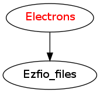

================
Electrons Module
================

Describes the electrons. For the moment, only the number of alpha and beta electrons
are provided by this module.

Assumptions
===========

.. Do not edit this section. It was auto-generated from the
.. NEEDED_MODULES_CHILDREN file by the `update_README.py` script.

* ``elec_num`` >= 0
* ``elec_alpha_num`` >= 0
* ``elec_beta_num`` >= 0
* ``elec_alpha_num`` >= ``elec_beta_num``

Needed Modules
==============

.. Do not edit this section It was auto-generated
.. by the `update_README.py` script.

* `Ezfio_files <http://github.com/LCPQ/quantum_package/tree/master/src/Ezfio_files>`_

Needed Modules
==============
.. Do not edit this section It was auto-generated
.. by the `update_README.py` script.

* `Ezfio_files <http://github.com/LCPQ/quantum_package/tree/master/src/Ezfio_files>`_

Documentation
=============
.. Do not edit this section It was auto-generated
.. by the `update_README.py` script.

`elec_alpha_num <http://github.com/LCPQ/quantum_package/tree/master/src/Electrons/ezfio_interface.irp.f#L25>`_
  Numbers of electrons alpha ("up")

`elec_beta_num <http://github.com/LCPQ/quantum_package/tree/master/src/Electrons/ezfio_interface.irp.f#L6>`_
  Numbers of electrons beta ("down")

`elec_num <http://github.com/LCPQ/quantum_package/tree/master/src/Electrons/electrons.irp.f#L1>`_
  Numbers of alpha ("up") , beta ("down") and total electrons

`elec_num_tab <http://github.com/LCPQ/quantum_package/tree/master/src/Electrons/electrons.irp.f#L2>`_
  Numbers of alpha ("up") , beta ("down") and total electrons

