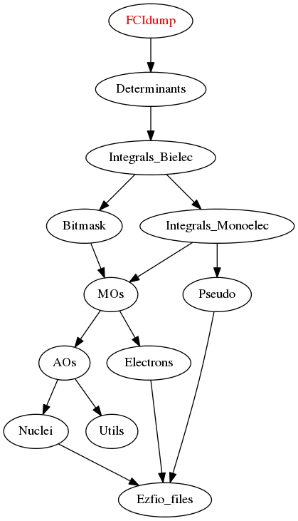

==============
FCIdump Module
==============

Interface for the `NECI <https://github.com/ghb24/NECI_STABLE>`_ Full-CI QMC program.

Documentation
=============

.. Do not edit this section. It was auto-generated from the
.. update_README.py.

`fcidump <http://github.com/LCPQ/quantum_package/tree/master/src/FCIdump/fcidump.irp.f#L1>`_
  Undocumented

Needed Modules
==============

.. Do not edit this section. It was auto-generated from the
.. update_README.py.

* `Determinants <http://github.com/LCPQ/quantum_package/tree/master/src/Determinants>`_

