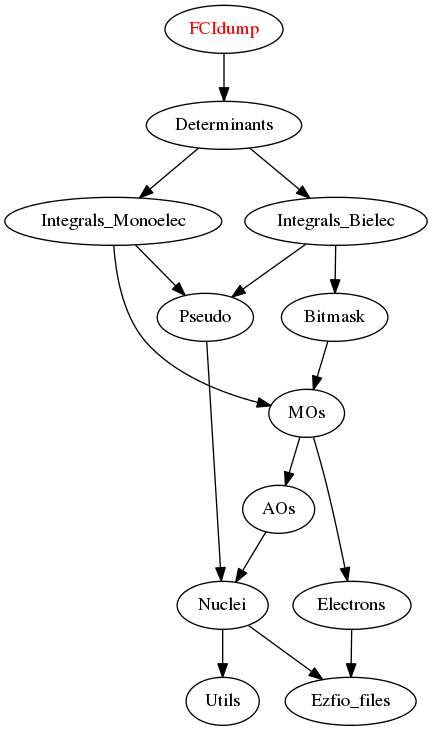

==============
FCIdump Module
==============

Interface for the `NECI <https://github.com/ghb24/NECI_STABLE>`_ Full-CI QMC program.

Documentation
=============

.. Do not edit this section. It was auto-generated from the
.. NEEDED_MODULES_CHILDREN file by the `update_README.py` script.

Needed Modules
==============

.. Do not edit this section. It was auto-generated from the
.. NEEDED_MODULES_CHILDREN file by the `update_README.py` script.

* `Determinants <http://github.com/LCPQ/quantum_package/tree/master/src/Determinants>`_

