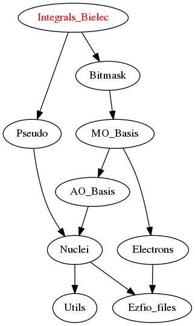

=============
BiInts Module
=============

Here, all bi-electronic integrals (:math:`1/r_{12}`) are computed. As they have
4 indices and many are zero, they are stored in a map, as defined in
``Utils/map_module.f90``.  To fetch an AO integral, use the
``get_ao_bielec_integral(i,j,k,l,ao_integrals_map)`` function, and to fetch and
MO integral, use ``get_mo_bielec_integral(i,j,k,l,mo_integrals_map)`` or
``mo_bielec_integral(i,j,k,l)``.

The conventions are:

* For AO integrals : (ik|jl) = (11|22)
* For MO integrals : <ij|kl> = <12|12>

Needed Modules
==============

.. Do not edit this section It was auto-generated
.. by the `update_README.py` script.

* `Pseudo <http://github.com/LCPQ/quantum_package/tree/master/src/Pseudo>`_
* `Bitmask <http://github.com/LCPQ/quantum_package/tree/master/src/Bitmask>`_

Needed Modules
==============
.. Do not edit this section It was auto-generated
.. by the `update_README.py` script.

* `Pseudo <http://github.com/LCPQ/quantum_package/tree/master/src/Pseudo>`_
* `Bitmask <http://github.com/LCPQ/quantum_package/tree/master/src/Bitmask>`_
* `ZMQ <http://github.com/LCPQ/quantum_package/tree/master/src/ZMQ>`_

Documentation
=============
.. Do not edit this section It was auto-generated
.. by the `update_README.py` script.

`add_integrals_to_map <http://github.com/LCPQ/quantum_package/tree/master/src/Integrals_Bielec/mo_bi_integrals.irp.f#L174>`_
  Adds integrals to tha MO map according to some bitmask

`add_integrals_to_map_no_exit_34 <http://github.com/LCPQ/quantum_package/tree/master/src/Integrals_Bielec/mo_bi_integrals.irp.f#L795>`_
  Adds integrals to tha MO map according to some bitmask

`add_integrals_to_map_three_indices <http://github.com/LCPQ/quantum_package/tree/master/src/Integrals_Bielec/mo_bi_integrals.irp.f#L480>`_
  Adds integrals to tha MO map according to some bitmask

`ao_bielec_integral <http://github.com/LCPQ/quantum_package/tree/master/src/Integrals_Bielec/ao_bi_integrals.irp.f#L1>`_
  integral of the AO basis <ik|jl> or (ij|kl)
  i(r1) j(r1) 1/r12 k(r2) l(r2)

`ao_bielec_integral_schwartz <http://github.com/LCPQ/quantum_package/tree/master/src/Integrals_Bielec/ao_bi_integrals.irp.f#L418>`_
  Needed to compute Schwartz inequalities

`ao_bielec_integral_schwartz_accel <http://github.com/LCPQ/quantum_package/tree/master/src/Integrals_Bielec/ao_bi_integrals.irp.f#L106>`_
  integral of the AO basis <ik|jl> or (ij|kl)
  i(r1) j(r1) 1/r12 k(r2) l(r2)

`ao_bielec_integrals_in_map <http://github.com/LCPQ/quantum_package/tree/master/src/Integrals_Bielec/ao_bi_integrals.irp.f#L328>`_
  Map of Atomic integrals
  i(r1) j(r2) 1/r12 k(r1) l(r2)

`ao_bielec_integrals_in_map_collector <http://github.com/LCPQ/quantum_package/tree/master/src/Integrals_Bielec/ao_bielec_integrals_in_map_slave.irp.f#L125>`_
  Collects results from the AO integral calculation

`ao_bielec_integrals_in_map_slave <http://github.com/LCPQ/quantum_package/tree/master/src/Integrals_Bielec/ao_bielec_integrals_in_map_slave.irp.f#L74>`_
  Computes a buffer of integrals

`ao_bielec_integrals_in_map_slave_inproc <http://github.com/LCPQ/quantum_package/tree/master/src/Integrals_Bielec/ao_bielec_integrals_in_map_slave.irp.f#L11>`_
  Computes a buffer of integrals. i is the ID of the current thread.

`ao_bielec_integrals_in_map_slave_tcp <http://github.com/LCPQ/quantum_package/tree/master/src/Integrals_Bielec/ao_bielec_integrals_in_map_slave.irp.f#L1>`_
  Computes a buffer of integrals. i is the ID of the current thread.

`ao_integrals_cache <http://github.com/LCPQ/quantum_package/tree/master/src/Integrals_Bielec/map_integrals.irp.f#L123>`_
  Cache of AO integrals for fast access

`ao_integrals_cache_max <http://github.com/LCPQ/quantum_package/tree/master/src/Integrals_Bielec/map_integrals.irp.f#L113>`_
  Min and max values of the AOs for which the integrals are in the cache

`ao_integrals_cache_min <http://github.com/LCPQ/quantum_package/tree/master/src/Integrals_Bielec/map_integrals.irp.f#L112>`_
  Min and max values of the AOs for which the integrals are in the cache

`ao_integrals_map <http://github.com/LCPQ/quantum_package/tree/master/src/Integrals_Bielec/map_integrals.irp.f#L6>`_
  AO integrals

`ao_integrals_threshold <http://github.com/LCPQ/quantum_package/tree/master/src/Integrals_Bielec/ezfio_interface.irp.f#L25>`_
  If |<pq|rs>| < ao_integrals_threshold then <pq|rs> is zero

`ao_l4 <http://github.com/LCPQ/quantum_package/tree/master/src/Integrals_Bielec/ao_bi_integrals.irp.f#L278>`_
  Computes the product of l values of i,j,k,and l

`bench_maps <http://github.com/LCPQ/quantum_package/tree/master/src/Integrals_Bielec/test_integrals.irp.f#L1>`_
  Performs timing benchmarks on integral access

`bielec_integrals_index <http://github.com/LCPQ/quantum_package/tree/master/src/Integrals_Bielec/map_integrals.irp.f#L19>`_
  Undocumented

`bielec_integrals_index_reverse <http://github.com/LCPQ/quantum_package/tree/master/src/Integrals_Bielec/map_integrals.irp.f#L36>`_
  Undocumented

`big_array_coulomb_integrals <http://github.com/LCPQ/quantum_package/tree/master/src/Integrals_Bielec/integrals_3_index.irp.f#L1>`_
  Undocumented

`big_array_exchange_integrals <http://github.com/LCPQ/quantum_package/tree/master/src/Integrals_Bielec/integrals_3_index.irp.f#L2>`_
  Undocumented

`clear_ao_map <http://github.com/LCPQ/quantum_package/tree/master/src/Integrals_Bielec/map_integrals.irp.f#L274>`_
  Frees the memory of the AO map

`clear_mo_map <http://github.com/LCPQ/quantum_package/tree/master/src/Integrals_Bielec/mo_bi_integrals.irp.f#L1370>`_
  Frees the memory of the MO map

`compute_ao_bielec_integrals <http://github.com/LCPQ/quantum_package/tree/master/src/Integrals_Bielec/ao_bi_integrals.irp.f#L289>`_
  Compute AO 1/r12 integrals for all i and fixed j,k,l

`compute_ao_integrals_jl <http://github.com/LCPQ/quantum_package/tree/master/src/Integrals_Bielec/ao_bi_integrals.irp.f#L1178>`_
  Parallel client for AO integrals

`disk_access_ao_integrals <http://github.com/LCPQ/quantum_package/tree/master/src/Integrals_Bielec/ezfio_interface.irp.f#L6>`_
  Read/Write AO integrals from/to disk [ Write | Read | None ]

`disk_access_mo_integrals <http://github.com/LCPQ/quantum_package/tree/master/src/Integrals_Bielec/ezfio_interface.irp.f#L44>`_
  Read/Write MO integrals from/to disk [ Write | Read | None ]

`do_direct_integrals <http://github.com/LCPQ/quantum_package/tree/master/src/Integrals_Bielec/ezfio_interface.irp.f#L63>`_
  Compute integrals on the fly

`dump_ao_integrals <http://github.com/LCPQ/quantum_package/tree/master/src/Integrals_Bielec/map_integrals.irp.f_template_717#L3>`_
  Save to disk the $ao integrals

`dump_mo_integrals <http://github.com/LCPQ/quantum_package/tree/master/src/Integrals_Bielec/map_integrals.irp.f_template_717#L137>`_
  Save to disk the $ao integrals

`eri <http://github.com/LCPQ/quantum_package/tree/master/src/Integrals_Bielec/ao_bi_integrals.irp.f#L581>`_
  ATOMIC PRIMTIVE bielectronic integral between the 4 primitives ::
  primitive_1 = x1**(a_x) y1**(a_y) z1**(a_z) exp(-alpha * r1**2)
  primitive_2 = x1**(b_x) y1**(b_y) z1**(b_z) exp(- beta * r1**2)
  primitive_3 = x2**(c_x) y2**(c_y) z2**(c_z) exp(-delta * r2**2)
  primitive_4 = x2**(d_x) y2**(d_y) z2**(d_z) exp(- gama * r2**2)

`four_idx <http://github.com/LCPQ/quantum_package/tree/master/src/Integrals_Bielec/four_idx_transform.irp.f#L1>`_
  4-index transformation from AO to MO integrals

`gauleg <http://github.com/LCPQ/quantum_package/tree/master/src/Integrals_Bielec/gauss_legendre.irp.f#L29>`_
  Gauss-Legendre

`gauleg_t2 <http://github.com/LCPQ/quantum_package/tree/master/src/Integrals_Bielec/gauss_legendre.irp.f#L10>`_
  t_w(i,1,k) = w(i)
  t_w(i,2,k) = t(i)

`gauleg_w <http://github.com/LCPQ/quantum_package/tree/master/src/Integrals_Bielec/gauss_legendre.irp.f#L11>`_
  t_w(i,1,k) = w(i)
  t_w(i,2,k) = t(i)

`general_primitive_integral <http://github.com/LCPQ/quantum_package/tree/master/src/Integrals_Bielec/ao_bi_integrals.irp.f#L443>`_
  Computes the integral <pq|rs> where p,q,r,s are Gaussian primitives

`get_ao_bielec_integral <http://github.com/LCPQ/quantum_package/tree/master/src/Integrals_Bielec/map_integrals.irp.f#L155>`_
  Gets one AO bi-electronic integral from the AO map

`get_ao_bielec_integrals <http://github.com/LCPQ/quantum_package/tree/master/src/Integrals_Bielec/map_integrals.irp.f#L195>`_
  Gets multiple AO bi-electronic integral from the AO map .
  All i are retrieved for j,k,l fixed.

`get_ao_bielec_integrals_non_zero <http://github.com/LCPQ/quantum_package/tree/master/src/Integrals_Bielec/map_integrals.irp.f#L223>`_
  Gets multiple AO bi-electronic integral from the AO map .
  All non-zero i are retrieved for j,k,l fixed.

`get_ao_map_size <http://github.com/LCPQ/quantum_package/tree/master/src/Integrals_Bielec/map_integrals.irp.f#L265>`_
  Returns the number of elements in the AO map

`get_mo_bielec_integral <http://github.com/LCPQ/quantum_package/tree/master/src/Integrals_Bielec/map_integrals.irp.f#L375>`_
  Returns one integral <ij|kl> in the MO basis

`get_mo_bielec_integrals <http://github.com/LCPQ/quantum_package/tree/master/src/Integrals_Bielec/map_integrals.irp.f#L421>`_
  Returns multiple integrals <ij|kl> in the MO basis, all
  i for j,k,l fixed.

`get_mo_bielec_integrals_coulomb_ii <http://github.com/LCPQ/quantum_package/tree/master/src/Integrals_Bielec/map_integrals.irp.f#L506>`_
  Returns multiple integrals <ki|li>
  k(1)i(2) 1/r12 l(1)i(2) :: out_val(i1)
  for k,l fixed.

`get_mo_bielec_integrals_exch_ii <http://github.com/LCPQ/quantum_package/tree/master/src/Integrals_Bielec/map_integrals.irp.f#L539>`_
  Returns multiple integrals <ki|il>
  k(1)i(2) 1/r12 i(1)l(2) :: out_val(i1)
  for k,l fixed.

`get_mo_bielec_integrals_ij <http://github.com/LCPQ/quantum_package/tree/master/src/Integrals_Bielec/map_integrals.irp.f#L452>`_
  Returns multiple integrals <ij|kl> in the MO basis, all
  i(1)j(2) 1/r12 k(1)l(2)
  i, j for k,l fixed.

`get_mo_map_size <http://github.com/LCPQ/quantum_package/tree/master/src/Integrals_Bielec/map_integrals.irp.f#L573>`_
  Return the number of elements in the MO map

`give_polynom_mult_center_x <http://github.com/LCPQ/quantum_package/tree/master/src/Integrals_Bielec/ao_bi_integrals.irp.f#L795>`_
  subroutine that returns the explicit polynom in term of the "t"
  variable of the following polynomw :
  I_x1(a_x, d_x,p,q) * I_x1(a_y, d_y,p,q) * I_x1(a_z, d_z,p,q)

`i_x1_new <http://github.com/LCPQ/quantum_package/tree/master/src/Integrals_Bielec/ao_bi_integrals.irp.f#L714>`_
  recursive function involved in the bielectronic integral

`i_x1_pol_mult <http://github.com/LCPQ/quantum_package/tree/master/src/Integrals_Bielec/ao_bi_integrals.irp.f#L858>`_
  recursive function involved in the bielectronic integral

`i_x1_pol_mult_a1 <http://github.com/LCPQ/quantum_package/tree/master/src/Integrals_Bielec/ao_bi_integrals.irp.f#L978>`_
  recursive function involved in the bielectronic integral

`i_x1_pol_mult_a2 <http://github.com/LCPQ/quantum_package/tree/master/src/Integrals_Bielec/ao_bi_integrals.irp.f#L1032>`_
  recursive function involved in the bielectronic integral

`i_x1_pol_mult_recurs <http://github.com/LCPQ/quantum_package/tree/master/src/Integrals_Bielec/ao_bi_integrals.irp.f#L892>`_
  recursive function involved in the bielectronic integral

`i_x2_new <http://github.com/LCPQ/quantum_package/tree/master/src/Integrals_Bielec/ao_bi_integrals.irp.f#L750>`_
  recursive function involved in the bielectronic integral

`i_x2_pol_mult <http://github.com/LCPQ/quantum_package/tree/master/src/Integrals_Bielec/ao_bi_integrals.irp.f#L1094>`_
  recursive function involved in the bielectronic integral

`insert_into_ao_integrals_map <http://github.com/LCPQ/quantum_package/tree/master/src/Integrals_Bielec/map_integrals.irp.f#L300>`_
  Create new entry into AO map

`insert_into_mo_integrals_map <http://github.com/LCPQ/quantum_package/tree/master/src/Integrals_Bielec/map_integrals.irp.f#L314>`_
  Create new entry into MO map, or accumulate in an existing entry

`integrale_new <http://github.com/LCPQ/quantum_package/tree/master/src/Integrals_Bielec/ao_bi_integrals.irp.f#L638>`_
  calculate the integral of the polynom ::
  I_x1(a_x+b_x, c_x+d_x,p,q) * I_x1(a_y+b_y, c_y+d_y,p,q) * I_x1(a_z+b_z, c_z+d_z,p,q)
  between ( 0 ; 1)

`load_ao_integrals <http://github.com/LCPQ/quantum_package/tree/master/src/Integrals_Bielec/map_integrals.irp.f_template_717#L89>`_
  Read from disk the $ao integrals

`load_mo_integrals <http://github.com/LCPQ/quantum_package/tree/master/src/Integrals_Bielec/map_integrals.irp.f_template_717#L223>`_
  Read from disk the $ao integrals

`mo_bielec_integral <http://github.com/LCPQ/quantum_package/tree/master/src/Integrals_Bielec/map_integrals.irp.f#L407>`_
  Returns one integral <ij|kl> in the MO basis

`mo_bielec_integral_jj <http://github.com/LCPQ/quantum_package/tree/master/src/Integrals_Bielec/mo_bi_integrals.irp.f#L1342>`_
  mo_bielec_integral_jj(i,j) = J_ij
  mo_bielec_integral_jj_exchange(i,j) = K_ij
  mo_bielec_integral_jj_anti(i,j) = J_ij - K_ij

`mo_bielec_integral_jj_anti <http://github.com/LCPQ/quantum_package/tree/master/src/Integrals_Bielec/mo_bi_integrals.irp.f#L1344>`_
  mo_bielec_integral_jj(i,j) = J_ij
  mo_bielec_integral_jj_exchange(i,j) = K_ij
  mo_bielec_integral_jj_anti(i,j) = J_ij - K_ij

`mo_bielec_integral_jj_anti_from_ao <http://github.com/LCPQ/quantum_package/tree/master/src/Integrals_Bielec/mo_bi_integrals.irp.f#L1061>`_
  mo_bielec_integral_jj_from_ao(i,j) = J_ij
  mo_bielec_integral_jj_exchange_from_ao(i,j) = J_ij
  mo_bielec_integral_jj_anti_from_ao(i,j) = J_ij - K_ij

`mo_bielec_integral_jj_exchange <http://github.com/LCPQ/quantum_package/tree/master/src/Integrals_Bielec/mo_bi_integrals.irp.f#L1343>`_
  mo_bielec_integral_jj(i,j) = J_ij
  mo_bielec_integral_jj_exchange(i,j) = K_ij
  mo_bielec_integral_jj_anti(i,j) = J_ij - K_ij

`mo_bielec_integral_jj_exchange_from_ao <http://github.com/LCPQ/quantum_package/tree/master/src/Integrals_Bielec/mo_bi_integrals.irp.f#L1060>`_
  mo_bielec_integral_jj_from_ao(i,j) = J_ij
  mo_bielec_integral_jj_exchange_from_ao(i,j) = J_ij
  mo_bielec_integral_jj_anti_from_ao(i,j) = J_ij - K_ij

`mo_bielec_integral_jj_from_ao <http://github.com/LCPQ/quantum_package/tree/master/src/Integrals_Bielec/mo_bi_integrals.irp.f#L1059>`_
  mo_bielec_integral_jj_from_ao(i,j) = J_ij
  mo_bielec_integral_jj_exchange_from_ao(i,j) = J_ij
  mo_bielec_integral_jj_anti_from_ao(i,j) = J_ij - K_ij

`mo_bielec_integral_vv_anti_from_ao <http://github.com/LCPQ/quantum_package/tree/master/src/Integrals_Bielec/mo_bi_integrals.irp.f#L1194>`_
  mo_bielec_integral_vv_from_ao(i,j) = J_ij
  mo_bielec_integral_vv_exchange_from_ao(i,j) = J_ij
  mo_bielec_integral_vv_anti_from_ao(i,j) = J_ij - K_ij
  but only for the virtual orbitals

`mo_bielec_integral_vv_exchange_from_ao <http://github.com/LCPQ/quantum_package/tree/master/src/Integrals_Bielec/mo_bi_integrals.irp.f#L1193>`_
  mo_bielec_integral_vv_from_ao(i,j) = J_ij
  mo_bielec_integral_vv_exchange_from_ao(i,j) = J_ij
  mo_bielec_integral_vv_anti_from_ao(i,j) = J_ij - K_ij
  but only for the virtual orbitals

`mo_bielec_integral_vv_from_ao <http://github.com/LCPQ/quantum_package/tree/master/src/Integrals_Bielec/mo_bi_integrals.irp.f#L1192>`_
  mo_bielec_integral_vv_from_ao(i,j) = J_ij
  mo_bielec_integral_vv_exchange_from_ao(i,j) = J_ij
  mo_bielec_integral_vv_anti_from_ao(i,j) = J_ij - K_ij
  but only for the virtual orbitals

`mo_bielec_integrals_in_map <http://github.com/LCPQ/quantum_package/tree/master/src/Integrals_Bielec/mo_bi_integrals.irp.f#L22>`_
  If True, the map of MO bielectronic integrals is provided

`mo_bielec_integrals_index <http://github.com/LCPQ/quantum_package/tree/master/src/Integrals_Bielec/mo_bi_integrals.irp.f#L1>`_
  Computes an unique index for i,j,k,l integrals

`mo_integrals_cache <http://github.com/LCPQ/quantum_package/tree/master/src/Integrals_Bielec/map_integrals.irp.f#L341>`_
  Cache of MO integrals for fast access

`mo_integrals_cache_max <http://github.com/LCPQ/quantum_package/tree/master/src/Integrals_Bielec/map_integrals.irp.f#L331>`_
  Min and max values of the MOs for which the integrals are in the cache

`mo_integrals_cache_min <http://github.com/LCPQ/quantum_package/tree/master/src/Integrals_Bielec/map_integrals.irp.f#L330>`_
  Min and max values of the MOs for which the integrals are in the cache

`mo_integrals_map <http://github.com/LCPQ/quantum_package/tree/master/src/Integrals_Bielec/map_integrals.irp.f#L287>`_
  MO integrals

`mo_integrals_threshold <http://github.com/LCPQ/quantum_package/tree/master/src/Integrals_Bielec/ezfio_interface.irp.f#L120>`_
  If |<ij|kl>| < ao_integrals_threshold then <pq|rs> is zero

`n_pt_max_integrals_16 <http://github.com/LCPQ/quantum_package/tree/master/src/Integrals_Bielec/gauss_legendre.irp.f#L1>`_
  Aligned n_pt_max_integrals

`n_pt_sup <http://github.com/LCPQ/quantum_package/tree/master/src/Integrals_Bielec/ao_bi_integrals.irp.f#L781>`_
  Returns the upper boundary of the degree of the polynomial involved in the
  bielctronic integral :
  Ix(a_x,b_x,c_x,d_x) * Iy(a_y,b_y,c_y,d_y) * Iz(a_z,b_z,c_z,d_z)

`no_ivvv_integrals <http://github.com/LCPQ/quantum_package/tree/master/src/Integrals_Bielec/ezfio_interface.irp.f#L101>`_
  Can be switched on only if  no_vvvv_integrals  is True, then do not computes the integrals having 3 virtual index and 1 belonging to the core inactive active orbitals

`no_vvv_integrals <http://github.com/LCPQ/quantum_package/tree/master/src/Integrals_Bielec/ezfio_interface.irp.f#L82>`_
  Can be switched on only if  no_vvvv_integrals  is True, then do not computes the integrals having 3 virtual orbitals

`no_vvvv_integrals <http://github.com/LCPQ/quantum_package/tree/master/src/Integrals_Bielec/ezfio_interface.irp.f#L139>`_
  If True, computes all integrals except for the integrals having 4 virtual index

`provide_all_mo_integrals <http://github.com/LCPQ/quantum_package/tree/master/src/Integrals_Bielec/mo_bi_integrals.irp.f#L1382>`_
  Undocumented

`push_integrals <http://github.com/LCPQ/quantum_package/tree/master/src/Integrals_Bielec/ao_bielec_integrals_in_map_slave.irp.f#L21>`_
  Push integrals in the push socket

`qp_ao_ints <http://github.com/LCPQ/quantum_package/tree/master/src/Integrals_Bielec/qp_ao_ints.irp.f#L1>`_
  Increments a running calculation to compute AO integrals

`read_ao_integrals <http://github.com/LCPQ/quantum_package/tree/master/src/Integrals_Bielec/read_write.irp.f#L1>`_
  One level of abstraction for disk_access_ao_integrals and disk_access_mo_integrals

`read_mo_integrals <http://github.com/LCPQ/quantum_package/tree/master/src/Integrals_Bielec/read_write.irp.f#L2>`_
  One level of abstraction for disk_access_ao_integrals and disk_access_mo_integrals

`set_integrals_exchange_jj_into_map <http://github.com/LCPQ/quantum_package/tree/master/src/Integrals_Bielec/mo_bi_integrals.irp.f#L152>`_
  Undocumented

`set_integrals_jj_into_map <http://github.com/LCPQ/quantum_package/tree/master/src/Integrals_Bielec/mo_bi_integrals.irp.f#L130>`_
  Undocumented

`write_ao_integrals <http://github.com/LCPQ/quantum_package/tree/master/src/Integrals_Bielec/read_write.irp.f#L3>`_
  One level of abstraction for disk_access_ao_integrals and disk_access_mo_integrals

`write_mo_integrals <http://github.com/LCPQ/quantum_package/tree/master/src/Integrals_Bielec/read_write.irp.f#L4>`_
  One level of abstraction for disk_access_ao_integrals and disk_access_mo_integrals

