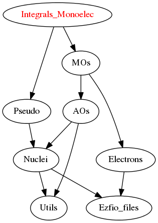

Needed Modules
==============

.. Do not edit this section It was auto-generated
.. by the `update_README.py` script.

* `MO_Basis <http://github.com/LCPQ/quantum_package/tree/master/src/MO_Basis>`_
* `Pseudo <http://github.com/LCPQ/quantum_package/tree/master/src/Pseudo>`_

Needed Modules
==============
.. Do not edit this section It was auto-generated
.. by the `update_README.py` script.

* `MO_Basis <http://github.com/LCPQ/quantum_package/tree/master/src/MO_Basis>`_
* `Pseudo <http://github.com/LCPQ/quantum_package/tree/master/src/Pseudo>`_

Documentation
=============
.. Do not edit this section It was auto-generated
.. by the `update_README.py` script.

`ao_deriv2_x <http://github.com/LCPQ/quantum_package/tree/master/src/Integrals_Monoelec/kin_ao_ints.irp.f#L1>`_
  second derivatives matrix elements in the ao basis
  .. math::
  .br
  {\tt ao_deriv2_x} = \langle \chi_i(x,y,z) \frac{\partial^2}{\partial x^2} |\chi_j (x,y,z) \rangle

`ao_deriv2_y <http://github.com/LCPQ/quantum_package/tree/master/src/Integrals_Monoelec/kin_ao_ints.irp.f#L2>`_
  second derivatives matrix elements in the ao basis
  .. math::
  .br
  {\tt ao_deriv2_x} = \langle \chi_i(x,y,z) \frac{\partial^2}{\partial x^2} |\chi_j (x,y,z) \rangle

`ao_deriv2_z <http://github.com/LCPQ/quantum_package/tree/master/src/Integrals_Monoelec/kin_ao_ints.irp.f#L3>`_
  second derivatives matrix elements in the ao basis
  .. math::
  .br
  {\tt ao_deriv2_x} = \langle \chi_i(x,y,z) \frac{\partial^2}{\partial x^2} |\chi_j (x,y,z) \rangle

`ao_deriv_1_x <http://github.com/LCPQ/quantum_package/tree/master/src/Integrals_Monoelec/spread_dipole_ao.irp.f#L148>`_
  array of the integrals of AO_i * d/dx  AO_j
  array of the integrals of AO_i * d/dy  AO_j
  array of the integrals of AO_i * d/dz  AO_j

`ao_deriv_1_y <http://github.com/LCPQ/quantum_package/tree/master/src/Integrals_Monoelec/spread_dipole_ao.irp.f#L149>`_
  array of the integrals of AO_i * d/dx  AO_j
  array of the integrals of AO_i * d/dy  AO_j
  array of the integrals of AO_i * d/dz  AO_j

`ao_deriv_1_z <http://github.com/LCPQ/quantum_package/tree/master/src/Integrals_Monoelec/spread_dipole_ao.irp.f#L150>`_
  array of the integrals of AO_i * d/dx  AO_j
  array of the integrals of AO_i * d/dy  AO_j
  array of the integrals of AO_i * d/dz  AO_j

`ao_dipole_x <http://github.com/LCPQ/quantum_package/tree/master/src/Integrals_Monoelec/spread_dipole_ao.irp.f#L75>`_
  array of the integrals of AO_i * x AO_j
  array of the integrals of AO_i * y AO_j
  array of the integrals of AO_i * z AO_j

`ao_dipole_y <http://github.com/LCPQ/quantum_package/tree/master/src/Integrals_Monoelec/spread_dipole_ao.irp.f#L76>`_
  array of the integrals of AO_i * x AO_j
  array of the integrals of AO_i * y AO_j
  array of the integrals of AO_i * z AO_j

`ao_dipole_z <http://github.com/LCPQ/quantum_package/tree/master/src/Integrals_Monoelec/spread_dipole_ao.irp.f#L77>`_
  array of the integrals of AO_i * x AO_j
  array of the integrals of AO_i * y AO_j
  array of the integrals of AO_i * z AO_j

`ao_kinetic_integral <http://github.com/LCPQ/quantum_package/tree/master/src/Integrals_Monoelec/kin_ao_ints.irp.f#L125>`_
  array of the priminitve basis kinetic integrals
  \langle \chi_i |\hat{T}| \chi_j \rangle

`ao_mono_elec_integral <http://github.com/LCPQ/quantum_package/tree/master/src/Integrals_Monoelec/ao_mono_ints.irp.f#L1>`_
  array of the mono electronic hamiltonian on the AOs basis
  : sum of the kinetic and nuclear electronic potential

`ao_mono_elec_integral_diag <http://github.com/LCPQ/quantum_package/tree/master/src/Integrals_Monoelec/ao_mono_ints.irp.f#L2>`_
  array of the mono electronic hamiltonian on the AOs basis
  : sum of the kinetic and nuclear electronic potential

`ao_nucl_elec_integral <http://github.com/LCPQ/quantum_package/tree/master/src/Integrals_Monoelec/pot_ao_ints.irp.f#L1>`_
  interaction nuclear electron

`ao_nucl_elec_integral_per_atom <http://github.com/LCPQ/quantum_package/tree/master/src/Integrals_Monoelec/pot_ao_ints.irp.f#L83>`_
  ao_nucl_elec_integral_per_atom(i,j,k) = -<AO(i)|1/|r-Rk|AO(j)>
  where Rk is the geometry of the kth atom

`ao_pseudo_integral <http://github.com/LCPQ/quantum_package/tree/master/src/Integrals_Monoelec/pot_ao_pseudo_ints.irp.f#L1>`_
  Pseudo-potential integrals

`ao_pseudo_integral_local <http://github.com/LCPQ/quantum_package/tree/master/src/Integrals_Monoelec/pot_ao_pseudo_ints.irp.f#L32>`_
  Local pseudo-potential

`ao_pseudo_integral_non_local <http://github.com/LCPQ/quantum_package/tree/master/src/Integrals_Monoelec/pot_ao_pseudo_ints.irp.f#L131>`_
  Local pseudo-potential

`ao_spread_x <http://github.com/LCPQ/quantum_package/tree/master/src/Integrals_Monoelec/spread_dipole_ao.irp.f#L1>`_
  array of the integrals of AO_i * x^2 AO_j
  array of the integrals of AO_i * y^2 AO_j
  array of the integrals of AO_i * z^2 AO_j

`ao_spread_y <http://github.com/LCPQ/quantum_package/tree/master/src/Integrals_Monoelec/spread_dipole_ao.irp.f#L2>`_
  array of the integrals of AO_i * x^2 AO_j
  array of the integrals of AO_i * y^2 AO_j
  array of the integrals of AO_i * z^2 AO_j

`ao_spread_z <http://github.com/LCPQ/quantum_package/tree/master/src/Integrals_Monoelec/spread_dipole_ao.irp.f#L3>`_
  array of the integrals of AO_i * x^2 AO_j
  array of the integrals of AO_i * y^2 AO_j
  array of the integrals of AO_i * z^2 AO_j

`check_ortho <http://github.com/LCPQ/quantum_package/tree/master/src/Integrals_Monoelec/check_orthonormality.irp.f#L1>`_
  Undocumented

`disk_access_ao_one_integrals <http://github.com/LCPQ/quantum_package/tree/master/src/Integrals_Monoelec/ezfio_interface.irp.f#L25>`_
  Read/Write AO one-electron integrals from/to disk [ Write | Read | None ]

`disk_access_mo_one_integrals <http://github.com/LCPQ/quantum_package/tree/master/src/Integrals_Monoelec/ezfio_interface.irp.f#L6>`_
  Read/Write MO one-electron integrals from/to disk [ Write | Read | None ]

`do_print <http://github.com/LCPQ/quantum_package/tree/master/src/Integrals_Monoelec/check_orthonormality.irp.f#L11>`_
  Undocumented

`give_polynom_mult_center_mono_elec <http://github.com/LCPQ/quantum_package/tree/master/src/Integrals_Monoelec/pot_ao_ints.irp.f#L228>`_
  Undocumented

`i_x1_pol_mult_mono_elec <http://github.com/LCPQ/quantum_package/tree/master/src/Integrals_Monoelec/pot_ao_ints.irp.f#L356>`_
  Undocumented

`i_x2_pol_mult_mono_elec <http://github.com/LCPQ/quantum_package/tree/master/src/Integrals_Monoelec/pot_ao_ints.irp.f#L427>`_
  Undocumented

`int_gaus_pol <http://github.com/LCPQ/quantum_package/tree/master/src/Integrals_Monoelec/pot_ao_ints.irp.f#L498>`_
  Undocumented

`mo_dipole_x <http://github.com/LCPQ/quantum_package/tree/master/src/Integrals_Monoelec/spread_dipole_mo.irp.f#L1>`_
  array of the integrals of MO_i * x MO_j
  array of the integrals of MO_i * y MO_j
  array of the integrals of MO_i * z MO_j

`mo_dipole_y <http://github.com/LCPQ/quantum_package/tree/master/src/Integrals_Monoelec/spread_dipole_mo.irp.f#L2>`_
  array of the integrals of MO_i * x MO_j
  array of the integrals of MO_i * y MO_j
  array of the integrals of MO_i * z MO_j

`mo_dipole_z <http://github.com/LCPQ/quantum_package/tree/master/src/Integrals_Monoelec/spread_dipole_mo.irp.f#L3>`_
  array of the integrals of MO_i * x MO_j
  array of the integrals of MO_i * y MO_j
  array of the integrals of MO_i * z MO_j

`mo_kinetic_integral <http://github.com/LCPQ/quantum_package/tree/master/src/Integrals_Monoelec/kin_mo_ints.irp.f#L1>`_
  Kinetic energy integrals in the MO basis

`mo_mono_elec_integral <http://github.com/LCPQ/quantum_package/tree/master/src/Integrals_Monoelec/mo_mono_ints.irp.f#L1>`_
  array of the mono electronic hamiltonian on the MOs basis :
  sum of the kinetic and nuclear electronic potential (and pseudo potential if needed)

`mo_nucl_elec_integral <http://github.com/LCPQ/quantum_package/tree/master/src/Integrals_Monoelec/pot_mo_ints.irp.f#L1>`_
  interaction nuclear electron on the MO basis

`mo_nucl_elec_integral_per_atom <http://github.com/LCPQ/quantum_package/tree/master/src/Integrals_Monoelec/pot_mo_ints.irp.f#L28>`_
  mo_nucl_elec_integral_per_atom(i,j,k) = -<MO(i)|1/|r-Rk|MO(j)>
  where Rk is the geometry of the kth atom

`mo_pseudo_integral <http://github.com/LCPQ/quantum_package/tree/master/src/Integrals_Monoelec/pot_mo_pseudo_ints.irp.f#L1>`_
  interaction nuclear electron on the MO basis

`mo_spread_x <http://github.com/LCPQ/quantum_package/tree/master/src/Integrals_Monoelec/spread_dipole_mo.irp.f#L32>`_
  array of the integrals of MO_i * x^2 MO_j
  array of the integrals of MO_i * y^2 MO_j
  array of the integrals of MO_i * z^2 MO_j

`mo_spread_y <http://github.com/LCPQ/quantum_package/tree/master/src/Integrals_Monoelec/spread_dipole_mo.irp.f#L33>`_
  array of the integrals of MO_i * x^2 MO_j
  array of the integrals of MO_i * y^2 MO_j
  array of the integrals of MO_i * z^2 MO_j

`mo_spread_z <http://github.com/LCPQ/quantum_package/tree/master/src/Integrals_Monoelec/spread_dipole_mo.irp.f#L34>`_
  array of the integrals of MO_i * x^2 MO_j
  array of the integrals of MO_i * y^2 MO_j
  array of the integrals of MO_i * z^2 MO_j

`nai_pol_mult <http://github.com/LCPQ/quantum_package/tree/master/src/Integrals_Monoelec/pot_ao_ints.irp.f#L148>`_
  Undocumented

`orthonormalize_mos <http://github.com/LCPQ/quantum_package/tree/master/src/Integrals_Monoelec/orthonormalize.irp.f#L1>`_
  Undocumented

`overlap_bourrin_deriv_x <http://github.com/LCPQ/quantum_package/tree/master/src/Integrals_Monoelec/spread_dipole_ao.irp.f#L365>`_
  Undocumented

`overlap_bourrin_dipole <http://github.com/LCPQ/quantum_package/tree/master/src/Integrals_Monoelec/spread_dipole_ao.irp.f#L318>`_
  Undocumented

`overlap_bourrin_spread <http://github.com/LCPQ/quantum_package/tree/master/src/Integrals_Monoelec/spread_dipole_ao.irp.f#L265>`_
  Undocumented

`overlap_bourrin_x <http://github.com/LCPQ/quantum_package/tree/master/src/Integrals_Monoelec/spread_dipole_ao.irp.f#L380>`_
  Undocumented

`overlap_bourrin_x_abs <http://github.com/LCPQ/quantum_package/tree/master/src/Integrals_Monoelec/spread_dipole_ao.irp.f#L226>`_
  Undocumented

`power <http://github.com/LCPQ/quantum_package/tree/master/src/Integrals_Monoelec/spread_dipole_ao.irp.f#L310>`_
  Undocumented

`pseudo_dz_k_transp <http://github.com/LCPQ/quantum_package/tree/master/src/Integrals_Monoelec/pot_ao_pseudo_ints.irp.f#L233>`_
  Transposed arrays for pseudopotentials

`pseudo_dz_kl_transp <http://github.com/LCPQ/quantum_package/tree/master/src/Integrals_Monoelec/pot_ao_pseudo_ints.irp.f#L251>`_
  Transposed arrays for pseudopotentials

`pseudo_n_k_transp <http://github.com/LCPQ/quantum_package/tree/master/src/Integrals_Monoelec/pot_ao_pseudo_ints.irp.f#L232>`_
  Transposed arrays for pseudopotentials

`pseudo_n_kl_transp <http://github.com/LCPQ/quantum_package/tree/master/src/Integrals_Monoelec/pot_ao_pseudo_ints.irp.f#L250>`_
  Transposed arrays for pseudopotentials

`pseudo_v_k_transp <http://github.com/LCPQ/quantum_package/tree/master/src/Integrals_Monoelec/pot_ao_pseudo_ints.irp.f#L231>`_
  Transposed arrays for pseudopotentials

`pseudo_v_kl_transp <http://github.com/LCPQ/quantum_package/tree/master/src/Integrals_Monoelec/pot_ao_pseudo_ints.irp.f#L249>`_
  Transposed arrays for pseudopotentials

`read_ao_one_integrals <http://github.com/LCPQ/quantum_package/tree/master/src/Integrals_Monoelec/read_write.irp.f#L1>`_
  One level of abstraction for disk_access_ao_integrals and disk_access_mo_integrals

`read_mo_one_integrals <http://github.com/LCPQ/quantum_package/tree/master/src/Integrals_Monoelec/read_write.irp.f#L2>`_
  One level of abstraction for disk_access_ao_integrals and disk_access_mo_integrals

`read_one_e_integrals <http://github.com/LCPQ/quantum_package/tree/master/src/Integrals_Monoelec/read_write.irp.f#L67>`_
  Read the 1-electron integrals into in A(m,n) from file 'filename'

`save_ortho_mos <http://github.com/LCPQ/quantum_package/tree/master/src/Integrals_Monoelec/save_ortho_mos.irp.f#L1>`_
  Undocumented

`v_e_n <http://github.com/LCPQ/quantum_package/tree/master/src/Integrals_Monoelec/pot_ao_ints.irp.f#L479>`_
  Undocumented

`v_phi <http://github.com/LCPQ/quantum_package/tree/master/src/Integrals_Monoelec/pot_ao_ints.irp.f#L543>`_
  Undocumented

`v_r <http://github.com/LCPQ/quantum_package/tree/master/src/Integrals_Monoelec/pot_ao_ints.irp.f#L527>`_
  Undocumented

`v_theta <http://github.com/LCPQ/quantum_package/tree/master/src/Integrals_Monoelec/pot_ao_ints.irp.f#L556>`_
  Undocumented

`wallis <http://github.com/LCPQ/quantum_package/tree/master/src/Integrals_Monoelec/pot_ao_ints.irp.f#L572>`_
  Undocumented

`write_ao_one_integrals <http://github.com/LCPQ/quantum_package/tree/master/src/Integrals_Monoelec/read_write.irp.f#L3>`_
  One level of abstraction for disk_access_ao_integrals and disk_access_mo_integrals

`write_mo_one_integrals <http://github.com/LCPQ/quantum_package/tree/master/src/Integrals_Monoelec/read_write.irp.f#L4>`_
  One level of abstraction for disk_access_ao_integrals and disk_access_mo_integrals

`write_one_e_integrals <http://github.com/LCPQ/quantum_package/tree/master/src/Integrals_Monoelec/read_write.irp.f#L49>`_
  Write the 1-electron integrals stored in A(m,n) into file 'filename'

