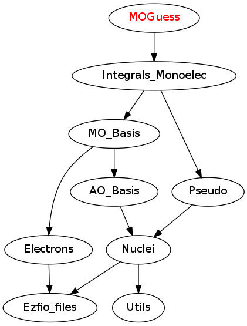

==============
MOGuess Module
==============

Needed Modules
==============

.. Do not edit this section It was auto-generated
.. by the `update_README.py` script.

* `Integrals_Monoelec <http://github.com/LCPQ/quantum_package/tree/master/src/Integrals_Monoelec>`_

Needed Modules
==============
.. Do not edit this section It was auto-generated
.. by the `update_README.py` script.

* `Integrals_Monoelec <http://github.com/LCPQ/quantum_package/tree/master/src/Integrals_Monoelec>`_

Documentation
=============
.. Do not edit this section It was auto-generated
.. by the `update_README.py` script.

`ao_ortho_canonical_nucl_elec_integral <http://github.com/LCPQ/quantum_package/tree/master/src/MOGuess/pot_mo_ortho_canonical_ints.irp.f#L1>`_
  Undocumented

`ao_ortho_lowdin_coef <http://github.com/LCPQ/quantum_package/tree/master/src/MOGuess/mo_ortho_lowdin.irp.f#L1>`_
  matrix of the coefficients of the mos generated by the
  orthonormalization by the S^{-1/2} canonical transformation of the aos
  ao_ortho_lowdin_coef(i,j) = coefficient of the ith ao on the jth ao_ortho_lowdin orbital

`ao_ortho_lowdin_nucl_elec_integral <http://github.com/LCPQ/quantum_package/tree/master/src/MOGuess/pot_mo_ortho_lowdin_ints.irp.f#L1>`_
  Undocumented

`ao_ortho_lowdin_overlap <http://github.com/LCPQ/quantum_package/tree/master/src/MOGuess/mo_ortho_lowdin.irp.f#L25>`_
  overlap matrix of the ao_ortho_lowdin
  supposed to be the Identity

`h_core_guess <http://github.com/LCPQ/quantum_package/tree/master/src/MOGuess/H_CORE_guess.irp.f#L1>`_
  Produce `H_core` MO orbital
  output:  mo_basis.mo_tot_num mo_basis.mo_label mo_basis.ao_md5 mo_basis.mo_coef mo_basis.mo_occ

`hcore_guess <http://github.com/LCPQ/quantum_package/tree/master/src/MOGuess/h_core_guess_routine.irp.f#L1>`_
  Produce `H_core` MO orbital

