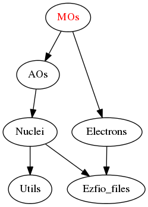

==========
MOs Module
==========

Molecular orbitals are expressed as 

.. math::

  \phi_k({\bf r}) = \sum_i C_{ik} \chi_k({\bf r})

where :math:`\chi_k` are *normalized* atomic basis set.

The current set of molecular orbitals has a label ``mo_label``.
When the orbitals are modified, the label should also be updated to keep
everything consistent.

When saving the MOs, the ``mo_basis`` directory of the EZFIO file is copied
in the ``save`` directory, named by the current ``mo_label``. All this is
done with the script named ``save_current_mos.sh`` in the ``scripts`` directory.

Assumptions
===========

.. Do not edit this section. It was auto-generated from the
.. NEEDED_MODULES_CHILDREN file by the `update_README.py` script.

ASSUMPTONS
==========

* The AO basis functions are normalized.

Needed Modules
==============

.. Do not edit this section It was auto-generated
.. by the `update_README.py` script.

* `AO_Basis <http://github.com/LCPQ/quantum_package/tree/master/src/AO_Basis>`_
* `Electrons <http://github.com/LCPQ/quantum_package/tree/master/src/Electrons>`_

Needed Modules
==============
.. Do not edit this section It was auto-generated
.. by the `update_README.py` script.

* `AO_Basis <http://github.com/LCPQ/quantum_package/tree/master/src/AO_Basis>`_
* `Electrons <http://github.com/LCPQ/quantum_package/tree/master/src/Electrons>`_

Documentation
=============
.. Do not edit this section It was auto-generated
.. by the `update_README.py` script.

`ao_cart_to_sphe_coef <http://github.com/LCPQ/quantum_package/tree/master/src/MO_Basis/ao_ortho_canonical.irp.f#L1>`_
  matrix of the coefficients of the mos generated by the
  orthonormalization by the S^{-1/2} canonical transformation of the aos
  ao_cart_to_sphe_coef(i,j) = coefficient of the ith ao on the jth ao_ortho_canonical orbital

`ao_cart_to_sphe_inv <http://github.com/LCPQ/quantum_package/tree/master/src/MO_Basis/ao_ortho_canonical.irp.f#L73>`_
  AO_cart_to_sphe_coef^(-1)

`ao_cart_to_sphe_num <http://github.com/LCPQ/quantum_package/tree/master/src/MO_Basis/ao_ortho_canonical.irp.f#L2>`_
  matrix of the coefficients of the mos generated by the
  orthonormalization by the S^{-1/2} canonical transformation of the aos
  ao_cart_to_sphe_coef(i,j) = coefficient of the ith ao on the jth ao_ortho_canonical orbital

`ao_cart_to_sphe_overlap <http://github.com/LCPQ/quantum_package/tree/master/src/MO_Basis/ao_ortho_canonical.irp.f#L51>`_
  AO overlap matrix in the spherical basis set

`ao_ortho_cano_to_ao <http://github.com/LCPQ/quantum_package/tree/master/src/MO_Basis/mos.irp.f#L278>`_
  Transform A from the AO basis to the orthogonal AO basis
  .br
  C^(-1).A_ao.Ct^(-1)

`ao_ortho_canonical_coef <http://github.com/LCPQ/quantum_package/tree/master/src/MO_Basis/ao_ortho_canonical.irp.f#L95>`_
  matrix of the coefficients of the mos generated by the
  orthonormalization by the S^{-1/2} canonical transformation of the aos
  ao_ortho_canonical_coef(i,j) = coefficient of the ith ao on the jth ao_ortho_canonical orbital

`ao_ortho_canonical_coef_inv <http://github.com/LCPQ/quantum_package/tree/master/src/MO_Basis/ao_ortho_canonical.irp.f#L86>`_
  ao_ortho_canonical_coef^(-1)

`ao_ortho_canonical_num <http://github.com/LCPQ/quantum_package/tree/master/src/MO_Basis/ao_ortho_canonical.irp.f#L96>`_
  matrix of the coefficients of the mos generated by the
  orthonormalization by the S^{-1/2} canonical transformation of the aos
  ao_ortho_canonical_coef(i,j) = coefficient of the ith ao on the jth ao_ortho_canonical orbital

`ao_ortho_canonical_overlap <http://github.com/LCPQ/quantum_package/tree/master/src/MO_Basis/ao_ortho_canonical.irp.f#L144>`_
  overlap matrix of the ao_ortho_canonical.
  Expected to be the Identity

`ao_to_mo <http://github.com/LCPQ/quantum_package/tree/master/src/MO_Basis/mos.irp.f#L156>`_
  Transform A from the AO basis to the MO basis
  .br
  C.A_ao.Ct

`cholesky_mo <http://github.com/LCPQ/quantum_package/tree/master/src/MO_Basis/cholesky_mo.irp.f#L1>`_
  Cholesky decomposition of AO Density matrix
  .br
  n : Number of AOs
  m : Number of MOs
  .br
  P(LDP,n) : Density matrix in AO basis
  .br
  C(LDC,m) : MOs
  .br
  tol_in : tolerance
  .br
  rank : Nomber of local MOs (output)
  .br

`give_all_mos_at_r <http://github.com/LCPQ/quantum_package/tree/master/src/MO_Basis/utils.irp.f#L271>`_
  Undocumented

`give_specific_mos_at_r <http://github.com/LCPQ/quantum_package/tree/master/src/MO_Basis/utils.irp.f#L278>`_
  Undocumented

`mix_mo_jk <http://github.com/LCPQ/quantum_package/tree/master/src/MO_Basis/mos.irp.f#L244>`_
  subroutine that rotates the jth MO with the kth MO
  to give two new MO's that are
  '+' = 1/sqrt(2) (|j> + |k>)
  '-' = 1/sqrt(2) (|j> - |k>)
  by convention, the '+' MO is in the lower index (min(j,k))
  by convention, the '-' MO is in the greater index (max(j,k))

`mo_as_eigvectors_of_mo_matrix <http://github.com/LCPQ/quantum_package/tree/master/src/MO_Basis/utils.irp.f#L47>`_
  Undocumented

`mo_as_eigvectors_of_mo_matrix_sort_by_observable <http://github.com/LCPQ/quantum_package/tree/master/src/MO_Basis/utils.irp.f#L150>`_
  Undocumented

`mo_as_svd_vectors_of_mo_matrix <http://github.com/LCPQ/quantum_package/tree/master/src/MO_Basis/utils.irp.f#L103>`_
  Undocumented

`mo_class <http://github.com/LCPQ/quantum_package/tree/master/src/MO_Basis/ezfio_interface.irp.f#L6>`_
  Core|Inactive|Active|Virtual|Deleted

`mo_coef <http://github.com/LCPQ/quantum_package/tree/master/src/MO_Basis/mos.irp.f#L29>`_
  Molecular orbital coefficients on AO basis set
  mo_coef(i,j) = coefficient of the ith ao on the jth mo
  mo_label : Label characterizing the MOS (local, canonical, natural, etc)

`mo_coef_in_ao_ortho_basis <http://github.com/LCPQ/quantum_package/tree/master/src/MO_Basis/mos.irp.f#L71>`_
  MO coefficients in orthogonalized AO basis
  .br
  C^(-1).C_mo

`mo_coef_transp <http://github.com/LCPQ/quantum_package/tree/master/src/MO_Basis/mos.irp.f#L103>`_
  Molecular orbital coefficients on AO basis set

`mo_label <http://github.com/LCPQ/quantum_package/tree/master/src/MO_Basis/mos.irp.f#L85>`_
  Molecular orbital coefficients on AO basis set
  mo_coef(i,j) = coefficient of the ith ao on the jth mo
  mo_label : Label characterizing the MOS (local, canonical, natural, etc)

`mo_occ <http://github.com/LCPQ/quantum_package/tree/master/src/MO_Basis/mos.irp.f#L134>`_
  MO occupation numbers

`mo_overlap <http://github.com/LCPQ/quantum_package/tree/master/src/MO_Basis/mo_overlap.irp.f#L2>`_
  Undocumented

`mo_sort_by_observable <http://github.com/LCPQ/quantum_package/tree/master/src/MO_Basis/utils.irp.f#L232>`_
  Undocumented

`mo_to_ao <http://github.com/LCPQ/quantum_package/tree/master/src/MO_Basis/mos.irp.f#L184>`_
  Transform A from the MO basis to the AO basis
  .br
  (S.C).A_mo.(S.C)t

`mo_to_ao_no_overlap <http://github.com/LCPQ/quantum_package/tree/master/src/MO_Basis/mos.irp.f#L218>`_
  Transform A from the MO basis to the S^-1 AO basis

`mo_tot_num <http://github.com/LCPQ/quantum_package/tree/master/src/MO_Basis/mos.irp.f#L1>`_
  Total number of molecular orbitals and the size of the keys corresponding

`mo_tot_num_align <http://github.com/LCPQ/quantum_package/tree/master/src/MO_Basis/mos.irp.f#L19>`_
  Aligned variable for dimensioning of arrays

`permut_mos <http://github.com/LCPQ/quantum_package/tree/master/src/MO_Basis/mo_permutation.irp.f#L1>`_
  Undocumented

`pouet <http://github.com/LCPQ/quantum_package/tree/master/src/MO_Basis/print_mo_in_space.irp.f#L1>`_
  Undocumented

`s_mo_coef <http://github.com/LCPQ/quantum_package/tree/master/src/MO_Basis/mos.irp.f#L121>`_
  Product S.C where S is the overlap matrix in the AO basis and C the mo_coef matrix.

`save_mos <http://github.com/LCPQ/quantum_package/tree/master/src/MO_Basis/utils.irp.f#L1>`_
  Undocumented

`save_mos_truncated <http://github.com/LCPQ/quantum_package/tree/master/src/MO_Basis/utils.irp.f#L24>`_
  Undocumented

`svd_mo <http://github.com/LCPQ/quantum_package/tree/master/src/MO_Basis/cholesky_mo.irp.f#L53>`_
  Singular value decomposition of the AO Density matrix
  .br
  n : Number of AOs
  m : Number of MOs
  .br
  P(LDP,n) : Density matrix in AO basis
  .br
  C(LDC,m) : MOs
  .br
  tol_in : tolerance
  .br
  rank : Nomber of local MOs (output)
  .br

`swap_mos <http://github.com/LCPQ/quantum_package/tree/master/src/MO_Basis/swap_mos.irp.f#L1>`_
  Undocumented

