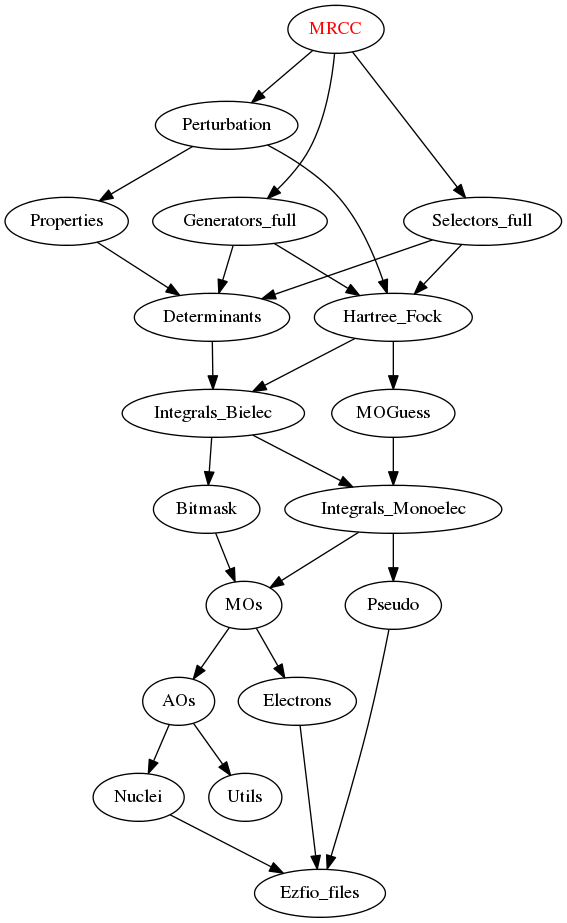

===========
MRCC Module
===========

Needed Modules
==============

.. Do not edit this section. It was auto-generated from the
.. NEEDED_MODULES_CHILDREN file by the `update_README.py` script.

* `Perturbation <http://github.com/LCPQ/quantum_package/tree/master/src/Perturbation>`_
* `Selectors_full <http://github.com/LCPQ/quantum_package/tree/master/src/Selectors_full>`_
* `Generators_full <http://github.com/LCPQ/quantum_package/tree/master/src/Generators_full>`_

Documentation
=============

.. Do not edit this section. It was auto-generated from the
.. NEEDED_MODULES_CHILDREN file by the `update_README.py` script.

`mrcc <http://github.com/LCPQ/quantum_package/tree/master/src/MRCC/mrcc.irp.f#L1>`_
  Undocumented

`run <http://github.com/LCPQ/quantum_package/tree/master/src/MRCC/mrcc.irp.f#L10>`_
  Undocumented

`run_mrcc <http://github.com/LCPQ/quantum_package/tree/master/src/MRCC/mrcc.irp.f#L42>`_
  Undocumented

`run_mrcc_test <http://github.com/LCPQ/quantum_package/tree/master/src/MRCC/mrcc.irp.f#L29>`_
  Undocumented

`find_triples_and_quadruples <http://github.com/LCPQ/quantum_package/tree/master/src/MRCC/mrcc_dress.irp.f#L202>`_
  Undocumented

`mrcc_dress <http://github.com/LCPQ/quantum_package/tree/master/src/MRCC/mrcc_dress.irp.f#L15>`_
  Undocumented

`mrcc_dress_simple <http://github.com/LCPQ/quantum_package/tree/master/src/MRCC/mrcc_dress.irp.f#L156>`_
  Undocumented

`psi_cas_lock <http://github.com/LCPQ/quantum_package/tree/master/src/MRCC/mrcc_dress.irp.f#L3>`_
  Locks on CAS determinants to fill delta_ij

`ci_eigenvectors_dressed <http://github.com/LCPQ/quantum_package/tree/master/src/MRCC/mrcc_utils.irp.f#L79>`_
  Eigenvectors/values of the CI matrix

`ci_eigenvectors_s2_dressed <http://github.com/LCPQ/quantum_package/tree/master/src/MRCC/mrcc_utils.irp.f#L80>`_
  Eigenvectors/values of the CI matrix

`ci_electronic_energy_dressed <http://github.com/LCPQ/quantum_package/tree/master/src/MRCC/mrcc_utils.irp.f#L78>`_
  Eigenvectors/values of the CI matrix

`ci_energy_dressed <http://github.com/LCPQ/quantum_package/tree/master/src/MRCC/mrcc_utils.irp.f#L144>`_
  N_states lowest eigenvalues of the dressed CI matrix

`delta_ij <http://github.com/LCPQ/quantum_package/tree/master/src/MRCC/mrcc_utils.irp.f#L43>`_
  Dressing matrix in N_det basis

`delta_ij_non_cas <http://github.com/LCPQ/quantum_package/tree/master/src/MRCC/mrcc_utils.irp.f#L34>`_
  Dressing matrix in SD basis

`diagonalize_ci_dressed <http://github.com/LCPQ/quantum_package/tree/master/src/MRCC/mrcc_utils.irp.f#L159>`_
  Replace the coefficients of the CI states by the coefficients of the
  eigenstates of the CI matrix

`dressing_type <http://github.com/LCPQ/quantum_package/tree/master/src/MRCC/mrcc_utils.irp.f#L26>`_
  [ Simple | MRCC ]

`h_matrix_dressed <http://github.com/LCPQ/quantum_package/tree/master/src/MRCC/mrcc_utils.irp.f#L63>`_
  Dressed H with Delta_ij

`lambda_mrcc <http://github.com/LCPQ/quantum_package/tree/master/src/MRCC/mrcc_utils.irp.f#L2>`_
  cm/<Psi_0|H|D_m>

