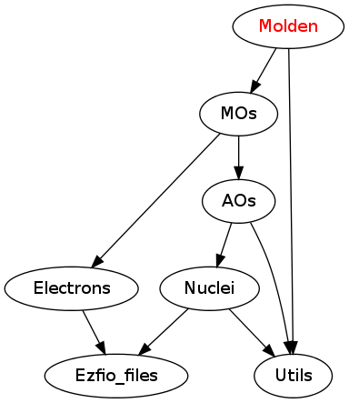

=============
Molden Module
=============

Documentation
=============

.. Do not edit this section. It was auto-generated from the
.. NEEDED_MODULES_CHILDREN file by the `update_README.py` script.

`print_mos <http://github.com/LCPQ/quantum_package/tree/master/src/Molden/print_mo.irp.f#L1>`_
  Undocumented

`write_ao_basis <http://github.com/LCPQ/quantum_package/tree/master/src/Molden/print_mo.irp.f#L63>`_
  Undocumented

`write_geometry <http://github.com/LCPQ/quantum_package/tree/master/src/Molden/print_mo.irp.f#L45>`_
  Undocumented

`write_intro_gamess <http://github.com/LCPQ/quantum_package/tree/master/src/Molden/print_mo.irp.f#L26>`_
  Undocumented

`write_mo_basis <http://github.com/LCPQ/quantum_package/tree/master/src/Molden/print_mo.irp.f#L112>`_
  Undocumented

Needed Modules
==============

.. Do not edit this section. It was auto-generated from the
.. NEEDED_MODULES_CHILDREN file by the `update_README.py` script.

* `MOs <http://github.com/LCPQ/quantum_package/tree/master/src/MOs>`_
* `Utils <http://github.com/LCPQ/quantum_package/tree/master/src/Utils>`_

