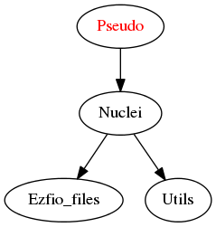

=============
Pseudo Module
=============

Needed Modules
==============

.. Do not edit this section It was auto-generated
.. by the `update_README.py` script.

* `Nuclei <http://github.com/LCPQ/quantum_package/tree/master/src/Nuclei>`_

Needed Modules
==============
.. Do not edit this section It was auto-generated
.. by the `update_README.py` script.

* `Nuclei <http://github.com/LCPQ/quantum_package/tree/master/src/Nuclei>`_

Documentation
=============
.. Do not edit this section It was auto-generated
.. by the `update_README.py` script.

`do_pseudo <http://github.com/LCPQ/quantum_package/tree/master/src/Pseudo/ezfio_interface.irp.f#L241>`_
  Using pseudo potential integral or not

`nucl_charge_remove <http://github.com/LCPQ/quantum_package/tree/master/src/Pseudo/ezfio_interface.irp.f#L45>`_
  Nuclear charges removed

`pseudo_dz_k <http://github.com/LCPQ/quantum_package/tree/master/src/Pseudo/ezfio_interface.irp.f#L202>`_
  test

`pseudo_dz_kl <http://github.com/LCPQ/quantum_package/tree/master/src/Pseudo/ezfio_interface.irp.f#L105>`_
  test

`pseudo_grid_rmax <http://github.com/LCPQ/quantum_package/tree/master/src/Pseudo/ezfio_interface.irp.f#L6>`_
  R_maxof the QMC grid

`pseudo_grid_size <http://github.com/LCPQ/quantum_package/tree/master/src/Pseudo/ezfio_interface.irp.f#L163>`_
  Nb of points of the QMC grid

`pseudo_klocmax <http://github.com/LCPQ/quantum_package/tree/master/src/Pseudo/ezfio_interface.irp.f#L125>`_
  test

`pseudo_kmax <http://github.com/LCPQ/quantum_package/tree/master/src/Pseudo/ezfio_interface.irp.f#L222>`_
  test

`pseudo_lmax <http://github.com/LCPQ/quantum_package/tree/master/src/Pseudo/ezfio_interface.irp.f#L144>`_
  test

`pseudo_n_k <http://github.com/LCPQ/quantum_package/tree/master/src/Pseudo/ezfio_interface.irp.f#L85>`_
  test

`pseudo_n_kl <http://github.com/LCPQ/quantum_package/tree/master/src/Pseudo/ezfio_interface.irp.f#L182>`_
  test

`pseudo_v_k <http://github.com/LCPQ/quantum_package/tree/master/src/Pseudo/ezfio_interface.irp.f#L25>`_
  test

`pseudo_v_kl <http://github.com/LCPQ/quantum_package/tree/master/src/Pseudo/ezfio_interface.irp.f#L65>`_
  test

